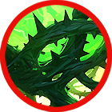
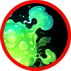
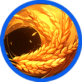

# 🍀 Tammuz



<table data-card-size="large" data-view="cards"><thead><tr><th></th><th data-hidden data-card-cover data-type="files"></th><th data-hidden data-card-target data-type="content-ref"></th></tr></thead><tbody><tr><td></td><td><a href="../../../.gitbook/assets/Git_Hero_Tammuz.png">Git_Hero_Tammuz.png</a></td><td><a href="../">..</a></td></tr><tr><td></td><td><a href="../../../.gitbook/assets/Git_Hero_Tammuz_water.png">Git_Hero_Tammuz_water.png</a></td><td><a href="../stats/elemental-bonus-damage.md#elemental-bonus-damage-table">#elemental-bonus-damage-table</a></td></tr></tbody></table>



### 📒 Tammuz: The Shepherd’s Shadow

"A healing touch with a freezing gaze."

Tammuz appeared like a miracle. When Elena and Ishtar were cornered by a monstrous fungus on their way to Asterica, the shepherd boy intervened with a light so gentle it mended their wounds in a heartbeat. He joined their party, smiling and easy-going, a free spirit who seemed to belong to the wind and the fields.

By all accounts, he is a prodigy. His healing magic doesn't just fix skin; it restores the very soul. But the longer Ishtar travels with him, the more she notices the cracks in the mask. Sometimes, the warmth in his eyes vanishes, replaced by a gaze so cold and sharp it feels like a blade in the dark.

Who is the boy behind the sheep? Behind the "free soul" lies a history that has been carefully buried—and the truth might be more dangerous than the monsters they flee.



#### 📒탐무즈: 자유로운 영혼의 양치기

탐무즈는 로튼힐을 떠나 아스테리카 왕국으로 향하던 엘레나와 이슈타르가, 거대한 버섯 괴물에게 습격당했을 때 갑작스레 나타나 두 소녀를 구해낸 양치기 소년이다. 그의 손끝에서 흘러나온 부드러운 빛은 순식간에 상처를 치유했고, 그 인연으로 셋은 함께 왕국으로 향하는 길동무가 된다. 들판을 누비며 양을 돌보던 평범한 소년처럼 보이지만, 탐무즈는 왕국에서도 보기 드문 **회복 마법**을 자유자재로 다루는 특별한 존재였다. 그의 마법은 단순히 상처를 낫게 하는 것이 아니라, 생명 그 자체에 따뜻한 숨결을 불어넣는 듯한 힘을 지니고 있다.

탐무즈는 바람처럼 자유로운 삶을 사랑하며, 언제나 밝은 웃음으로 주변 사람들을 안심시킨다. 그러나 이슈타르는 그와 가까워질수록 설명할 수 없는 불안을 느낀다. 문득 그의 눈빛에 스쳐 지나가는 알 수 없는 기운, 그것은 깊은 숲 속 그림자처럼 차갑고 날카로웠다. 밝고 온화한 모습 뒤에 숨겨진 또 다른 얼굴. \
탐무즈는 과연 어떤 과거를 품고 있는 것일까? \
자유로운 영혼의 양치기 소년 뒤에 감춰진 이야기는, 아직 아무도 알지 못한다.



#### 📒タムズ（Tammuz）：自由を愛する羊飼いの影

「癒しの手、凍てつく眼差し。微笑みの裏側に潜むのは……。」

ロッテンヒルから王都へ向かう道中、巨大な魔物に襲われたエレナとイシュタル。絶体絶命の窮地に、風のように現れたのが羊飼いの少年タムズでした。その指先から溢れる柔らかな光は一瞬にして二人の傷を癒し、彼らは行動を共にすることになります。野原を駆け、羊を慈しむどこにでもいる少年のように見えますが、その癒しの術は王都の賢者ですら驚嘆するほどの深みを秘めていました。

自由奔放で、絶えず穏やかな微笑みを浮かべるタムズ。しかし、行動を共にするうちにイシュタルは奇妙な違和感を覚え始めます。ふとした瞬間に彼の瞳をよぎる、深い森の奥底に潜む影のような、冷たく鋭い気配。その優しい顔の裏には、決して誰にも見せない「別の顔」が隠されているようで――。

自由な魂を自称する羊飼い。彼が背負う語られざる過去。 その真実に触れる者は、まだ誰もいません。



### ❇️Tammuz‘s skill list &#x20;

<table data-full-width="true"><thead><tr><th width="208">Skill</th><th width="108" align="center">Icon</th><th width="115">Type</th><th width="479">contents</th><th align="center">loot prob</th></tr></thead><tbody><tr><td>Tammuz's blessing 탐무즈의 축복 TAmmuzの祝福</td><td align="center"></td><td><mark style="color:green;">Buff</mark></td><td>
<strong>EN</strong> Upon use, recovers HP per second for a set duration and reduces the damage you take. While active, MP is consumed every second.

🔹 <strong>KR</strong> 사용 시 정해진 시간 동안 초당 HP를 회복하고, 받는 데미지가 감소합니다. 스킬이 유지되는 동안 매초 MP가 소모됩니다.

🔹 <strong>JP</strong> 使用すると、一定時間毎秒HPが回復し、自身が受けるダメージが減少します。効果中は毎秒MPを消費します。
</td><td align="center">15%</td></tr><tr><td>Sheep Sheep Sheep 양양양이 많아요 羊羊羊が多いです</td><td align="center"></td><td><mark style="color:purple;">Summon</mark></td><td>
<strong>EN</strong> Summons three mischievous sheep for a set duration. The sheep attack nearby enemies with their attack power. Elemental bonus damage is increased.

🔹 <strong>KR</strong> 불량한 양 3마리를 소환합니다. 양들은 정해진 시간 동안 소환되어 주변의 적들을 공격합니다. 상성에 따른 <strong>부가 데미지</strong>가 증가합니다.

🔹 <strong>JP</strong> 不良な羊を3匹召喚します。羊は一定時間、周囲の敵を攻撃します。属性相性に応じた<strong>追加ダメージ</strong>が増加します。
</td><td align="center">15%</td></tr><tr><td>Life is a Thorny road 인생은 가시밭길 人生は茨の道</td><td align="center"></td><td><mark style="color:red;">AoE</mark></td><td>
<strong>EN</strong> Summons thorny bushes forward, dealing damage to enemies. Elemental bonus damage is increased.

🔹 <strong>KR</strong> 전방으로 가시 덤불을 소환해 적들에게 피해를 입힙니다. 상성에 따른 <strong>부가 데미지</strong>가 증가합니다.

🔹 <strong>JP</strong> 前方に棘の茂みを召喚し、敵にダメージを与えます。属性相性に応じた<strong>追加ダメージ</strong>が増加します。
</td><td align="center">15%</td></tr><tr><td>Flower of blessing 축복의 꽃 祝福の花</td><td align="center"></td><td><mark style="color:green;">Buff</mark></td><td>
<strong>EN</strong> Upon use, recovers HP per second for a set duration and increases damage. While active, MP is consumed every second.

🔹 <strong>KR</strong> 사용 시 정해진 시간 동안 초당 HP를 회복하고, 데미지가 증가합니다. 스킬이 유지되는 동안 매초 MP가 소모됩니다.

🔹 <strong>JP</strong> 使用すると、一定時間毎秒HPが回復し、ダメージが増加します。効果中は毎秒MPを消費します。
</td><td align="center">15%</td></tr><tr><td>Poisonous weed 독초 毒草</td><td align="center"></td><td><mark style="color:red;">AoE</mark></td><td>
<strong>EN</strong> Spreads a Poisonous Weed field. Enemies standing on the field take damage per tick, and affected targets suffer a movement speed reduction debuff for a set duration.

🔹 <strong>KR</strong> 독초로 이루어진 독장판을 설치합니다. 장판 위에 있는 적들은 틱당 피해를 입으며, 피해를 받은 타겟은 정해진 시간 동안 이동 속도가 감소하는 디버프에 걸립니다.

🔹 <strong>JP</strong> 毒草で作られた毒のフィールドを設置します。フィールド上にいる敵はティックごとのダメージを受け、ダメージを受けたターゲットは一定時間移動速度が低下するデバフにかかります。
</td><td align="center">15%</td></tr><tr><td>Piercing a thorn 가시뚫기 とげ抜き</td><td align="center"></td><td><mark style="color:red;">AoE</mark></td><td>
<strong>EN</strong> Launches a powerful thorn attack forward, dealing damage to enemies and knocking them back. Elemental bonus damage is increased.

🔹 <strong>KR</strong> 전방으로 강력한 가시 공격을 날려 적들에게 피해를 입히고, 넉백시킵니다. 상성에 따른 <strong>부가 데미지</strong>가 증가합니다.

🔹 <strong>JP</strong> 前方に強力な棘の攻撃を放ち、敵にダメージを与えてノックバックさせます。属性相性に応じた<strong>追加ダメージ</strong>が増加します。
</td><td align="center">15%</td></tr><tr><td>Suhyangmi 수향미 水香味</td><td align="center"></td><td><mark style="color:blue;">Projectile</mark></td><td>
<strong>EN</strong> Fires a large amount of golden Suhyangmi rice forward. Each hit deals damage to enemies and stuns them with its enticing aroma.

🔹 <strong>KR</strong> 황금빛 수향미를 전방으로 다량 발사해 적들에게 탄당 피해를 입히며, 고소한 향기에 적들이 현혹되어 스턴 상태가 됩니다.

🔹 <strong>JP</strong> 黄金の水香味を大量に前方へ発射し、敵にヒットごとのダメージを与え、香ばしい香りによって敵をスタン状態にします。
</td><td align="center">10%</td></tr></tbody></table>

<em>※ This guide was written based on the game status as of December 29, 2025,</em>  <em>and its contents may change with future updates.</em>

