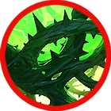
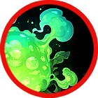
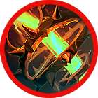
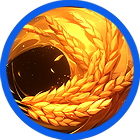

# 🍀 Tammuz



<table data-card-size="large" data-view="cards"><thead><tr><th></th><th data-hidden data-card-cover data-type="files"></th><th data-hidden data-card-target data-type="content-ref"></th></tr></thead><tbody><tr><td></td><td><a href="../../../.gitbook/assets/Git_Hero_Tammuz.png">Git_Hero_Tammuz.png</a></td><td><a href="../">..</a></td></tr><tr><td></td><td><a href="../../../.gitbook/assets/Git_Hero_Tammuz_water.png">Git_Hero_Tammuz_water.png</a></td><td><a href="../stats/elemental-bonus-damage.md#elemental-bonus-damage-table">#elemental-bonus-damage-table</a></td></tr></tbody></table>



### 📒 Tammuz: The Shepherd’s Shadow

"A healing touch with a freezing gaze."

Tammuz appeared like a miracle. When Elena and Ishtar were cornered by a monstrous fungus on their way to Asterica, the shepherd boy intervened with a light so gentle it mended their wounds in a heartbeat. He joined their party, smiling and easy-going, a free spirit who seemed to belong to the wind and the fields.

By all accounts, he is a prodigy. His healing magic doesn't just fix skin; it restores the very soul. But the longer Ishtar travels with him, the more she notices the cracks in the mask. Sometimes, the warmth in his eyes vanishes, replaced by a gaze so cold and sharp it feels like a blade in the dark.

Who is the boy behind the sheep? Behind the "free soul" lies a history that has been carefully buried—and the truth might be more dangerous than the monsters they flee.



#### 📒탐무즈: 자유로운 영혼의 양치기

탐무즈는 로튼힐을 떠나 아스테리카 왕국으로 향하던 엘레나와 이슈타르가, 거대한 버섯 괴물에게 습격당했을 때 갑작스레 나타나 두 소녀를 구해낸 양치기 소년이다. 그의 손끝에서 흘러나온 부드러운 빛은 순식간에 상처를 치유했고, 그 인연으로 셋은 함께 왕국으로 향하는 길동무가 된다. 들판을 누비며 양을 돌보던 평범한 소년처럼 보이지만, 탐무즈는 왕국에서도 보기 드문 **회복 마법**을 자유자재로 다루는 특별한 존재였다. 그의 마법은 단순히 상처를 낫게 하는 것이 아니라, 생명 그 자체에 따뜻한 숨결을 불어넣는 듯한 힘을 지니고 있다.

탐무즈는 바람처럼 자유로운 삶을 사랑하며, 언제나 밝은 웃음으로 주변 사람들을 안심시킨다. 그러나 이슈타르는 그와 가까워질수록 설명할 수 없는 불안을 느낀다. 문득 그의 눈빛에 스쳐 지나가는 알 수 없는 기운, 그것은 깊은 숲 속 그림자처럼 차갑고 날카로웠다. 밝고 온화한 모습 뒤에 숨겨진 또 다른 얼굴. \
탐무즈는 과연 어떤 과거를 품고 있는 것일까? \
자유로운 영혼의 양치기 소년 뒤에 감춰진 이야기는, 아직 아무도 알지 못한다.



#### 📒タムズ（Tammuz）：自由を愛する羊飼いの影

「癒しの手、凍てつく眼差し。微笑みの裏側に潜むのは……。」

ロッテンヒルから王都へ向かう道中、巨大な魔物に襲われたエレナとイシュタル。絶体絶命の窮地に、風のように現れたのが羊飼いの少年タムズでした。その指先から溢れる柔らかな光は一瞬にして二人の傷を癒し、彼らは行動を共にすることになります。野原を駆け、羊を慈しむどこにでもいる少年のように見えますが、その癒しの術は王都の賢者ですら驚嘆するほどの深みを秘めていました。

自由奔放で、絶えず穏やかな微笑みを浮かべるタムズ。しかし、行動を共にするうちにイシュタルは奇妙な違和感を覚え始めます。ふとした瞬間に彼の瞳をよぎる、深い森の奥底に潜む影のような、冷たく鋭い気配。その優しい顔の裏には、決して誰にも見せない「別の顔」が隠されているようで――。

自由な魂を自称する羊飼い。彼が背負う語られざる過去。 その真実に触れる者は、まだ誰もいません。



<figure><figcaption></figcaption></figure>

### ❇️Tammuz‘s skill list &#x20;

<table data-full-width="true"><thead><tr><th width="208">Skill</th><th width="108" align="center">Icon</th><th width="115">Type</th><th width="479">contents</th><th align="center">loot prob</th></tr></thead><tbody><tr><td>Tammuz's blessing 탐무즈의 축복 TAmmuzの祝福</td><td align="center"></td><td><mark style="color:green;">Buff</mark></td><td>
<strong>EN</strong> Upon casting the skill, removes 1 instance of Stun and debuffs affecting you. For a period of time, restores a certain amount of HP and creates a shield that reduces damage by a certain amount. While the skill is active, a portion of its MP cost is gradually reduced.

🔹 <strong>KR</strong> 스킬 시전 시, 자신에게 걸린 스턴 및 디버프를 1회 제거한다. 일정 시간 동안 HP를 일정량 회복하고, 데미지를 일정량 감소시키는 실드를 생성한다. 스킬 사용 중에는 MP 소모값 일부가 지속적으로 감소한다.

🔹 <strong>JP</strong> スキル使用時、自身にかかっているスタンおよびデバフを1回解除する。一定時間、HPを一定量回復し、ダメージを一定量軽減するシールドを生成する。スキル使用中は、MP消費量の一部が継続的に減少する。
</td><td align="center">15%</td></tr><tr><td>Sheep Sheep Sheep 양양양 羊羊羊</td><td align="center"></td><td><mark style="color:purple;">Summon</mark></td><td>
<strong>EN</strong> Summons several Troublesome Sheep. The sheep remain summoned for a period of time and attack nearby enemies with magic attack power. EBD+

🔹 <strong>KR</strong> 여러 마리의 불량한 양들이 소환된다. 양들은 일정 시간 동안 소환되어 마법 공격력으로 가까운 적을 공격한다. EBD+

🔹 <strong>JP</strong> 複数のいたずらなヒツジを召喚する。ヒツジは一定時間召喚され、魔法攻撃力で近くの敵を攻撃する。 EBD+
</td><td align="center">15%</td></tr><tr><td>Life is a Thorny road 인생은 가시밭길 人生は茨の道</td><td align="center"></td><td><mark style="color:red;">AoE</mark></td><td>
<strong>EN</strong> Summons thorny brambles forward, dealing magic damage to enemies. Enemies hit have their Physical Magical Critical Hit Rate reduced by a certain amount for a period of time. EBD+

🔹 <strong>KR</strong> 전방으로 가시 덤불을 소환하여 적에게 마법 피해를 입힌다. 피해를 입은 적은 일정 시간 동안 물리 /마법 치명타 확률이 일정량 감소한다. EBD+

🔹 <strong>JP</strong> 前方にトゲの茂みを召喚し、 敵に魔法ダメージを与える。ダメージを受けた敵は一定時間、物理魔法クリティカル率が一定量減少する。 EBD+
</td><td align="center">15%</td></tr><tr><td>Flower of blessing 축복의 꽃 祝福の花</td><td align="center"></td><td><mark style="color:green;">Buff</mark></td><td>
<strong>EN</strong> Upon use, restores a certain amount of HP per second and increases Damage by a certain amount for a period of time. While the skill is active, a portion of its MP cost is gradually reduced.

🔹 <strong>KR</strong> 사용 시 일정 시간 동안 자신의 HP를 초당 일정량씩 회복하고, 데미지가 일정량 증가한다. 스킬 사용 중에는 MP 소모값 일부가 지속적으로 감소한다.

🔹 <strong>JP</strong> 使用時、一定時間、自身のHPを毎秒一定量回復し、ダメージが一定量増加する。スキル使用中は、MP消費量の一部が継続的に減少する。
</td><td align="center">15%</td></tr><tr><td>Poisonous weed 독초 毒草</td><td align="center"></td><td><mark style="color:red;">AoE</mark></td><td>
<strong>EN</strong> Scatters a poisonous field made from toxic herbs. Enemies within range take magic damage. Targets hit have their Movement Speed reduced by a certain amount for a period of time, and are afflicted with a debuff that reduces HP recovery from Potions and Heal skills by a certain amount.

🔹 <strong>KR</strong> 독초로 만들어진 독장판을 뿌린다. 범위 내 적은 마법 피해를 입는다. 피해를 입은 대상은, 일정 시간 동안 이동속도가 일정량 감소하며, 포션 및 힐 스킬을 통한 HP회복량이 일정량 감소하는 디버프에 걸린다.

🔹 <strong>JP</strong> 毒草でできた毒のフィールドを撒く。範囲内の敵は魔法ダメージを受ける。ダメージを受けた対象は一定時間、移動速度が一定量減少し、ポーションおよびヒールスキルによるHP回復量が一定量減少するデバフにかかる。
</td><td align="center">15%</td></tr><tr><td>Piercing a thorn 가시뚫기 とげ抜き</td><td align="center"></td><td><mark style="color:red;">AoE</mark></td><td>
<strong>EN</strong> Launches a powerful thorny vine attack forward. Deals magic damage to the enemy and inflicts Stun. EBD+

🔹 <strong>KR</strong> 전방으로 강력한 가시덤불 공격을 가한다. 적에게 마법 피해를 입히고, 스턴 상태로 만든다. EBD+

🔹 <strong>JP</strong> 前方へ強力な茨の攻撃を放つ。敵に魔法ダメージを与え、スタン状態にする。 EBD+
</td><td align="center">15%</td></tr><tr><td>Suhyangmi 수향미 水香味</td><td align="center"></td><td><mark style="color:blue;">Projectile</mark></td><td>
<strong>EN</strong> Fires a large amount of golden Soohyangmi forward. Deals magic damage to enemies and stuns them with the nutty scent.

🔹 <strong>KR</strong> 황금빛 수향미를 전방으로 다량 발사한다. 적에게 마법 피해를 입히며, 고소한 냄새에 적들이 당황하여 스턴 상태가 된다.

🔹 <strong>JP</strong> 前方に大量の黄金色の芳香を発射する.敵に魔法ダメージを与え, 芳香によって敵をスタン状態にする.
</td><td align="center">10%</td></tr></tbody></table>

<em>※ This guide was written based on the game status as of April 08, 2026,</em>  <em>and its contents may change with future updates.</em>

