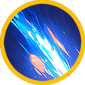

# 🌊 Tiamat



<table data-card-size="large" data-view="cards"><thead><tr><th></th><th data-hidden data-card-cover data-type="files"></th><th data-hidden data-card-target data-type="content-ref"></th></tr></thead><tbody><tr><td></td><td><a href="../../../.gitbook/assets/Git_Hero_Tiamat.png">Git_Hero_Tiamat.png</a></td><td><a href="../">..</a></td></tr><tr><td></td><td><a href="../../../.gitbook/assets/Git_Hero_Tiamat_water.png">Git_Hero_Tiamat_water.png</a></td><td><a href="../stats/elemental-bonus-damage.md#elemental-bonus-damage-table">#elemental-bonus-damage-table</a></td></tr></tbody></table>



#### 📒Tiamat: The Knight Hunting the Shadow of the Curse

Tiamat stands as a pillar of strength among the Wizard Knights, a master of magic and a mind as sharp as any blade. She has earned the unwavering trust of their leader, Aruru, and her name commands respect throughout the ranks. Yet beneath her composed exterior burns a restless determination, fueled by the enigma of the amethysts unearthed from the Tomb of the Damned.

Whispers about these amethysts echo through the palace halls. Some say they bring unimaginable luck—tales of gamblers striking it rich overnight or students acing exams they never studied for. The gem has become a symbol of fortune, but its shine hides a chilling truth. Several who dared to purchase it have vanished, leaving nothing behind but unanswered questions. These were ordinary folk, united only by their possession of the cursed stone.

Tiamat refuses to dismiss these disappearances as mere chance. Her instincts scream that this mystery is linked to a wound she carries deep within—the sudden disappearance of her closest friend, a fellow Wizard Knight. That friend was her confidant, her shield in battle, gone without a trace one fateful day. The loss gnaws at her, a quiet agony she can’t shake. Now, she’s certain the amethysts hold the key to what happened.

The path to the Cursed Tomb is fraught with peril—ancient curses and unseen threats may await. But Tiamat is undeterred. For her friend, for the truth, she’ll face any darkness that stands in her way. Her journey is just beginning, and her resolve is a fire that refuses to fade.



#### 📒티아마트: 저주의 그림자를 쫓는 기사

티아마트는 위자드 기사단의 뛰어난 실력자로, 강력한 마법과 예리한 통찰력을 겸비한 인물이다. 단장 아루루로부터 가장 큰 신임을 받는 그녀는 기사단 내에서도 독보적인 존재감을 자랑한다. 동료들은 그녀의 침착한 판단과 따뜻한 마음에 깊은 신뢰를 보내지만, 최근 그녀의 눈빛엔 깊은 근심이 서려 있다. 바로 저주 받은 무덤에서 발견된 자수정에 얽힌 기묘한 사건 때문이다.

왕궁 안팎에서는 이 자수정에 대한 소문이 무성하다. 어떤 이는 자수정을 지닌 뒤 도박판에서 거금을 손에 쥐었고, 또 다른 이는 불가능해 보이던 시험을 통과했다고 자랑한다. 행운의 보석이라는 낭만적인 이야기가 퍼져 나갔지만, 그 이면엔 어두운 비밀이 숨겨져 있다. 자수정을 구매한 이들 중 몇몇이 흔적도 없이 사라진 것이다. 실종자들은 하나같이 평범한 삶을 살던 사람들이었고, 그 공통점은 오직 자수정뿐이었다.

티아마트는 이 사건이 단순한 우연이 아니라고 믿는다. 그녀의 마음을 더욱 무겁게 만드는 것은 위자드 기사단에서 어느 날 갑자기 자취를 감춘 소중한 친구의 기억이다. 그 친구는 티아마트에게 동료 이상의 존재였고, 함께 수많은 전장을 누빈 전우였다. 친구가 사라진 날, 티아마트는 무언가 잘못되었다는 직감을 느꼈지만, 단서를 찾지 못한 채 시간만 흘렀다. 이제 자수정 사건이 친구의 실종과 연결되어 있다는 확신이 그녀를 사로잡았다.

저주 받은 무덤으로 향하는 길은 험난하다. 고대의 저주와 어둠이 도사리고 있을지도 모른다. 하지만 티아마트는 망설이지 않는다. 친구를 되찾고, 진실을 밝히기 위해 그녀는 모든 것을 걸 준비가 되어 있다. 그녀의 발걸음은 단단하고, 마음은 뜨겁다.



#### 📒ティアマト: 呪いの影を追う騎士

ティアマトはウィザード騎士団に所属する優れた実力者であり、魔法の力と鋭い洞察力を併せ持つ存在です。団長アルルから最も深い信頼を寄せられ、仲間たちからもその冷静な判断と温かい心に敬意を払われています。しかし最近、彼女の瞳には拭えぬ憂いが宿っています。その原因は、呪われた墓から発見されたアメジストにまつわる不可解な事件です。

王宮の内外では、このアメジストを巡る奇妙な噂が広がっています。ある者はそれを身につけた後、賭博で大金を手にしたり、到底合格できそうにない試験を突破したりしたと語ります。幸運の宝石としての評判が囁かれていますが、その裏には暗い秘密が隠されています。アメジストを購入した者のうち、何人かが忽然と姿を消してしまったのです。失踪者たちは皆、ごく平凡な暮らしを送っていた人々で、唯一の繋がりは件の宝石だけでした。

ティアマトはこれが偶然の産物ではないと確信しています。彼女の心をより深く苛むのは、ウィザード騎士団からある日突然消えた大切な友の存在です。その友はティアマトにとって単なる仲間以上の存在であり、数々の戦場を共にした戦友でした。友が消えた日、彼女は何かがおかしいと感じましたが、手がかりを得られぬまま月日が過ぎました。今、ティアマトはこのアメジストが友の失踪と結びついていると直感しています。

呪われた墓への道は険しく、古代の呪いや見えざる脅威が待ち受けているかもしれません。それでもティアマトは躊躇しません。友を取り戻し、真実を明らかにするため、彼女は全てを賭ける覚悟を決めています。彼女の旅はまだ始まったばかりで、その決意は静かに、しかし熱く燃え続けています。



### ❇️Tiamat‘s skill list  &#x20;

<table data-full-width="true"><thead><tr><th width="207">Skill</th><th width="106" align="center">Icon</th><th width="105">Type</th><th width="479">contents</th><th align="center">loot prob</th></tr></thead><tbody><tr><td>Waves 파도 波濤</td><td align="center"></td><td>Buff</td><td>
Creates a shield for a set duration that increases your damage and reduces enemy damage. MP decreases every second while the skill is active. 

🔹 

정해진 시간 동안 나의 데미지가 상승하고, 적의 데미지를 감소시키는 실드를 생성합니다. 스킬 사용 중에는 매 초마다 MP가 감소합니다. 

🔹 

一定時間、自身のダメージを増加させ、敵のダメージを減少させるシールドを生成します。スキル使用中は毎秒MPが減少します。
</td><td align="center">15%</td></tr><tr><td>Rain of destruction 멸망의 비 滅亡の碑</td><td align="center"></td><td>Melee</td><td>
Fires a powerful water spell forward, dealing damage per tick to enemies. Elemental bonus damage is increased. 

🔹 

전방으로 강력한 물의 마법을 발사하여 적에게 틱당 피해를 입힙니다. 상성에 따른 부가 데미지가 증가합니다. 

🔹 

前方に強力な水の魔法を発射し、敵にティックごとのダメージを与えます。属性に応じた追加ダメージが増加します。
</td><td align="center">15%</td></tr><tr><td>Water ball 워터볼 ウォーターボール</td><td align="center"></td><td>Projectile</td><td>
A powerful water ball is thrown like a boomerang and returns, dealing damage per hit to enemies within the area and briefly stunning them. Elemental bonus damage is increased. 

🔹 

강력한 워터볼이 부메랑처럼 발사되었다 돌아오며 범위 내 적들에게 타격당 피해를 입히고, 적들은 짧은 스턴 상태가 됩니다. 상성에 따른 부가 데미지가 증가합니다. 

🔹 

強力なウォーターボールがブーメランのように発射され、戻ってきて範囲内の敵にヒットごとにダメージを与え、短時間スタンさせます。属性に応じた追加ダメージが増加します。
</td><td align="center">15%</td></tr><tr><td>Sinking 침몰 沈没</td><td align="center"></td><td>AoE</td><td>
Fires an absorbing water orb that pulls enemies within the area for a set duration. Enemies within the area take damage per tick. 

🔹 

흡성하는 물의 구를 발사하여 범위 내 적들을 일정 시간 동안 끌어당깁니다. 범위 내 적들은 틱당 피해를 입습니다. 

🔹

 吸引する水の球を発射し、範囲内の敵を一定時間引き寄せます。範囲内の敵はティックごとのダメージを受けます。
</td><td align="center">10%</td></tr><tr><td>Salt Flower 소금꽃 塩の花</td><td align="center"></td><td>AoE</td><td>
Throws salt flowers at enemies in front, dealing damage per hit. Enemies within the area are briefly stunned and afflicted with a corrosion debuff, taking damage per second for a set duration. 

🔹 

전방의 적들에게 소금꽃을 뿌려 타격당 피해를 입힙니다. 범위 내 적들은 짧은 스턴 상태가 되며, 일정 시간 동안 초당 피해를 입히는 부식 디버프에 걸립니다. 

🔹 

前方の敵に塩の花を撒き、ヒットごとにダメージを与えます。範囲内の敵は短時間スタン状態になり、一定時間、毎秒ダメージを与える腐食デバフにかかります。
</td><td align="center">15%</td></tr><tr><td>Healing power of water 물의 치유 水の癒し</td><td align="center"></td><td>Buff</td><td>
For a set duration, your damage increases and HP regenerates per second. MP decreases every second while the skill is active. 

🔹 

정해진 시간 동안 자신의 데미지가 상승하고, 초당 HP가 회복됩니다. 스킬 사용 중에는 매 초마다 MP가 감소합니다. 

🔹 

一定時間、自身のダメージが増加し、毎秒HPが回復します。スキル使用中は毎秒MPが減少します。
</td><td align="center">15%</td></tr><tr><td>Water Storm 물의 폭풍 水の嵐</td><td align="center"></td><td>Projectile</td><td>
Fires a waterstorm forward, dealing damage per tick to enemies within the area, and advancing until it dissipates. Elemental bonus damage is increased. 

🔹 

전방으로 물의 폭풍을 날려보내어 범위 내 적들에게 틱당 피해를 입히며 소멸할 때까지 전진합니다. 상성에 따른 부가 데미지가 증가합니다. 

🔹 

前方に水の嵐を放ち、範囲内の敵にティックごとのダメージを与え、消滅するまで前進します。属性に応じた追加ダメージが増加します。
</td><td align="center">15%</td></tr></tbody></table>
