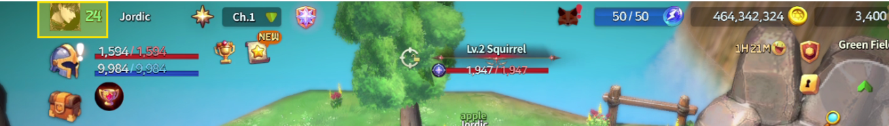
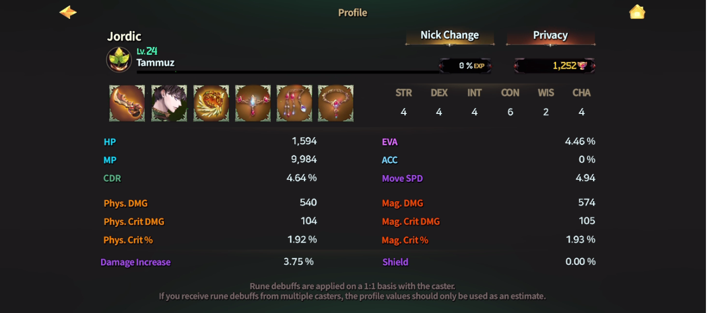

# ✴️ Stats



### 📊 Stat Guide

💡 **Stats** are the core elements that define a Hero’s combat style and growth path.\
In **EXTOCIUM**, simply understanding stats can make combat much easier\
and clarify how to build and operate your Hero..

***

#### ◾ Stat Structure in EXTOCIUM

Stats in EXTOCIUM are divided into two main categories.

[**Combat Stats**](combat-stats.md)

* Increased primarily through equipment
* Directly affect combat results such as **Attack**, **Defense**, and **Critical hits**

[**Special Stats**](special-stats/)

* Innate attributes a Hero is born with
* Define the Hero’s core traits and long-term growth direction

👉 Detailed effects of each stat can be found in the sub-guides below.

***

#### ◾ Stat Distribution on Hero Creation

When a Hero is created, a total of **15–21 Stat Points (SP)** are automatically distributed.

📌 **Stat Distribution Rules**\
1️⃣ All stats receive a base of **2 points**\
2️⃣ Remaining points are **randomly distributed across the 6 stats**

| Stat Name          | Base Assigned Point | Additional Assigned Points |
| ------------------ | ------------------- | -------------------------- |
| STR (Strength)     | 2 points            | Randomly allocated         |
| DEX (Dexterity)    | 2 points            | Randomly allocated         |
| INT (Intelligence) | 2 points            | Randomly allocated         |
| CON (Constitution) | 2 points            | Randomly allocated         |
| WIS (Wisdom)       | 2 points            | Randomly allocated         |
| CHA (Charisma)     | 2 points            | Randomly allocated         |

As a result, every Hero is born with a unique combination of abilities and traits.

***

#### ◾ The 6 Special Stats

Special Stats form the foundation of a Hero’s core capabilities.

* **Strength (STR)**\
  Increases physical attack power and affects certain equipment requirements
* **Dexterity (DEX)**\
  Influences accuracy and critical hit chance
* **Intelligence (INT)**\
  Enhances magic attack power and MP-related abilities
* **Constitution (CON)**\
  Increases HP and overall survivability
* **Wisdom (WIS)**\
  Improves magic resistance and MP recovery efficiency
* **Charisma (CHA)**\
  Affects certain skill effects and trait activations

💡 Different combinations of these six stats create distinct play styles for each Hero.

***

#### ◾ How to Check Final Stats

All stats—including base stats, equipment bonuses, and applied effects—are displayed together.

📘 **How to View**

* Tap the **Profile Icon** at the top-left of the main HUD

<figure><figcaption></figcaption></figure>

* View all stats at a glance in the **Profile Widget**

<figure><figcaption></figcaption></figure>

***

#### ◾ Learn More About Stats

For a deeper understanding of the stat system, please refer to the guides below.

**👇 Combat Stats** – Stats that directly affect combat


[combat-stats.md](combat-stats.md)


**👇 Special Stats** – Core traits and growth direction


[special-stats](special-stats/)


**👇 Calculate Stats** – How stats are calculated


[calculate-stats.md](calculate-stats.md)


**👇 Elemental Bonus Damage** – Attribute-based bonus damage


[elemental-bonus-damage.md](elemental-bonus-damage.md)


***

✨&#x20;

> The moment you understand stats, the flow of combat changes.\
> Build your own stat combinations\
> and grow a Hero optimized for your strategy.



### 📊 스탯 가이드 (Stat)

💡 **스탯은 영웅의 전투 성향과 성장 방향을 결정하는 핵심 요소입니다.**\
EXTOCIUM에서는 스탯을 이해하는 것만으로도\
전투가 훨씬 쉬워지고, 캐릭터 운용이 명확해집니다.

***

#### ◾ EXTOCIUM의 스탯 구조

EXTOCIUM의 스탯은 크게 두 가지로 나뉩니다.

* [**전투 스탯 (Combat Stats)**](combat-stats.md)\
  장비에 의해 증가하며,\
  공격력·방어력·치명타 등 전투 결과에 직접적인 영향을 줍니다.
* [**스페셜 스탯 (Special Stats)**](special-stats/)\
  영웅이 태어날 때부터 지니는 고유 능력치로,\
  영웅의 기본 성향과 성장 방향을 결정합니다.

👉 각 스탯의 자세한 효과는 하위 가이드에서 확인할 수 있습니다.

***

#### ◾ 영웅 생성 시 스탯 분배 방식

영웅을 생성하면 **총 15\~21의 스탯 포인트(SP)**&#xAC00; 자동으로 분배됩니다.

📌 **스탯 분배 규칙**\
1️⃣ 모든 스탯에 기본 2포인트가 먼저 할당됩니다.\
2️⃣ 남은 포인트는 6개의 스탯에 무작위로 추가 분배됩니다.

| 스탯 이름 | 기본 배정 포인트 | 추가 배정 포인트 |
| ----- | --------- | --------- |
| STR   | 2포인트      | 랜덤 분배     |
| DEX   | 2포인트      | 랜덤 분배     |
| INT   | 2포인트      | 랜덤 분배     |
| CON   | 2포인트      | 랜덤 분배     |
| WIS   | 2포인트      | 랜덤 분배     |
| CHA   | 2포인트      | 랜덤 분배     |

이로 인해, **각 영웅은 서로 다른 개성을 가진 독특한 능력치 조합을 갖게 됩니다**

***

#### ◾ 6가지 스페셜 스탯 종류

스페셜 스탯은 영웅의 기본 능력을 구성하는 핵심 요소입니다.

* **힘 (STR)**\
  물리 공격력 증가 및 일부 장비 착용 조건에 영향
* **솜씨 (DEX)**\
  명중률과 치명타 확률에 영향
* **지능 (INT)**\
  마법 공격력 및 MP 관련 능력 강화
* **체력 (CON)**\
  HP 증가 및 생존력 강화
* **지혜 (WIS)**\
  마법 저항력 및 MP 회복 효율 증가
* **매력 (CHA)**\
  특정 스킬 효과 및 특성 발동에 영향

💡 이 6가지 스탯 조합에 따라 각 영웅은 고유한 플레이 스타일을 갖게 됩니다.

***

#### ◾ 최종 스탯 확인 방법

영웅의 기본 스탯과 장비, 효과로 증가한 모든 스탯은 합산되어 표시됩니다.

📘 **확인 방법**

* 메인 HUD 좌측 상단의 **프로필 아이콘** 터치

<figure><figcaption></figcaption></figure>

* 프로필 위젯에서 모든 스탯을 한눈에 확인 가능

<figure><figcaption></figcaption></figure>

***

#### ◾ 스탯 가이드 더 알아보기

스탯 시스템을 더 자세히 이해하고 싶다면 아래 가이드를 참고해 주세요.

**👇 Combat Stats** – 전투에 직접 영향을 주는 능력치


[combat-stats.md](combat-stats.md)


**👇 Special Stats** – 영웅의 기본 성향과 성장 방향


[special-stats](special-stats/)


**👇 Calculate Stats** – 스탯 계산 방식 안내


[calculate-stats.md](calculate-stats.md)


**👇 Elemental Bonus Damage** – 속성 보너스 피해 설명


[elemental-bonus-damage.md](elemental-bonus-damage.md)


***

✨&#x20;

> **스탯을 이해하는 순간, 전투의 흐름이 달라집니다.**\
> 나만의 스탯 조합으로\
> 최적화된 영웅을 성장시켜 보세요.



### 📊 ステータスガイド

💡 **ステータス**は、ヒーローの戦闘傾向や成長方針を決定する重要な要素です。\
**EXTOCIUM**では、ステータスを理解するだけで\
戦闘が格段に楽になり、キャラクター運用が明確になります。

***

#### ◾ EXTOCIUMのステータス構造

EXTOCIUMのステータスは、大きく2種類に分かれています。

[**戦闘ステータス（Combat Stats）**](combat-stats.md)

* 主に装備によって上昇
* **攻撃力・防御力・クリティカル** など、戦闘結果に直接影響します

[**スペシャルステータス（Special Stats）**](special-stats/)

* ヒーローが生まれ持つ固有の能力値
* ヒーローの基本的な性質や成長方向を決定します

👉 各ステータスの詳細な効果は、下位ガイドをご確認ください。

***

#### ◾ ヒーロー作成時のステータス分配

ヒーロー作成時、合計 **15～21のステータスポイント（SP）** が自動で分配されます。

📌 **分配ルール**\
1️⃣ すべてのステータスに **基本値として2ポイント** が付与されます\
2️⃣ 残りのポイントは、**6つのステータスにランダムで分配**されます

| ステータス名   | 基本割り振りポイント | 追加割り振りポイント |
| -------- | ---------- | ---------- |
| STR (力)  | 2ポイント      | ランダムに割り振り  |
| DEX (腕前) | 2ポイント      | ランダムに割り振り  |
| INT (知力) | 2ポイント      | ランダムに割り振り  |
| CON (体力) | 2ポイント      | ランダムに割り振り  |
| WIS (知恵) | 2ポイント      | ランダムに割り振り  |
| CHA (魅力) | 2ポイント      | ランダムに割り振り  |

この仕組みにより、すべてのヒーローは 異なる個性を持つ能力値構成で誕生します。

***

#### ◾ 6つのスペシャルステータス

スペシャルステータスは、ヒーローの基礎能力を構成する重要な要素です。

* **力（STR）**\
  物理攻撃力の上昇、一部装備の装着条件に影響
* **敏捷（DEX）**\
  命中率およびクリティカル発生率に影響
* **知能（INT）**\
  魔法攻撃力やMP関連能力を強化
* **体力（CON）**\
  HP増加および生存力の向上
* **精神（WIS）**\
  魔法耐性およびMP回復効率を強化
* **魅力（CHA）**\
  特定スキル効果や特性発動に影響

💡 これら6つのステータスの組み合わせによって、\
ヒーローごとに異なるプレイスタイルが生まれます。

***

#### ◾ 最終ステータスの確認方法

基本ステータスに加え、装備や効果による増加分を含めた\
**すべてのステータスが合算表示**されます。

📘 **確認方法**

* メインHUD左上の **プロフィールアイコン** をタップ

<figure><figcaption></figcaption></figure>

* プロフィールウィジェットで全ステータスを一目で確認可能

<figure><figcaption></figcaption></figure>

***

#### ◾ ステータスをさらに理解する

ステータスシステムをより深く理解したい場合は、以下のガイドをご参照ください。

**👇 Combat Stats** – 戦闘に直接影響する能力値


[combat-stats.md](combat-stats.md)


**👇 Special Stats** – ヒーローの基本性向と成長方向


[special-stats](special-stats/)


**👇 Calculate Stats** – ステータス計算方式


[calculate-stats.md](calculate-stats.md)


**👇 Elemental Bonus Damage** – 属性ボーナスダメージ解説


[elemental-bonus-damage.md](elemental-bonus-damage.md)


***

✨&#x20;

> ステータスを理解した瞬間、戦闘の流れは変わります。\
> 自分だけのステータス構成で、\
> 最適化されたヒーローを育ててみてください。



<em>※ This guide was written based on the game status as of December 30, 2025,</em>  <em>and its contents may change with future updates.</em>

