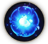

# 4️⃣ Elemental Bonus Damage



💡**All heroes and monsters in Extocium have one attribute.**&#x20;

<figure><figcaption></figcaption></figure>

Attributes refer to the 7 properties: dark, light, stone, water, fire, leaf, and force. \
Damage is increased based on the strength relationship between each attribute.

<figure><figcaption></figcaption></figure>

👉 The target's attribute information can be checked on the target panel.

<figure><figcaption></figcaption></figure>

👉 If a green arrow floats above the target's head, it means I can deal an additional 12% damage to the target.

<figure><figcaption></figcaption></figure>

👉 If a red arrow floats above the target's head, it means the target can deal an additional 12% damage to me.&#x20;


Elemental bonus damage is applied as **{Final Damage \* (1 +&#x20;**<mark style="color:red;">**n%**</mark>**)}**, calculated in [**3️⃣ Calculate Stats**.](calculate-stats.md#eng)


[**🔹For more detailed information, refer to the table below.**](elemental-bonus-damage.md#elemental-bonus-damage-table)

***

**❓When equipment has elemental bonus damage**

<figure><figcaption></figcaption></figure>


Elemental bonus damage on equipment means it deals **n% additional damage** to targets of that element.\
For example, if **10% Light attribute** is added, it means **Ishtar (Light)** will take **10% additional damage**, as shown in the image.




💡**Extocium의 모든 영웅과 몬스터는 1개의 속성을 갖고 있습니다.**&#x20;

<figure><figcaption></figcaption></figure>

속성은 어둠, 빛, 돌, 물, 불, 잎, 힘, 이렇게 7가지의 성질을 갖고 있습니다. \
각 속성의 강약 관계에 따라 데미지가 추가됩니다 .

<figure><figcaption></figcaption></figure>

👉타겟의 속성 정보는 타겟 패널에서 확인할 수 있습니다.

<figure><figcaption></figcaption></figure>

👉타겟의 머리 위에 녹색 화살표가 떠 있다면, 내가 해당 타겟에게 12%의 추가 데미지를 입힐 수 있음을 의미합니다.

<figure><figcaption></figcaption></figure>

👉타겟의 머리 위에 붉은 화살표가 떠 있다면, 타겟이 나에게 12%의 추가 데미지를 입힐 수 있음을 의미합니다.


상성 부가 데미지는 [**3️⃣Calculate stats**](calculate-stats.md#undefined-1)에서 계산된 **{최종 데미지 \* ( 1 +&#x20;**<mark style="color:red;">**n%**</mark>**&#x20;)}** 로 적용됩니다.


[**🔹더 자세한 정보는 아래 표를 참조해보세요.**](elemental-bonus-damage.md#elemental-bonus-damage-table)

***

**❓장비에 상성 부가 데미지가 붙은 경우**

<figure><figcaption></figcaption></figure>


**장비에 붙은 상성 부가 데미지는 해당 속성에게 n%의 부가 데미지를 입히는 것을 의미합니다.**\
이미지에서 처럼 '빛 속성'에 10%가 추가되었다면, 이슈타르(빛)에게 10%의 추가 데미지를 입히게 됩니다.




💡**Extociumのすべての英雄とモンスターは1つの属性を持っています。**&#x20;

<figure><figcaption></figcaption></figure>

属性は闇、光、石、水、火、葉、力の7つの性質を持っています。 \
各属性の強弱関係に応じてダメージが追加されます。

<figure><figcaption></figcaption></figure>

👉 ターゲットの属性情報は、ターゲットパネルで確認できます。

<figure><figcaption></figcaption></figure>

👉 ターゲットの頭上に緑色の矢印が浮かんでいる場合、そのターゲットに対して12%の追加ダメージを与えることができることを意味します。

<figure><figcaption></figcaption></figure>

👉 ターゲットの頭上に赤い矢印が浮かんでいる場合、そのターゲットが私に12%の追加ダメージを与えることができることを意味します。


属性追加ダメージは、[**3️⃣ Calculate Stats**](calculate-stats.md#ri-ben-yu)で計算された\*\***{最終ダメージ \* (1 +&#x20;**<mark style="color:red;">**n%**</mark>**)}**\*\*として適用されます。


[🔹より詳細な情報については、下の表を参照してください。](elemental-bonus-damage.md#elemental-bonus-damage-table)

***

**❓装備に属性追加ダメージが付いている場合**

<figure><figcaption></figcaption></figure>


装備に付いている属性追加ダメージは、その属性に対して**n%の追加ダメージ**を与えることを意味します。\
例えば、画像のように**光属性**に\*\*10%\*\*が追加された場合、**イシュタル（光）に10%の追加ダメージ**を与えることになります。




### ✅**Elemental Bonus Damage Table**

<table><thead><tr><th width="123" align="center">Hero</th><th width="130" align="center">Property</th><th width="153" align="center">Damage Bonus</th><th>Description</th></tr></thead><tbody><tr><td align="center">Aruru</td><td align="center"> dark</td><td align="center">stone, fire 돌, 불 石, 火</td><td>Adds +12% damage to Stone and Fire attributes 돌, 불 속성에 +12% 데미지 추가 石、火属性に+12% ダメージ追加</td></tr><tr><td align="center">Ishtar</td><td align="center"> light</td><td align="center">dark 어둠 闇</td><td>Adds +12% damage to Dark attributes 어둠 속성에 +12%데미지 추가 闇属性に+12%ダメージ追加</td></tr><tr><td align="center">Iskandar</td><td align="center"> fire</td><td align="center">leaf, stone 잎, 돌 葉, 石</td><td>Adds +12% damage to Leaf and Stone attributes 잎, 돌 속성에 +12%데미지 추가 葉、石属性に+12%ダメージ追加</td></tr><tr><td align="center">Tiamat</td><td align="center"> water</td><td align="center">fire, light 불, 빛 火, 光</td><td>Adds +12% damage to Fire and Light attributes 불, 빛 속성에 +12%데미지 추가 火、光属性に+12%ダメージ追加</td></tr><tr><td align="center">Aristo</td><td align="center"> stone</td><td align="center">water, leaf 물, 잎 水, 葉</td><td>Adds +12% damage to Water and Leaf attributes 물, 잎 속성에 +12%데미지 추가 水、葉属性に+12%ダメージ追加</td></tr><tr><td align="center">Tammuz</td><td align="center"> leaf</td><td align="center">light, water 빛, 물 光, 水</td><td>Adds +12% damage to Light and Water attributes 빛, 물 속성에 +12%데미지 추가 光、水属性に+12%ダメージ追加</td></tr><tr><td align="center">Elena</td><td align="center"> force</td><td align="center">-</td><td>                                   -</td></tr><tr><td align="center"><em>*Indra</em></td><td align="center"> fire</td><td align="center">leaf, stone 잎, 돌 葉, 石</td><td>Adds +12% damage to Leaf and Stone attributes 잎, 돌 속성에 +12%데미지 추가 葉、石属性に+12%ダメージ追加</td></tr><tr><td align="center"><em>*Nanna</em></td><td align="center"> water</td><td align="center">fire, light 불, 빛 火, 光</td><td>Adds +12% damage to Fire and Light attributes 불, 빛 속성에 +12%데미지 추가 火、光属性に+12%ダメージ追加</td></tr></tbody></table>

