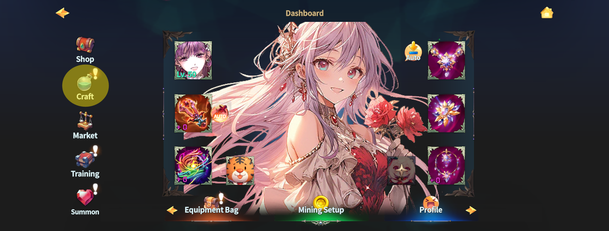
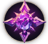
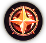
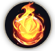
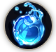
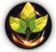
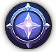

# 4️⃣ Elemental Bonus Damage



### 🌈 Elemental Bonus Damage

<figure><figcaption></figcaption></figure>

💡 All Heroes and Monsters in **EXTOCIUM** possess a single elemental attribute.\
Depending on elemental advantages and disadvantages,\
**additional damage may be applied during combat**.

***

#### ◾ Element Types

There are **7 elemental attributes** in total:

* Dark / Light / Stone / Water / Fire / Leaf / Force

Each element has its own **strengths and weaknesses against others**.\
Based on these relationships, **Elemental Bonus Damage (EBD)** is applied.

***

#### ◾ How to Check Elemental Information

* You can check a target’s element in the **Target Panel**.

<figure><figcaption></figcaption></figure>

* During combat,\
  an **arrow icon displayed above the target’s head** allows you to quickly identify\
  elemental advantages or disadvantages at a glance.

***

#### ◾ Arrow Icon Guide

* **Green Arrow&#x20;**<mark style="color:green;">**▲**</mark>\
  → You deal **12% additional damage** to the target.

<figure><figcaption></figcaption></figure>

* **Red Arrow&#x20;**<mark style="color:red;">**▼**</mark>\
  → The target deals **12% additional damage** to you.

<figure><figcaption></figcaption></figure>

💡 These arrows indicate the **elemental advantage or disadvantage** in the encounter.

***

#### ◾ How Elemental Bonus Damage Is Applied

Elemental Bonus Damage is applied as an **additional multiplier**\
to the **final damage calculated in the** [**Calculate Stats**](calculate-stats.md) **stage**.


#### Application Formula

> **Final Damage × (1 +&#x20;**<mark style="color:orange;">**n%**</mark>**)**

In other words,\
when you have an elemental advantage,\
an extra percentage bonus is multiplied onto your already calculated final damage.


🔹 [For detailed values, please refer to the table below.](elemental-bonus-damage.md#elemental-bonus-damage-table)

***

#### ◾ Elemental Bonus Damage From Equipment

Some equipment can grant **Elemental Bonus Damage** against specific elements as an option.

<figure><figcaption></figcaption></figure>


This effect increases damage dealt to enemies of the specified element by **n%**

For example, if your equipment grants **+8% against Light**,\
you will deal **8% additional damage** to Light-element enemies


***

✨ Understanding elements can dramatically change battle outcomes,\
even with the same stats.\
✨ Before entering combat, always check your target’s element.



### 🌈 Elemental Bonus Damage (속성 보너스 데미지)

<figure><figcaption></figcaption></figure>

💡 **EXTOCIUM의 모든 영웅과 몬스터는 하나의 속성을 가지고 있습니다.**\
속성 간의 상성에 따라, 전투 시 추가 데미지가 발생할 수 있습니다.

***

#### ◾ 속성 종류

속성은 총 **7가지**로 구성되어 있습니다.

* 어둠 / 빛 / 돌 / 물 / 불 / 잎 / 힘

각 속성은 서로 **강점과 약점 관계**를 가지고 있으며,\
이 상성에 따라 **속성 보너스 데미지(Elemental Bonus Damage)**&#xAC00; 적용됩니다.

***

#### ◾ 속성 정보 확인 방법

* 타겟의 속성은 **타겟 패널**에서 확인할 수 있습니다.

<figure><figcaption></figcaption></figure>

* 전투 중에는 타겟의 머리 위에 표시되는 **화살표 아이콘**을 통해\
  상성 관계를 직관적으로 확인할 수 있습니다.

***

#### ◾ 화살표 아이콘 안내

* **녹색 화살표&#x20;**<mark style="color:green;">**▲**</mark>\
  → 내가 해당 타겟에게 **12%의 추가 데미지**를 입힐 수 있다는 의미입니다.

<figure><figcaption></figcaption></figure>

* **붉은 화살표&#x20;**<mark style="color:red;">**▼**</mark>\
  → 해당 타겟이 나에게 **12%의 추가 데미지**를 입힐 수 있다는 의미입니다.

<figure><figcaption></figcaption></figure>

💡 화살표는 **속성 상성으로 인한 유불리 관계**를 나타냅니다.

***

#### ◾ 속성 보너스 피해 적용 방식

속성 보너스 피해는 [**Calculate Stats**](calculate-stats.md) 단계에서 계산된 최종 데미지에 추가 배율로 적용됩니다.


#### **적용 방식**

> **최종 데미지 × (1 +&#x20;**<mark style="color:orange;">**n%**</mark>**)**

즉, 속성 상성으로 유리한 경우 이미 계산된 최종 데미지에 추가 퍼센트 보너스가 곱해집니다


**🔹**[**더 자세한 정보는 아래 표를 참조해보세요.**](elemental-bonus-damage.md#elemental-bonus-damage-table)

***

#### ◾ 장비에 부여된 속성 보너스 **데미지**

일부 장비에는 특정 속성에 대한 **속성 보너스 데미지**가 옵션으로 부여될 수 있습니다.

<figure><figcaption></figcaption></figure>


장비에 붙은 속성 보너스 데미지는 **해당 속성의 적에게 n% 추가 데미지**를 입히는 효과입니다.

예를 들어, 장비에 '빛 속성'에 8%가 추가되었다면 빛 속성의 적에게 **8% 추가 데미지**를 입히게 됩니다.


***

✨ **속성을 이해하면, 같은 스탯이라도 전투 결과는 크게 달라집니다.**\
✨ **전투 전, 타겟의 속성을 꼭 확인해 보세요!**



### 🌈 属性ボーナスダメージ（Elemental Bonus Damage）

<figure><figcaption></figcaption></figure>

💡 **EXTOCIUM**に登場するすべてのヒーローとモンスターは、\
それぞれ **1つの属性** を持っています。\
属性の相性によって、戦闘中に **追加ダメージ** が発生する場合があります。

***

#### ◾ 属性の種類

属性は、全部で **7種類** 存在します。

* 闇 / 光 / 石 / 水 / 火 / 葉 / 力

各属性には、それぞれ有利・不利の関係があり、\
その相性に応じて **属性ボーナスダメージ（Elemental Bonus Damage）** が適用されます。

***

#### ◾ 属性情報の確認方法

* ターゲットの属性は、**ターゲットパネル**から確認できます。

<figure><figcaption></figcaption></figure>

* 戦闘中は、\
  ターゲットの頭上に表示される **矢印アイコン** によって、\
  属性の有利・不利を直感的に把握できます。

***

#### ◾ 矢印アイコンの説明

* **緑の矢印&#x20;**<mark style="color:green;">**▲**</mark>\
  → 対象に **12％の追加ダメージ** を与えられる状態です。

<figure><figcaption></figcaption></figure>

* **赤の矢印&#x20;**<mark style="color:red;">**▼**</mark>\
  → 対象から **12％の追加ダメージ** を受ける状態です。

<figure><figcaption></figcaption></figure>

💡 矢印は、属性相性による有利・不利を示しています。

***

#### ◾ 属性ボーナスダメージの適用方法

属性ボーナスダメージは、\
[**Calculate Stats**](calculate-stats.md) 段階で算出された **最終ダメージ** に対して、**追加倍率** として適用されます。


#### 適用方式

> **最終ダメージ × (1 +&#x20;**<mark style="color:orange;">**n%**</mark>**)**

つまり、属性相性で有利な場合、\
すでに計算された最終ダメージに 追加のパーセンテージボーナスが乗算されます。


**🔹**[詳細な数値については、下記の表をご参照ください。](elemental-bonus-damage.md#elemental-bonus-damage-table)

***

#### ◾ 装備に付与される属性ボーナスダメージ

一部の装備には、\
特定の属性に対する **属性ボーナスダメージ** が オプションとして付与される場合があります。

<figure><figcaption></figcaption></figure>


装備に付いた属性ボーナスダメージは、対応する属性の敵に **n％の追加ダメージ** を与える効果です。

例：装備に **「光属性に対して＋8％」** が付与されている場合、光属性の敵に **8％の追加ダメージ** を与えます。


***

✨ 属性を理解すれば、同じステータスでも戦闘結果は大きく変わります。\
✨ 戦闘前には、必ずターゲットの属性を確認しましょう。



<em>※ This guide was written based on the game status as of December 30, 2025,</em>  <em>and its contents may change with future updates.</em>

### ✅**Elemental Bonus Damage Table**

<table><thead><tr><th width="123" align="center">Hero</th><th width="130" align="center">Property</th><th width="153" align="center">Damage Bonus</th><th>Description</th></tr></thead><tbody><tr><td align="center">Aruru</td><td align="center"> dark</td><td align="center">stone, fire 돌, 불 石, 火</td><td>Adds +12% damage to Stone and Fire attributes 돌, 불 속성에 +12% 데미지 추가 石、火属性に+12% ダメージ追加</td></tr><tr><td align="center">Ishtar</td><td align="center"> light</td><td align="center">dark 어둠 闇</td><td>Adds +12% damage to Dark attributes 어둠 속성에 +12%데미지 추가 闇属性に+12%ダメージ追加</td></tr><tr><td align="center">Iskandar</td><td align="center"> fire</td><td align="center">leaf, stone 잎, 돌 葉, 石</td><td>Adds +12% damage to Leaf and Stone attributes 잎, 돌 속성에 +12%데미지 추가 葉、石属性に+12%ダメージ追加</td></tr><tr><td align="center">Tiamat</td><td align="center"> water</td><td align="center">fire, light 불, 빛 火, 光</td><td>Adds +12% damage to Fire and Light attributes 불, 빛 속성에 +12%데미지 추가 火、光属性に+12%ダメージ追加</td></tr><tr><td align="center">Aristo</td><td align="center"> stone</td><td align="center">water, leaf 물, 잎 水, 葉</td><td>Adds +12% damage to Water and Leaf attributes 물, 잎 속성에 +12%데미지 추가 水、葉属性に+12%ダメージ追加</td></tr><tr><td align="center">Tammuz</td><td align="center"> leaf</td><td align="center">light, water 빛, 물 光, 水</td><td>Adds +12% damage to Light and Water attributes 빛, 물 속성에 +12%데미지 추가 光、水属性に+12%ダメージ追加</td></tr><tr><td align="center">Elena</td><td align="center"> force</td><td align="center">-</td><td>                                   -</td></tr><tr><td align="center"><em>*Indra</em></td><td align="center"> fire</td><td align="center">leaf, stone 잎, 돌 葉, 石</td><td>Adds +12% damage to Leaf and Stone attributes 잎, 돌 속성에 +12%데미지 추가 葉、石属性に+12%ダメージ追加</td></tr><tr><td align="center"><em>*Nanna</em></td><td align="center"> water</td><td align="center">fire, light 불, 빛 火, 光</td><td>Adds +12% damage to Fire and Light attributes 불, 빛 속성에 +12%데미지 추가 火、光属性に+12%ダメージ追加</td></tr></tbody></table>

