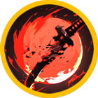
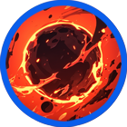
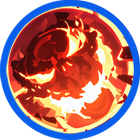
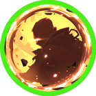

# 🌑 Asura

<table data-full-width="true"><thead><tr><th width="181.27276611328125" align="center">Skill</th><th width="123.0909423828125" align="center">Icon</th><th width="128.9091796875" align="center">Type</th><th>contents</th></tr></thead><tbody><tr><td align="center">수라난격 Asura Barrage 修羅乱撃</td><td align="center">

</td><td align="center"><mark style="color:yellow;">Melee</mark></td><td><strong>EN</strong> Multiple arms of Asura manifest and unleash a ruthless flurry of strikes at enemies in front. The attack penetrates a certain percentage of the target’s EVA to deal continuous damage and reduces the target’s healing received for a certain duration. 🔹 <strong>KR</strong> 아수라의 여러 개의 팔이 형상화되어 전방의 적에게 무자비한 연타를 날린다. 타겟의 EVA를 일정 비율 관통하여 연속된 피해를 입히고, 일정 시간동안 타겟의 힐량을 감소시킨다. 🔹 <strong>JP</strong> 阿修羅の複数の腕が具現化し、前方の敵に容赦ない連打を浴びせる。対象のEVAを一定割合貫通して連続ダメージを与え、一定時間のあいだ対象の回復量を減少させる。</td></tr><tr><td align="center">혈륜 Blood Wheel 血輪</td><td align="center"></td><td align="center"><mark style="color:blue;">Projectile</mark></td><td><strong>EN</strong> Launches a Blood Wheel at the enemy. The Blood Wheel spreads in a 360-degree direction, does not disappear easily, and bounces off walls. Each time a projectile bounces off a wall, its damage increases by n%. 🔹 <strong>KR</strong> 혈륜을 적에게 발사한다. 혈륜은 360도 방향으로 퍼지며, 쉽게 사라지지 않고 벽에 튕겨 나온다. 탄이 벽에 튕길 때 마다 데미지가 n%씩 증가한다. 🔹 <strong>JP</strong> 血輪を敵に向けて発射する。血輪は360度方向に広がり、簡単には消えず壁に跳ね返る。弾が壁に跳ね返るたびにダメージがn%ずつ増加する。</td></tr><tr><td align="center">아수라장 Asura Battlefield 修羅場</td><td align="center"></td><td align="center"><mark style="color:blue;">Projectile</mark></td><td><strong>EN</strong> Extends the hand of a hellish spirit to pull the enemy in front of you. The pulled target is briefly stunned. The first attack against the target deals additional damage while partially penetrating the target’s shield. 🔹 <strong>KR</strong> 지옥귀의 손을 뻗어 상대를 나의 앞으로 끌고 온다. 끌려 온 상대는 잠시 기절 상태가 된다. 타겟에 대한 첫 공격은, 대상의 실드를 일부 관통하면서 추가 데미지를 입힌다. 🔹 <strong>JP</strong> 地獄鬼の手を伸ばして相手を自分の前へ引き寄せる。引き寄せられた相手はしばらく気絶状態になる。対象への最初の攻撃は、相手のシールドを一部貫通しながら追加ダメージを与える。</td></tr><tr><td align="center">투신의 그림자 Shadow of the War God 闘神の影</td><td align="center"></td><td align="center"><mark style="color:green;">Buff</mark></td><td><strong>EN</strong> Conceals yourself within the dust and intense killing intent of the battlefield. Enter stealth for a certain duration and gain increased movement speed. The first attack after stealth deals additional damage. 🔹 <strong>KR</strong> 전장의 흙먼지와 짙은 살기 속으로 모습을 감춘다. 일정 시간 동안 은신 상태가 되며, 이동 속도가 증가한다. 은신 후 첫 공격은 추가 데미지를 입힌다. 🔹 <strong>JP</strong> 戦場の土煙と濃い殺気の中へ姿を隠す。一定時間ステルス状態となり、移動速度が増加する。ステルス後の最初の攻撃は追加ダメージを与える。</td></tr><tr><td align="center">수라강체 Asura Iron Body 修羅剛体</td><td align="center"></td><td align="center"><mark style="color:green;">Buff</mark></td><td><strong>EN</strong> The hardened body of the war god blocks upward attacks raining down from the sky and movement for a certain duration. Grants a small damage increase buff. 🔹 <strong>KR</strong> 투신의 단단한 육체가 하늘에서 쏟아지는 상방 공격과 이동을 일정 시간 동안 모두 막아낸다. 소량의 데미지 증가 버프 발생한다. 🔹 <strong>JP</strong> 闘神の強靭な肉体が、空から降り注ぐ上方攻撃と移動を一定時間すべて防ぐ。少量のダメージ増加バフが発生する。</td></tr></tbody></table>

<em>※ This guide was written based on the game status as of April 08, 2026,</em>  <em>and its contents may change with future updates.</em>

