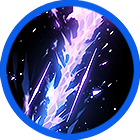
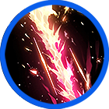
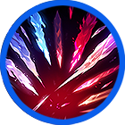
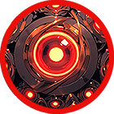
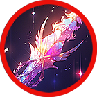

# ❤️‍🔥 Indra

### 

<table data-full-width="true"><thead><tr><th width="181" align="center">Skill</th><th width="135" align="center">Icon</th><th width="105">Type</th><th width="606">contents</th></tr></thead><tbody><tr><td align="center"> 푸른 번개 Blue Lightning</td><td align="center"></td><td>Projectile</td><td>
Fires a powerful blue lightning bolt at the enemy, dealing damage based on attack power. The lightning chains to up to 5 enemies, and damage increases by n% with each chain. Elemental bonus damage is increased. 

🔹 

강력한 푸른 번개를 적에게 발사하여 공격력 기반의 피해를 입힙니다. 번개는 범위 내 최대 5명의 적에게 전이되며, 체인될 때마다 데미지가 n%씩 증가합니다. 상성 부가 데미지가 증가합니다. 

🔹 

強力な青い雷を敵に発射し、攻撃力に基づいたダメージを与えます。雷は範囲内の最大5名の敵に連鎖し、連鎖するたびにダメージがn%増加します。属性に応じた追加ダメージが増加します。
</td></tr><tr><td align="center"> 붉은 번개 Red Lightning </td><td align="center"></td><td>Projectile</td><td>
Fires a powerful red lightning bolt at the enemy, dealing damage based on attack power. Enemies hit by the lightning are stunned. 

🔹 

강력한 붉은 번개를 적에게 발사하여 공격력 기반의 피해를 입힙니다. 번개를 맞은 적들은 스턴 상태가 됩니다. 

🔹 

強力な赤い雷を敵に発射し、攻撃力に基づいたダメージを与えます。雷に当たった敵はスタン状態になります。
</td></tr><tr><td align="center">
바즈라 난사

Vajra
</td><td align="center"></td><td>Projectile</td><td>
Fires numerous Vajras, dealing damage based on attack power. Elemental bonus damage is increased. 

🔹 

수많은 바즈라를 난사하여 공격력 기반의 피해를 입힙니다. 상성 부가 데미지가 증가합니다. 

🔹

 無数のヴァジュラを乱射し、攻撃力に基づいたダメージを与えます。属性に応じた追加ダメージが増加します。
</td></tr><tr><td align="center"> 33 </td><td align="center"></td><td>AoE</td><td>
Eyes of observation are placed around the area. Targets within range are pulled towards the eyes, taking continuous damage per tick based on attack power. 

🔹 

관찰의 눈이 사방에 배치되어 범위 내 타겟을 눈이 있는 곳으로 끌어당기며, 틱당 공격력 기반의 지속적인 피해를 입힙니다. 

🔹 

観察の目が四方に配置され、範囲内のターゲットを目のある場所に引き寄せ、攻撃力に基づいたティックごとの持続ダメージを与えます。
</td></tr><tr><td align="center">
Indradhanus 인드라다누스

</td><td align="center"></td><td>AoE</td><td>
Performs a quick jump attack, dealing damage to enemies based on attack power. 

🔹 

빠르게 점프하여 적을 공격하고, 공격력 기반의 피해를 입힙니다. 

🔹 

素早くジャンプして敵を攻撃し、攻撃力に基づいたダメージを与えます。
</td></tr></tbody></table>
