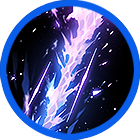
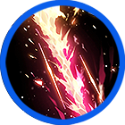
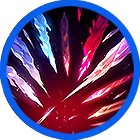
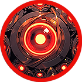
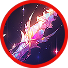

# ❤️‍🔥 Indra

<table data-full-width="true"><thead><tr><th width="157.66668701171875" align="center">Skill</th><th width="135" align="center">Icon</th><th width="105" valign="middle">Type</th><th width="549.3333740234375">contents</th></tr></thead><tbody><tr><td align="center"> 푸른 번개 Blue Lightning 青い稲妻</td><td align="center"></td><td valign="middle"><mark style="color:blue;">Projectile</mark></td><td>
<strong>EN</strong> Fires a powerful blue lightning bolt at the enemy with magic attack power. The lightning chains to up to n enemies within range, increasing its damage by n% with each chain. EBD+

🔹 

<strong>KR</strong> 강력한 푸른 번개를 마법 공격력으로 적에게 발사한다. 번개는 범위 내의 n명의 적에게 전이되며, 체인될 때마다 데미지가 n%씩 증가한다. EBD+

🔹 

<strong>JP</strong> 魔法攻撃力で強力な青い雷を敵に放つ。雷は範囲内の最大n体の敵に連鎖し、連鎖するたびにダメージがn%増加する。 EBD+
</td></tr><tr><td align="center"> 붉은 번개 Red Lightning 赤い稲妻</td><td align="center"></td><td valign="middle"><mark style="color:blue;">Projectile</mark></td><td>
<strong>EN</strong> Fires a powerful red lightning at the enemy with magic damage's attack power, and enemies hit by the lightning are stunned.

🔹 

<strong>KR</strong> 강력한 붉은 번개를 마법 공격력으로 적에게 발사한다. 번개를 맞은 적들은 스턴 상태가 된다.

🔹 

<strong>JP</strong> 魔法攻撃力で強力な赤い雷を敵に発射し, 命中した敵はスタン状態になる.
</td></tr><tr><td align="center">
바즈라 난사

Vajra バズラ乱射
</td><td align="center"></td><td valign="middle"><mark style="color:blue;">Projectile</mark></td><td>
<strong>EN</strong> Unleashes a barrage of Vajras with magic attack power, knocking the target back. This attack ignores a certain amount of the target's Shield and a certain amount of their EVA. EBD+

🔹 

<strong>KR</strong> 마법 공격력으로 수많은 바즈라가 난사되며, 대상이 넉백된다. 이 공격은 대상의 실드와 EVA를 일정량 무시한다. EBD+

🔹

 <strong>JP</strong> 魔法攻撃力で無数のヴァジュラを乱射し、対象をノックバックさせる。この攻撃は対象のシールドを一定量無視し、EVAを一定量無視する。 EBD+
</td></tr><tr><td align="center"> 33 </td><td align="center"></td><td valign="middle"><mark style="color:red;">AoE</mark></td><td>
<strong>EN</strong> Eyes of Observation are placed all around. Targets within range are pulled toward the eyes and continuously taking magic attack power per tick.

🔹 

<strong>KR</strong> 관찰의 눈이 사방에 배치된다. 범위 내 타겟은 눈이 있는 곳으로 끌어 당겨지며, 마법 피해를 지속적으로 입는다.

🔹 

<strong>JP</strong> 観察の目が四方に配置される.射程内のターゲットは目の位置に引き寄せられ, 魔法ダメージを連続して受ける.
</td></tr><tr><td align="center">
Indradhanus 인드라다누스 インドラダヌス

</td><td align="center"></td><td valign="middle"><mark style="color:red;">AoE</mark></td><td>
<strong>EN</strong> Jumps quickly and strikes downward with magic attack power, stunning the target.

🔹  <strong>KR</strong>

빠르게 점프하여 마법 공격력으로 적을 내리찍고, 대상을 스턴상태로 만든다.

🔹  <strong>JP</strong>

素早くジャンプして魔法攻撃力で敵を叩きつけ、スタン状態にする。
</td></tr></tbody></table>

<em>※ This guide was written based on the game status as of April 08, 2026,</em>  <em>and its contents may change with future updates.</em>

