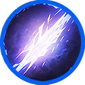

# 🌊 Nanna

### .png>)

<table data-full-width="true"><thead><tr><th width="151" align="center">Skill</th><th width="135" align="center">Icon</th><th>Type</th><th width="613">contents</th></tr></thead><tbody><tr><td align="center">
 신월

New moon 新月
</td><td align="center"></td><td><mark style="color:yellow;">Melee</mark></td><td>
<strong>EN</strong> Unleashes a crescent moon–shaped sword strike. Performs a piercing attack that ignores a certain amount of the target’s Shield, dealing physical damage. Enemies struck are stunned. EBD+

🔹 

<strong>KR</strong> 초승달을 닮은 검 공격을 가한다. 대상의 실드를 일정량 무시하는 관통 공격을 가해, 물리 피해를 입힌다. 피해를 입은 적은 스턴 상태가 된다. EBD+

🔹 

<strong>JP</strong> 三日月を思わせる剣撃を放つ。対象のシールドを一定量無視する貫通攻撃を行い、物理ダメージを与える。ダメージを受けた敵はスタン状態になる。 EBD+
</td></tr><tr><td align="center">
 만월

Full moon 満月 
</td><td align="center"></td><td><mark style="color:blue;">Projectile</mark></td><td>
<strong>EN</strong> Orbs of the full moon radiate in all directions. Delivers a piercing attack to enemies within range that ignores a certain amount of the target's EVA, deals magic damage, and knocks the target back. EBD+

🔹 

<strong>KR</strong> 사방으로 만월의 구가 뻗어 나간다. 범위 내 적에게 대상의 EVA를 일정량 무시하는 관통 공격을 가해, 마법 피해를 입히며, 대상을 넉백시킨다. EBD+

🔹 

<strong>JP</strong> 満月の球が四方へと広がる。範囲内の敵に、対象のEVAを一定量無視する貫通攻撃を放ち、魔法ダメージを与え、対象をノックバックさせる。 EBD+
</td></tr><tr><td align="center">
이클립스

eclipse エクリプス
</td><td align="center"></td><td><mark style="color:red;">AoE</mark></td><td>
<strong>EN</strong> Creates a shadow circle that deals magic damage to targets within range. Enemies hit have their Movement Speed reduced by a certain amount for a period of time, and are afflicted with a debuff that reduces Physical Magical Critical Damage by a certain amount.

🔹 

<strong>KR</strong> 그림자 원을 생성하여 범위 내의 타겟들에게 마법 피해를 입힌다. 피해를 입은 적들은 일정 시간 동안 이동 속도가 일정량 감소하며, 물리/마법 치명타 데미지가 일정량 감소하는 디버프에 걸린다.

🔹 

<strong>JP</strong> 影の円陣を生成し、範囲内の対象に魔法ダメージを与える。ダメージを受けた敵は一定時間、移動速度が一定量減少し、物理魔法クリティカルダメージが一定量減少するデバフにかかる。
</td></tr><tr><td align="center">
 만조

High tide 滿潮
</td><td align="center"></td><td><mark style="color:blue;">Projectile</mark></td><td>
<strong>EN</strong> Become a wave and charge toward the target, dealing magic damage and knocking them back.

🔹 

<strong>KR</strong> 파도가 되어 타겟을 향해 돌진하여 마법 피해를 입히고 대상을 넉백시킨다.

🔹

 <strong>JP</strong> 波となってターゲットに突進し、魔法ダメージを与えてノックバックさせる。
</td></tr><tr><td align="center">
달의 폭풍

lunar storm

月の嵐
</td><td align="center"></td><td><mark style="color:yellow;">Melee</mark></td><td>
<strong>EN</strong> Transform into a Moonstorm, sweeping through the surroundings while moving. Deals physical damage to enemies within range. During the skill, a shield is created that reduces incoming damage by a certain amount. Move at high speed. 🛡️ <mark style="color:green;"><strong>Using other shield buffs will apply a stacking debuff.</strong></mark>

🔹 

<strong>KR</strong> 달의 폭풍이 되어 주변을 휩쓸며 이동한다. 범위 내의 적들에게 물리 피해를 입힌다. 스킬 시전 중에는 받는 피해를 감소시키는 실드가 생성된다. 빠른 속도로 이동한다. 🛡️ <mark style="color:green;"><strong>다른 실드 버프 사용 시 중첩 디버프가 적용됩니다.</strong></mark>

🔹 

<strong>JP</strong> 月の嵐となり周囲を薙ぎ払いながら移動する.範囲内の敵に物理ダメージを与える.スキル詠唱中はダメージを一定量軽減するシールドが生成される.素早い速度で移動する. 🛡️ <mark style="color:green;"><strong>他のシールドバフを使用すると 重複デバフが適用されます。</strong></mark>
</td></tr></tbody></table>

<em>※ This guide was written based on the game status as of December 30, 2025,</em>  <em>and its contents may change with future updates.</em>

