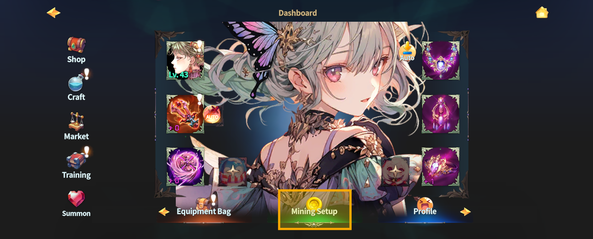
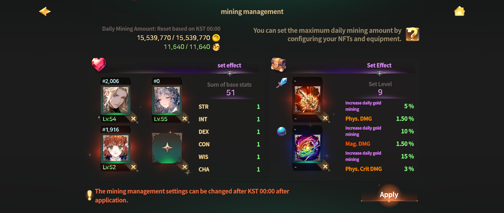
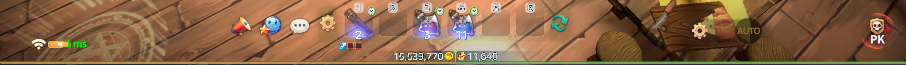

# ⛏️ Mining Settings



### ◾ Mining Setup

Mining Setup is a system designed to prevent inflation caused by multi-account bots producing excessive currency.\
By registering Hero NFTs and equipment in the Mining Setup slots,\
the maximum amount of mineable resources increases.

In other words,\
players who invest more in their equipment can mine a larger amount of resources.

***

#### ◾ Base Mining Limits

When an account is created, the following base mining limits apply.

* Daily mineable Gold: **10,000**
* Daily collectible gathering resources: **100**

These limits can be increased through the Mining Setup.

***

#### ◾ How to Access Mining Setup

Mining Setup can be accessed **using the methods below.**

* Tap the **\[Dashboard]** button at the top-left of the Main HUD.

<figure><figcaption></figcaption></figure>

* From the Dashboard, tap **\[Mining Setup]** to display the Mining Setup widget.

<figure><figcaption></figcaption></figure>

***

#### ◾ How to Set Up Mining

Once the Mining Setup widget is displayed,\
you can equip **Heroes, Weapons, and Orbs** into each slot.

Depending on the equipped Heroes and equipment,\
the maximum amount of mineable Gold and gathering resources increases.

<figure><figcaption></figcaption></figure>

***

#### ◾ Detailed Guides

* For more details on Hero Mining Setup, \
  please refer to the **\[**[**Hero Mining Setup Guide**](hero-nft-settings/)**]**.
* For more details on Equipment Mining Setup, \
  please refer to the **\[**[**Equipment Mining Setup Guide**](equipment-settings.md)**]**.

***

#### ◾ Mining Setup Change Limit

Mining Setup can be changed **once per day**.

* The change count resets daily at **00:00 (KST)**.
* For the USA server, the reset time is **00:00 (UTC)**.

***

#### ◾ Checking Mining Status

The remaining amount of mineable Gold and gathering resources\
for today can be checked **in real time** at the bottom of the Main HUD.

<figure><figcaption></figcaption></figure>




### ◾ 채굴 세팅

채굴 세팅은 다계정 봇이 무분별하게 재화를 생산하여 \
게임 내 **인플레이션이 발생하는 것을 방지하기 위해** 도입된 시스템입니다. \
영웅 NFT와 장비를 채굴 세팅 슬롯에 등록하면 **채굴 가능한 재화의 최대치가 증가**합니다.

즉,\
장비에 더 많은 투자를 한 유저일수록 더 많은 양의 재화를 채굴할 수 있습니다.

***

#### ◾ 기본 채굴 제한

계정 생성 시, 아래의 기본 채굴 제한이 적용됩니다.

* 일일 채굴 가능 골드: **10,000**
* 일일 채집 가능 채집물: **100**

채굴 세팅을 통해 해당 수치는 증가시킬 수 있습니다.

***

#### ◾ 채굴 세팅 접근 방법

채굴 세팅은 **아래 방법으로 접근할 수 있습니다.**

* 메인 HUD 좌측 상단의 **\[대시보드] 버튼**을 터치합니다.

<figure><figcaption></figcaption></figure>

* 대시보드에서 **\[채굴 세팅] 버튼**을 터치하면 채굴 세팅 위젯이 표시됩니다.

<figure><figcaption></figcaption></figure>

***

#### ◾ 채굴 세팅 방법

채굴 세팅 위젯이 표시되면, 각 슬롯에 **영웅, 무기, 오브**를 장착할 수 있습니다.\
장착된 영웅과 장비에 따라 채굴 가능한 **골드 및 채집물의 최대치가 증가**합니다.

<figure><figcaption></figcaption></figure>

***

#### ◾ 상세 가이드 안내

* 영웅 채굴 세팅에 대한 자세한 내용은 **\[**[**영웅 채굴 세팅 가이드**](hero-nft-settings/)**]**&#xB97C; 참고해 주세요.
* 장비 채굴 세팅에 대한 자세한 내용은 **\[**[**장비 채굴 세팅 가이드**](equipment-settings.md)**]**&#xB97C; 참고해 주세요.

***

#### ◾ 채굴 세팅 변경 제한

채굴 세팅은 **하루 1회만 변경**할 수 있습니다.

* 변경 횟수는 **한국 시간 기준 매일 00:00**에 초기화됩니다.
* (USA 서버 기준: **UTC 00:00**)

***

#### ◾ 채굴 현황 확인

오늘 채굴 가능한 **골드 및 채집물의 잔여량**은 메인 HUD 하단에서 **실시간으로 확인**할 수 있습니다.

<figure><figcaption></figcaption></figure>




### ◾ 採掘設定

採掘設定は、複数アカウントのボットによる過剰な資源生成を防ぎ、\
ゲーム内インフレーションを抑制するために導入されたシステムです。

ヒーローNFTや装備を 採掘設定スロットに登録すると、採掘可能な資源の最大量が増加します。

つまり、\
装備により多く投資したプレイヤーほど、より多くの資源を採掘できます。

***

#### ◾ 基本採掘制限

アカウント作成時、以下の基本採掘制限が適用されます。

* 1日の採掘可能ゴールド量: **10,000**
* 1日の採集可能素材量: **100**

採掘設定を行うことで、これらの数値を増加させることができます。

***

#### ◾ 採掘設定へのアクセス方法

採掘設定は、**以下の方法でアクセスできます。**

* メインHUD左上&#x306E;**［ダッシュボード］** ボタンをタップします。

<figure><figcaption></figcaption></figure>

* ダッシュボード内&#x306E;**［採掘設定］** をタップすると、採掘設定ウィジェットが表示されます。

<figure><figcaption></figcaption></figure>

***

#### ◾ 採掘設定方法

採掘設定ウィジェットが表示されると、各スロットに **ヒーロー・武器・オーブ** を装備できます。\
装備したヒーローや装備に応じて、採掘可能なゴールドおよび採集素材の最大量が増加します。

<figure><figcaption></figcaption></figure>

***

#### ◾ 詳細ガイド案内

* ヒーロー採掘設定の詳細については、**［**[**ヒーロー採掘設定ガイド**](hero-nft-settings/)**］** をご確認ください。
* 装備採掘設定の詳細については、**［**[**装備採掘設定ガイド**](equipment-settings.md)**］** をご確認ください。

***

#### ◾ 採掘設定の変更制限

採掘設定は **1日1回のみ変更可能**です。

* 変更回数は **毎日 00:00（KR）** にリセットされます。
* （USAサーバー基準：**UTC 00:00**）

***

#### ◾ 採掘状況の確認

本日採掘可能な ゴールドおよび採集素材の残量は、\
メインHUD下部で **リアルタイムに確認**できます。

<figure><figcaption></figcaption></figure>



<em>※ This guide was written based on the game status as of January 6, 2026,</em>  <em>and its contents may change with future updates.</em>

