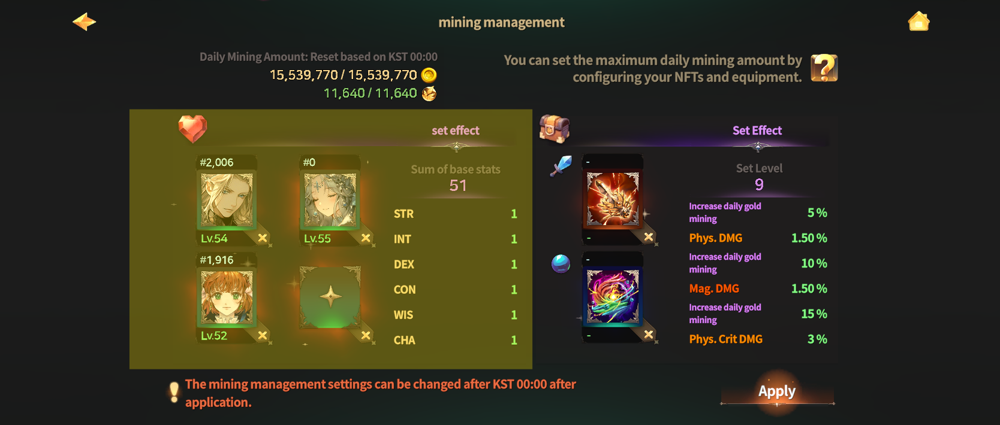

# 🤠 Hero NFT Settings



### ◾ Hero Mining Setup

You can increase your daily mining output by registering **Hero NFTs** in the Mining Setup.

<figure><figcaption></figcaption></figure>

***

#### ◾ Basic Rules for Hero Setup

* You can register up to **4 Hero NFTs** in the Mining Setup.
* Heroes registered in the Mining Setup\
  are **used only for setup calculations**\
  and are **not related to direct hero usage or combat participation**.
* Daily mining output is determined by\
  the Hero’s **base stats and level**.

❓ [Check Daily Gold Mining Amount](gold-mining-quantity.md)\
❓ [Check Daily Gathering Resource Amount](gathering-yield.md)

***

#### ◾ Set Effects

Set Effects are applied based on the **total sum of base stats**\
of the Hero NFTs registered in the Mining Setup slots.

Set Effects are calculated according to the following rules:


**Primary stat additional calculation:** Final primary stat value + n + n2 + n3...

**Secondary stat additional calculation:** Final secondary stat value \* (1 + (n% + n2% + n3%...))


Detailed Set Effect values can be checked in the table below:\
\
**Hero Base Stat Total Effect Table**.

| Total Base Stats | Effect                                    |
| ---------------- | ----------------------------------------- |
| 18               | STR +1                                    |
| 21               | INT +1                                    |
| 30               | DEX +1                                    |
| 40               | CON +1                                    |
| 45               | WIS +1                                    |
| 50               | CHA +1                                    |
| 60               | STR +1                                    |
| 63               | INT +1                                    |
| 65               | DEX +1                                    |
| 68               | CON +1                                    |
| 72               | WIS +1                                    |
| 76               | CHA +1                                    |
| 80               | DEX +3                                    |
| 81               | WIS +3                                    |
| 82               | EVA <mark style="color:blue;">\*5%</mark> |
| 83               | CHA +3                                    |
| 84               | CON +8                                    |



### ◾ 영웅 채굴 세팅

영웅 NFT를 채굴 세팅에 등록하여 **일일 채굴량을 증가**시킬 수 있습니다.

<figure><figcaption></figcaption></figure>

***

#### ◾ 영웅 세팅 기본 룰

* 채굴 세팅에 등록할 수 있는 **영웅 NFT는 최대 4개**입니다.
* 채굴 세팅에 등록된 영웅은 **세팅 정보에만 사용되며**,\
  영웅을 직접 사용하거나 **전투에 참여하는 것과는 무관합니다.**
* 일일채굴량은 영웅의 **베이스 스탯과 레벨**에 따라 결정됩니다.
  * ❓[일일골드 채굴량 확인하기](gold-mining-quantity.md)
  * ❓[일일 채집물 채집량 확인하기](gathering-yield.md)

***

#### ◾ 세트 효과

채굴 세팅 슬롯에 등록된 영웅 NFT가 보유한 **베이스 스탯의 총 합산**에 따라 **세트 효과**가 적용됩니다.

세트 효과는 아래 기준에 따라 계산됩니다.


**1차 스탯 추가 계산 :** 최종1차 스탯 값 + n + n2 + n3 ...

**2차 스탯 추가 계산 :** 최종 2차 스탯 값 \* ( 1 + ( n% + n2% + n3%...) )


세트 효과에 따른 구체적인 수치는 아래의 **영웅 베이스 스탯 합산별 효과 표**를 통해 확인할 수 있습니다.

| Total Base Stats | Effect                                    |
| ---------------- | ----------------------------------------- |
| 18               | STR +1                                    |
| 21               | INT +1                                    |
| 30               | DEX +1                                    |
| 40               | CON +1                                    |
| 45               | WIS +1                                    |
| 50               | CHA +1                                    |
| 60               | STR +1                                    |
| 63               | INT +1                                    |
| 65               | DEX +1                                    |
| 68               | CON +1                                    |
| 72               | WIS +1                                    |
| 76               | CHA +1                                    |
| 80               | EVA <mark style="color:blue;">\*5%</mark> |
| 81               | WIS +3                                    |
| 82               | DEX +3                                    |
| 83               | CHA +3                                    |
| 84               | CON +8                                    |



### ◾ ヒーロー採掘設定

ヒーローNFTを採掘設定に登録することで、1日の採掘量を増加させることができます。

<figure><figcaption></figcaption></figure>

***

#### ◾ ヒーロー設定の基本ルール

* 採掘設定に登録できる ヒーローNFTは **最大4体**です。
* 採掘設定に登録されたヒーローは **設定情報としてのみ使用**され、\
  ヒーローを直接使用したり、**戦闘に参加することとは無関係**です。
* 1日の採掘量は、ヒーローの**ベースステータスとレベル**に基づいて決定されます。
  * ❓ [1日のゴールド採掘量を確認](gold-mining-quantity.md)
  * ❓ [1日の採集素材量を確認](gathering-yield.md)

***

#### ◾ セット効果

採掘設定スロットに登録された ヒーローNFTが保有する **ベースステータスの総合計**に応じて\
セット効果が適用されます。

セット効果は、以下の基準で計算されます。


**1次ステータス追加計算：**&#x6700;終1次ステータス値 + n + n2 + n3...

**2次ステータス追加計算：**&#x6700;終2次ステータス値 \* (1 + (n% + n2% + n3%...))


セット効果の詳細な数値は、下記の **ヒーローベースステータス合算別効果表** をご確認ください。

| Total Base Stats | Effect                                    |
| ---------------- | ----------------------------------------- |
| 18               | STR +1                                    |
| 21               | INT +1                                    |
| 30               | DEX +1                                    |
| 40               | CON +1                                    |
| 45               | WIS +1                                    |
| 50               | CHA +1                                    |
| 60               | STR +1                                    |
| 63               | INT +1                                    |
| 65               | DEX +1                                    |
| 68               | CON +1                                    |
| 72               | WIS +1                                    |
| 76               | CHA +1                                    |
| 80               | EVA <mark style="color:blue;">\*5%</mark> |
| 81               | WIS +3                                    |
| 82               | DEX +3                                    |
| 83               | CHA +3                                    |
| 84               | CON +8                                    |



<em>※ This guide was written based on the game status as of January 6, 2026,</em>  <em>and its contents may change with future updates.</em>

