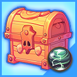

# 🗃️ Random Box Info

### <mark style="color:purple;">**📜Header List**</mark>

* 🍯[General Material Random Box Lv.1](random-box-info.md#general-material-random-box-lv.1)
* 🍯[General Material Random Box Lv.2](random-box-info.md#general-material-random-box-lv.2)
* 🍯[General Material Random Box Lv.3](random-box-info.md#general-material-random-box-lv.3)
* 🍯[General Material Random Box Lv.4](random-box-info.md#general-material-random-box-lv.4)

***

* 🌷[Potion Material Random Box](random-box-info.md#potion-material-random-box)
* 🌷[Special Material Random Box](random-box-info.md#special-material-random-box)
* 🌷[Raid Material Random Box](random-box-info.md#raid-material-random-box)
* 🌷[Dungeon Material Random Box](random-box-info.md#dungeon-material-random-box)
* 🌷[Arena Material Random Box](random-box-info.md#arena-material-random-box)

## 🍯General Material Random Box Lv.1

<figure><figcaption></figcaption></figure>

💡You can create this material box in the Craft > Scroll tab.

💡제작 > 주문서 탭에서 이 재료 박스를 제작할 수 있습니다.

💡この材料ボックスは、「クラフト > スクロール」タブで作成できます。

|  **Item**  |  **min** |  **max** |  **prob** |
| ---------- | -------- | -------- | --------- |
| Acorn      | 30       | 40       | 10        |
| Walnut     | 30       | 40       | 10        |
| Nuts       | 30       | 40       | 10        |
| Pork belly | 30       | 40       | 10        |
| Bark       | 30       | 40       | 10        |
| Bamboo     | 30       | 40       | 10        |
| Fur ball   | 30       | 40       | 10        |
| Milk       | 30       | 40       | 10        |
| Leather    | 30       | 40       | 10        |
| Flint      | 30       | 40       | 10        |

## 🍯General Material Random Box Lv.2

<figure><figcaption></figcaption></figure>

💡You can create this material box in the Craft > Scroll tab.

💡제작 > 주문서 탭에서 이 재료 박스를 제작할 수 있습니다.

💡この材料ボックスは、「クラフト > スクロール」タブで作成できます。

|  **Item**        |  **min** |  **max** |  **prob** |
| ---------------- | -------- | -------- | --------- |
| Lizard's tail    | 30       | 40       | 10        |
| Jelly            | 30       | 40       | 10        |
| Magic bead       | 30       | 40       | 10        |
| Rubber           | 30       | 40       | 10        |
| Scrap metal      | 30       | 40       | 10        |
| Spider venom     | 30       | 40       | 10        |
| Mud              | 30       | 40       | 10        |
| Hard bone        | 30       | 40       | 10        |
| Piece of copper  | 30       | 40       | 10        |
| Piece of jewelry | 30       | 40       | 10        |

## 🍯General Material Random Box Lv.3

<figure><figcaption></figcaption></figure>

💡You can create this material box in the Craft > Scroll tab.

💡제작 > 주문서 탭에서 이 재료 박스를 제작할 수 있습니다.

💡この材料ボックスは、「クラフト > スクロール」タブで作成できます。

|  **Item**          |  **min** |  **max** |  **prob** |
| ------------------ | -------- | -------- | --------- |
| Sand               | 20       | 40       | 10        |
| Powder of blessing | 20       | 40       | 10        |
| Snow White         | 20       | 40       | 10        |
| Ammonite           | 20       | 40       | 10        |
| Cotton wool        | 20       | 40       | 10        |
| Fur                | 20       | 40       | 10        |
| Mineral            | 20       | 40       | 10        |
| Black feather      | 20       | 40       | 10        |
| Goblin Club        | 20       | 40       | 10        |
| Heart of Ghoul     | 20       | 40       | 10        |

## 🍯General Material Random Box Lv.4

<figure><figcaption></figcaption></figure>

💡You can create this material box in the Craft > Scroll tab.

💡제작 > 주문서 탭에서 이 재료 박스를 제작할 수 있습니다.

💡この材料ボックスは、「クラフト > スクロール」タブで作成できます。

|  **Item**        |  **min** |  **max** |  **prob** |
| ---------------- | -------- | -------- | --------- |
| Blue Statue      | 20       | 30       | 10        |
| Mutated Mushroom | 20       | 30       | 10        |
| Eye of Ghoul     | 20       | 30       | 10        |
| Purple Slime     | 20       | 30       | 10        |
| Sharp Thorn      | 20       | 30       | 10        |
| Gilded Fishbone  | 20       | 30       | 10        |
| Mutated Leaf     | 20       | 30       | 10        |
| Soul Bubble      | 20       | 30       | 5         |
| Sharit's Tooth   | 20       | 30       | 5         |
| Sharit's Claw    | 20       | 30       | 5         |
| Ziz's Scale      | 20       | 30       | 5         |
| Ziz's Tear       | 20       | 30       | 5         |
| Water Crystal    | 20       | 30       | 5         |

***

## 🌷Potion Material Random Box

<figure><figcaption></figcaption></figure>

💡You can obtain it through the [XTO Holding Service](../xto-token/xto-holding-service/) rewards.

💡[XTO 홀딩 서비스](../xto-token/xto-holding-service/) 보상을 통해 획득할 수 있습니다.

💡[XTOホールディングサービス](../xto-token/xto-holding-service/)の報酬を通じて入手できます。

|  **Item**              |  **min** |  **max** |  **prob** |
| ---------------------- | -------- | -------- | --------- |
| Healing essence        | 40       | 100      | 15        |
| Magic essence          | 40       | 100      | 15        |
| Snow White             | 40       | 100      | 10        |
| Powder of blessing     | 40       | 100      | 10        |
| Neutralizing agent     | 40       | 100      | 20        |
| Cedar wood             | 40       | 100      | 5         |
| Artifact Fragment      | 40       | 100      | 5         |
| Pork belly             | 40       | 100      | 5         |
| Advanced HP potion     | 40       | 100      | 5         |
| Advanced MP potion     | 40       | 100      | 5         |
| Summons HP Potion Lv.3 | 40       | 100      | 5         |

## 🌷Special Material Random Box

<figure><figcaption></figcaption></figure>

💡You can obtain it through the [XTO Holding Service](../xto-token/xto-holding-service/) rewards.

💡[XTO 홀딩 서비스](../xto-token/xto-holding-service/) 보상을 통해 획득할 수 있습니다.

💡[XTOホールディングサービス](../xto-token/xto-holding-service/)の報酬を通じて入手できます。

|  **Item**               |  **min**  |  **max**  |  **prob**  |
| ----------------------- | --------- | --------- | ---------- |
| Extocium Fragment       | 1         | 3         | 15         |
| Extocium                | 1         | 3         | 10         |
| Broken Power            | 10        | 20        | 14.2       |
| Mystic stone            | 1         | 1         | 0.3        |
| Crystal of destruction  | 1         | 5         | 18         |
| Crystal of courage      | 1         | 5         | 18         |
| Lucky core              | 1         | 5         | 10         |
| Core of protection      | 1         | 5         | 10         |
| God's Breath            | 1         | 1         | 0.1        |
| Legendary Scroll        | 1         | 1         | 0.1        |
| Legendary Elixir        | 1         | 1         | 0.1        |
| Equipment Trading Shard | 1         | 1         | 2          |
| Item Trading Shard      | 1         | 1         | 2          |

## 🌷Raid Material Random Box

<figure><figcaption></figcaption></figure>

💡You can create this material box in the Craft > Scroll tab.\
💡You can obtain it through the [XTO Holding Service](../xto-token/xto-holding-service/) rewards.

💡제작 > 주문서 탭에서 이 재료 박스를 제작할 수 있습니다.\
💡[XTO 홀딩 서비스](../xto-token/xto-holding-service/) 보상을 통해 획득할 수 있습니다.

💡この材料ボックスは、「クラフト > スクロール」タブで作成できます。\
💡[XTOホールディングサービス](../xto-token/xto-holding-service/)の報酬を通じて入手できます。

|  **Item**              |  **min**  |  **max**  |  **prob**  |
| ---------------------- | --------- | --------- | ---------- |
| Evil crystal           | 3         | 8         | 10         |
| Poison crystal         | 2         | 4         | 8          |
| Crystal of wrath       | 2         | 4         | 8          |
| Curse crystal          | 2         | 4         | 8          |
| Rock crystal           | 2         | 4         | 8          |
| Monster mushroom       | 2         | 4         | 7          |
| Freshly caught octopus | 2         | 4         | 7          |
| Cursed medicine        | 2         | 4         | 7          |
| Humbaba's rice balls   | 2         | 4         | 7          |
| Wealth crystal         | 2         | 4         | 8          |
| Lobster                | 2         | 4         | 7          |
| Primordial Crystal     | 2         | 4         | 7          |
| Spicy pepper           | 2         | 4         | 4          |
| Hell's Crystal         | 2         | 4         | 2          |
| Leviathan Meat         | 2         | 4         | 2          |

## 🌷Dungeon Material Random Box

<figure><figcaption></figcaption></figure>

💡You can create this material box in the Craft > Scroll tab.\
💡You can obtain it through the [XTO Holding Service](../xto-token/xto-holding-service/) rewards.

💡제작 > 주문서 탭에서 이 재료 박스를 제작할 수 있습니다.\
💡[XTO 홀딩 서비스](../xto-token/xto-holding-service/) 보상을 통해 획득할 수 있습니다.

💡この材料ボックスは、「クラフト > スクロール」タブで作成できます。\
💡[XTOホールディングサービス](../xto-token/xto-holding-service/)の報酬を通じて入手できます。

|  **Item**                      |  **min**  |  **max**  |  **prob**  |
| ------------------------------ | --------- | --------- | ---------- |
| Amber gemstone                 | 5         | 10        | 13.5       |
| Piece of blood                 | 5         | 10        | 13.5       |
| Piece of soul                  | 5         | 10        | 13.5       |
| Lightning orb                  | 1         | 1         | 5.5        |
| Hexagonal Gem frame            | 1         | 5         | 13.5       |
| Square Gem frame               | 1         | 5         | 13         |
| Pentagram Gem frame            | 1         | 5         | 13         |
| Round Gem frame                | 1         | 5         | 13         |
| Lv.30 Sanjiba 1 hour \[Solo]   | 1         | 1         | 0.5        |
| Lv.40 Kalasutra 1 hour \[Solo] | 1         | 1         | 0.5        |
| Lv.50 Samgata 1 hour \[Solo]   | 1         | 1         | 0.5        |

## 🌷Arena Material Random Box

<figure><figcaption></figcaption></figure>

💡You can obtain it through the [XTO Holding Service](../xto-token/xto-holding-service/) rewards.

💡[XTO 홀딩 서비스](../xto-token/xto-holding-service/) 보상을 통해 획득할 수 있습니다.

💡[XTOホールディングサービス](../xto-token/xto-holding-service/)の報酬を通じて入手できます。

|  **Item**                   |  **min**  |  **max**  |  **prob**  |
| --------------------------- | --------- | --------- | ---------- |
| Arena seal                  | 1         | 3         | 23         |
| Arena Coin                  | 1         | 3         | 23         |
| Ancient arena seal          | 1         | 1         | 10         |
| Lemon juice                 | 1         | 1         | 20         |
| Pen of Oblivion             | 1         | 1         | 20.5       |
| Crystal of Patience         | 1         | 1         | 0.3        |
| Resurrection Feather        | 1         | 1         | 1          |
| Starcandy                   | 1         | 1         | 0.1        |
| Book of Oblivion            | 1         | 1         | 0.1        |
| PK Shield Fragment          | 1         | 1         | 1          |
| Town Return Scroll Fragment | 1         | 1         | 1          |
