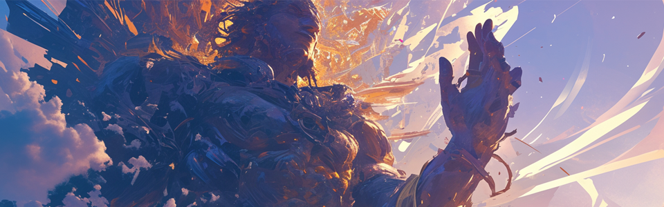
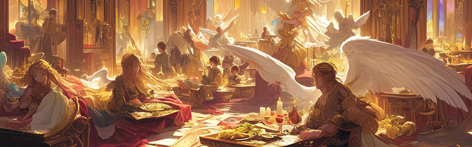
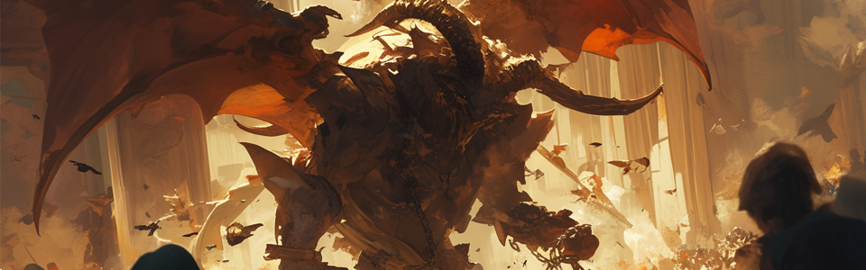
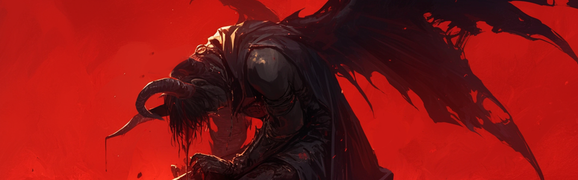
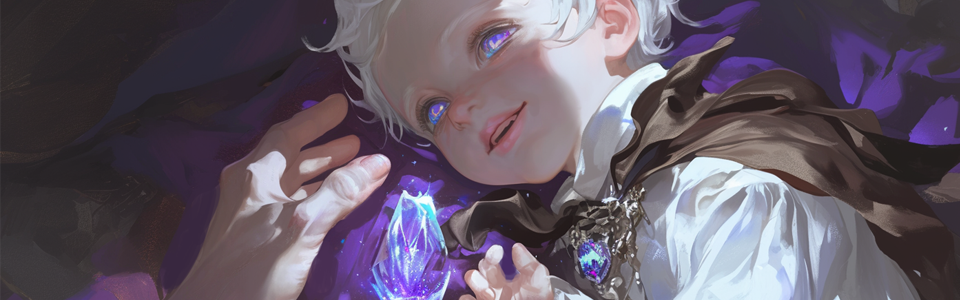
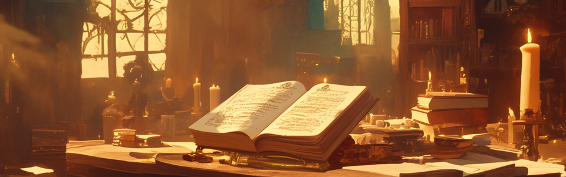

# 📘 Legend of EXTOCIUM





<figure><figcaption></figcaption></figure>

In a legend, there was an empire called 'EXTOCIUM,' known as the Land of the Gods. \
The gods there received their power from the explosion of the primordial star.\
\
The power of the exploding star was so enormous that the gods found it difficult to control the overflowing strength.\
\
They shared their own power and stored it in a mineral called 'Extocium' to use. \
The power of this divine mineral was so immense that Extocium soon became not only their empire but also their everything.\
\
The gods were strong, young and fearless, \
so they expanded their territory without hesitation, making all sorts of creatures and monsters kneel beneath the might of Extocium.

<figure><figcaption></figcaption></figure>

The empire is flourishing, and the warehouses overflowed with Extocium. \
The gods, no longer needing to conquer, indulged in luxury and pleasure.\
\
They no longer needed swords and shields, but wine and perfumes were sold at high prices. \
Some of the gods, for the sake of gold and silver jewellery and costly delicacies, \
even sold the Extocium, containing the power of the gods, to the earthly monsters at a dirtcheap price.\
\
There were gods who were against luxury and pleasure, \
All of them were exiled and lived in seclusion in the imperial court.\
\
Among those who were exiled, there was one who is often spoken of. \
He wore the wings of a dragon, had a large protruding spine, and horns of a goat on his head, making his appearance alone terrifying, it is said.  \
When he was exiled and driven out of Extocium, he reportedly shouted these words towards the crowd.

<figure><figcaption></figcaption></figure>

**"I will return to restore Extocium for its former glory.** \
**In the year of my return, this place will be stained with blood and vomit flames.** \
**You are the immortal gods, but you will finally die,** \
**and in your next life you will be reborn as mere trifles, yearning for Extocium."**\

Meanwhile, the monsters driven away from the earth to the sea by the might of the gods, had sharpened their blades of revenge. \
They gathered on the small islands and islets of the sea and quietly grew their forces.\
\
The Empire of Extocium buys all kinds of delicacies at a high price, so the sea monsters have divided themselves into earthly species to trade their seafood for Extocium. \
For centuries, these monsters focused on studying the power embedded in Extocium.

<figure><figcaption></figcaption></figure>

Finally, the peace of the Empire, which seemed to last forever, \
was shattered one day by an invading army of monsters from the sea.\
\
The gods were about to join the war, but there was no Extocium in the warehouse. \
Across the vast empire's territories, there was so little Extocium left. \
The gods had invested too much power into the mineral, and without Extocium, they became beings weaker than monsters.\
\
And so the Empire of Extocium, the land of the gods, was stained with blood and engulfed in flames. According to legend, a man with horns and dragon wings commanded an army of monsters on that warfield. In those two eyes, sorrow and madness shone, he trampled down everything on the earth and severed the threads of life.

<figure><figcaption></figcaption></figure>

Upon the ruins of the land, where black ashes scattered, both the Holy Empire and the monsters were pierced by the sting of bloodshed and met their end. The Legionnaire of Madness is said to have sealed himself away, weeping alone over the land.\
\
The Extociums that the monsters used are scattered all around, hidden on land and in the sea.\
\
Thousands of years passed, and flowers bloomed on the earth again, and a warm breeze blew.\
\
A race of minor creatures, called humans, lived in villages, farmed, and prospered. Some of the humans loved pretty, shiny things, so they collected stones of all kinds.

<figure><figcaption></figcaption></figure>

There was a pretty purple stone with a unique pattern among the others. \
When it was given as a gift to a child in a certain house, the stone cast a magic.\
\
The astonished humans, searching through records and legends, \
discovered that the purple stone was Extocium. \
And so, began their endless journey to find this mysterious power of Extocium.

<figure><figcaption></figcaption></figure>

At the very last page of the ancient book where legends were recorded, there was a small inscription of the phrase that appeared throughout the book.\
\
&#xNAN;**"I will return to restore Extocium for its former glory.** \
**In the year of my return, this place will be stained with blood and vomit flames.** \
**You are the immortal gods, but you will finally die,** \
**and in your next life you will be reborn as mere trifles, yearning for Extocium."**



<figure><figcaption></figcaption></figure>

전설에, 신들의 나라라 불리웠던 ‘엑스토시움’이라는 제국이 있었다. \
그 곳의 신들은 태초의 별이 폭발하여 태어난 힘을 받았다.\
\
별이 폭발한 힘은 너무나도 거대해서, 신들은 넘쳐 나는 힘을 주체하기가 힘들었다.\
\
그들은 그들 스스로의 힘을 나누어 ‘엑스토시움’ 이라는 광물에 저장하여 사용했다. \
신의 힘이 깃든 광물의 위력은 대단했기에, 엑스토시움이 곧 제국이자, 그들의 전부였다 한다.\
\
신들은 강하고 젊어 두려울 것이 없었기에, \
거침없이 영토를 확장하고 온갖 생물과 마물들을 엑스토시움의 발 아래 무릎 꿇게 하였다.

<figure><figcaption></figcaption></figure>

제국은 번성하고, 창고에 엑스토시움은 넘쳐흘러, \
더 이상 정복이 필요 없는 신들은 사치와 향락에 빠졌다.\
\
그들에게 창과 방패는 필요 없어지고 와인과 향유가 비싼 값에 팔려나갔다. \
신들 중 어떤 이는 금은 보석과 값비싼 산해진미를 위해서라면,\
지상의 마물들에게 신의 힘이 깃든 엑스토시움 마저도 헐값에 팔아치웠다.

<figure><figcaption></figcaption></figure>

사치와 향락을 반대하는 신들도 더러 있었는데, \
그들 모두는 제국의 법정에서 유배형을 받아 쓸쓸히 자취를 감추었다.\
\
유배를 받은 자들 중, 종종 화자되는 이가 있었다. \
그는 용의 날개를 달고, 커다랗게 돋아난 척추뼈와, 머리에는 염소의 뿔을 달고 있어 그 생김새만으로도 공포스러웠다 전해진다. \
그가 유배형을 받아 엑스토시움에서 쫓겨날 때 군중들을 향해 이렇게 외쳤다 한다.

<figure><figcaption></figcaption></figure>

**“나는 엑스토시움의 영광을 되찾으러 돌아올 것이다.**\
**내가 돌아오는 그 해에 이 곳은 피로 물들고 화염을 토할 것이다.**\
**너희는 죽지 않는 신들이나 비로소 죽게 될 것이니,**\
**다음 생에 한낱 번뇌하는 미물로 태어나 엑스토시움을 열망하게 될지어다.”**\
\
한편, 신들의 강성함에 지상에서 쫓겨나 바다로 떠났던 마물들은 복수의 칼날을 갈았다. \
그들은 바다의 작은 섬과 섬들에 모여들어 조용히 세력을 키워갔다.\
\
엑스토시움 제국에서는 산해진미를 비싼 값에 사들였기에, 바다의 마물들은 지상의 종족으로 분하여 산해진미를 바치고 엑스토시움을 받아왔다. \
마물들은 수백년의 시간을 엑스토시움에 깃든 힘을 사용하는 연구에 몰두하였다.

<figure><figcaption></figcaption></figure>

마침내 영원할 것 같았던 제국의 평화는, \
어느 날 바다에서 쳐들어온 마물의 군대로 인해 모조리 짓밟혔다.\
\
신들은 전쟁에 나서려 했으나 창고에 엑스토시움이 없었다. \
드넓은 제국 영토 어디에도, 남아있는 엑스토시움은 너무도 적었다. \
신들은 너무 많은 힘을 광물에 주입한 바람에, 엑스토시움 없이는 마물보다 못한 존재가 되었다.\
\
그렇게 신들의 나라, 엑스토시움 제국은 피로 물들고 화염으로 뒤덮혔다. \
\
전설에는 그 전쟁터에 뿔이 돋아나고 용의 날개를 가진 이가 마물의 군대를 지휘하였다 한다. \
그 두 눈에는 슬픔과 광기가 서려, 지상의 모든 것을 짓밟고 생명의 끈을 잘라버렸다.

<figure><figcaption></figcaption></figure>

폐허가 된 땅 위에는 검은 재만 날리고, 신도 제국도 마물도 모두 피의 꼬챙이에 찔려 죽었다. \
광기의 군단장은 그 땅 위에 홀로 엉엉 울며 스스로를 봉인했다 한다.\
\
마물들이 사용했던 엑스토시움들은 지상과 바다 이곳 저곳에 흩어져 존재를 감추었다.\
\
수천년이 지나 땅 위에 다시 꽃이 피고 훈풍이 불었다.\
\
미물중의 미물이라 불리우는 인간이라 하는 종족들은 마을을 이루고 농사를 지으며 번영하였다. 인간들 중에는 예쁘고 반짝이는 것을 좋아하여, 이런 저런 돌멩이를 수집하는 이들이 있었다.

<figure><figcaption></figcaption></figure>

개중에 특이한 문양이 새겨진 예쁜 보라빛 돌멩이가 있었는데, \
어떤 집의 자식에게 선물하니 그 돌멩이가 마법을 부렸다.\
\
놀란 인간들은 기록과 전설을 뒤져, 그 보라색 돌멩이가 엑스토시움임을 알아냈다. \
그리하여 인간들은 이 미지의 힘을 지닌 엑스토시움을 찾아, 끝없는 여정을 시작하게 된다.

<figure><figcaption></figcaption></figure>

전설이 기록됐던 고서의 맨 끝 페이지에는 책 중에 나오는 글귀가 다시 한 번 조그맣게 적혀있었다.\
\
&#xNAN;**“나는 엑스토시움의 영광을 되찾으러 돌아올 것이다.**\
**내가 돌아오는 그 해에 이 곳은 피로 물들고 화염을 토할 것이다.**\
**너희는 죽지 않는 신들이나 비로소 죽게 될 것이니,**\
**다음 생에 한낱 번뇌하는 미물로 태어나 엑스토시움을 열망하게 될지어다.”**



<figure><figcaption></figcaption></figure>

伝説に、神々の国と呼ばれた「エクストシウム」という帝国がありました。 \
そこの神々は太初の星が爆発して生まれた力を受けました。\
\
星が爆発した力はあまりにも巨大で、神々はあふれる力をコントロールするのが大変でした。\
\
彼らは自分たちの力を分けて「エクストシウム」という鉱物に貯蔵して使用しました。 \
神の力が宿った鉱物の威力はすごかったため、エクストシウムがまさに帝国であり、彼らの全てだったという。\
\
神々は強くて若いので恐れることがありませんでした、 \
躊躇なく領土を拡張し、あらゆる生物と魔物をエクストシウムの足元にひざまずかせました。

<figure><figcaption></figcaption></figure>

\
\
帝国は栄え、倉庫にエクストシウムはあふれています、 \
もはや征服を必要としない神々は贅沢と享楽に陥りました。\
\
彼らに槍と盾は必要なくなり、ワインと香油が高値で売られました。 \
神々の中には、金は宝石と高価な山海の珍味です、 \
地上の魔物たちに神の力が宿ったエクストシウムさえも安値で売り払った。\
\
贅沢と享楽に反対する神々もたまにいましたが、 \
彼らは皆、帝国の法廷で流刑を受け、寂しく姿を消しました。\
\
流刑を受けた者の中には、しばしば話者になる者がいました。 \
彼は龍の翼をつけて、大きく生えた脊椎骨と頭にはヤギの角をつけていて、その姿だけでも怖かったと伝えられています。 \
彼が流刑を受けてエクストリウムから追い出される時、群衆に向かってこのように叫んだという。

<figure><figcaption></figcaption></figure>

**「私はエクストシウムの栄光を取り戻しに戻ってきます。** \
**私が帰ってくるその年にここは血で染まり、火炎を吐くでしょう。** \
**君たちは死なない神々がはじめて死ぬのですから、** \
**来世でただ煩悩する美物として生まれ、エクストシウムを熱望するようになるでしょう」**\
\
一方、神々の強さに地上から追い出され海に向かった魔物たちは復讐の刃を研いだ。 \
彼らは海の小さな島や島々に集まって静かに勢力を伸ばした。\
\
エクストシウム帝国では山海の珍味を高値で買い付けたため、海の魔物たちは地上の種族に扮して山海の珍味を捧げてエクストシウムを受けてきました。\
魔物たちは何百年もの時間をエクストシウムに宿った力を使う研究に没頭しました。

<figure><figcaption></figcaption></figure>

ついに永遠のようだった帝国の平和は、\
ある日海から攻め寄せた魔物の軍隊によってすべて踏みにじられました。\
\
神々は戦争に出ようとしましたが、倉庫にエクストシウムがありませんでした。 \
広大な帝国領土のどこにも、残っているエクストリウムは少なすぎます。 \
神々はあまりにも多くの力を鉱物に注入したため、エクストシウムなしでは魔物より劣る存在となりました。\
\
そうして神々の国、エクストシウム帝国は血で染まり、火炎に覆われた。 伝説にはその戦場に角が生え、龍の翼を持つ人が魔物の軍隊を指揮したそうです。 その両目には悲しみと狂気が漂っています、 地上のすべてを踏みにじり、命の紐を切ってしまいました。

<figure><figcaption></figcaption></figure>

廃墟になった土の上には黒い灰だけが飛ばして、信徒帝国も魔物もすべて血の串に刺されて死んだ。狂気の軍団長はその土地の上に一人で、わあわあと泣いて自らを封印したという。

魔物たちが使っていたエクストリウムは地上と海のあちこちに散らばって存在を隠した。\
\
何千年も経って地面に花が咲き, 薫風が吹きました。\
\
微物の中の微物と呼ばれる人間という種族は、村を成して農業を営みながら繁栄しました。 \
人間の中にはきれいできらめくのが好きで、あれこれ石ころを収集する人がいました。

<figure><figcaption></figcaption></figure>

その中に独特の模様が刻まれたきれいな紫色の石ころがありました、 \
ある家の子供にプレゼントすると、その石ころが魔法をかけた。\
\
驚いた人間たちは記録と伝説を調べ、その紫色の石ころがエクストシウムであることを突き止めた。 \
そうして人間たちはイメージの力を持ったエクストシウムを探し、果てしない旅を始めることになります。

<figure><figcaption></figcaption></figure>

伝説が記録された古書の最後のページには、本の中に出てくる文句がもう一度小さく書かれていた。\
\
**「私はエクストシウムの栄光を取り戻しに戻ってきます。** \
**私が帰ってくるその年にここは血で染まり、火炎を吐くでしょう。** \
**君たちは死なない神々がはじめて死ぬのですから、** \
**来世でただ煩悩する美物として生まれ、エクストシウムを熱望するようになるでしょう」**


