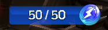
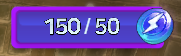

# ⚡ Energy

<figure><figcaption></figcaption></figure>



### 🔋 Energy System

Energy is a **core resource** required to obtain hunting rewards in EXTOCIUM.

Once both **Free Energy** and **Paid Energy** are fully consumed,\
**items and gold will no longer drop.**

The Energy System exists to prevent excessive item supply in the game\
and to maintain the value of items obtained through hunting.

***

### ◾ Basic Energy Rules

<figure><figcaption>
Indicator for Free Energy Usage
</figcaption></figure> <figure><figcaption>
Indicator for Paid Energy Usage
</figcaption></figure>

* Energy is **bound to each owned Hero individually**.
* Energy is divided into **Free Energy** and **Paid Energy**.

👉 [Check Free Energy Recharge Rules](recharge-rules.md)

| Category                                                   | Description                                                                                                                             |
| ---------------------------------------------------------- | --------------------------------------------------------------------------------------------------------------------------------------- |
| Energy Types                                               | Free Energy, Paid Energy                                                                                                                |
| Energy Usage Order                                         | Paid Energy is consumed before daily energy                                                                                             |
| <mark style="color:blue;">Free Energy Recharge</mark>      | 
Automatically recharges 50 daily, does not accumulate, and resets daily 🕖Asia Server : KST 00:00 🕖USA Server : UTC 00:00
 |
| <mark style="color:purple;">Paid Energy Acquisition</mark> | Can be purchased from the shop or acquired through ads                                                                                  |
| <mark style="color:blue;">When Using Free Energy</mark>    | ⛔<mark style="color:orange;">**Item and Gold drop rates decrease by 20%**</mark>                                                        |
| <mark style="color:purple;">When Using Paid Energy</mark>  | 🍀<mark style="color:green;">**Bonus drops exclusive to paid energy occur (during hunting and gathering)**</mark>                       |

***

### ◾ Energy Consumption Rules

Each monster in a field is configured to consume **1 to n Energy Points**.

When a monster is defeated, Energy Points are accumulated.\
Once the accumulated points reach the threshold (**n**), **1 Energy is consumed**.

The amount of Energy Points consumed may vary\
depending on the **monster type and the field**.

Through this system,\
hunting in **higher-level hunting grounds becomes more efficient**,\
and high-level Heroes can also **hunt or gather more easily in lower-level areas**. 

***

### ◾ 0 Energy State

When all Energy is consumed, **items and gold no longer drop**,\
and the amount of EXP gained is reduced.

👉 [Check 0 Energy Penalty Details](0-energy-penalty.md)

***

### ◾ Paid Energy Purchase

If you wish to continue hunting,\
you can purchase additional Energy from the [shop](../../economy/shop/) using **BNB or Gems**.

* Each Hero can charge up to **2,000 Paid Energy per week**.
* When an Energy Potion is used,\
  it is applied immediately to the **currently equipped Hero**.

<figure><figcaption></figcaption></figure>



### 🔋 에너지 시스템

에너지는 EXTOCIUM에서 사냥 보상을 획득하기 위해 필요한 **기본 자원**입니다.\
무료 에너지와 유료 에너지를 모두 소모하면, 더 이상 **아이템과 골드가 드랍되지 않습니다.**

에너지 시스템은 게임 내 아이템의 과도한 공급을 방지하고,\
사냥을 통해 획득되는 아이템의 가치를 유지하기 위한 장치입니다.

***

### ◾ 에너지 기본 규칙

<figure><figcaption>
무료 에너지 사용 시 표시
</figcaption></figure> <figure><figcaption>
유료 에너지 사용 시 표시
</figcaption></figure>

* 에너지는 **보유 중인 각 영웅에게 귀속**됩니다.
* 에너지는 **무료 에너지**와 **유료 에너지**로 구분됩니다.

👉 [무료 에너지 충전 규칙 확인하기](recharge-rules.md)

| 구분                                             | 설명                                                                                                                                                   |
| ---------------------------------------------- | ---------------------------------------------------------------------------------------------------------------------------------------------------- |
| 에너지 종류                                         | 무료 에너지, 유료 에너지                                                                                                                                       |
| 에너지 소모 순서                                      | 유료 에너지가 일일 에너지보다 우선 소모됨                                                                                                                              |
| <mark style="color:blue;">무료 에너지 충전</mark>     | 
매일 50 만큼 자동 충전,  누적되지 않고 매일 초기화 🕖Asia Server : KST 00:00 🕖USA Server : UTC 00:00
                                                   |
| <mark style="color:purple;">유료 에너지 획득</mark>   | [상점](../../economy/trade/market/#undefined-1)에서 구입하거나 광고를 통해 획득 가능                                                                                   |
| <mark style="color:blue;">무료 에너지 사용 시</mark>   | ⛔<mark style="color:orange;">**아이템 및 골드 드랍 확률 20% 감소**</mark>                                                                                        |
| <mark style="color:purple;">유료 에너지 사용 시</mark> | 
🍀<mark style="color:green;"><strong>유료 에너지 전용 보너스 드랍 풀 발생</strong></mark>  <mark style="color:green;"><strong>(사냥 및 채집 시)</strong></mark>
 |

***

### ◾ 에너지 소모 규칙

각 필드의 몬스터는 **1 \~ n의 에너지 포인트**를 소모하도록 설정되어 있습니다.

몬스터를 처치하면 에너지 포인트가 누적되며,\
**누적 포인트가 기준값(n)에 도달하면 에너지 1이 소모**됩니다.

몬스터의 종류와 필드에 따라, 소모되는 에너지 포인트 수는 다를 수 있습니다.

이 시스템을 통해, **상위 레벨 사냥터에서의 사냥 효율이 더욱 높아지며**,\
고레벨 영웅이 **저레벨 지역에서 채집이나 사냥을 진행하는 것도 수월해집니다.**

***

### ◾ 0 에너지 상태

에너지를 모두 소모하면 아이템과 골드가 **더 이상 드랍되지 않으며**, 획득 경험치의 양이 감소합니다.

👉 [0 에너지 패널티 자세히 확인하기](0-energy-penalty.md)

***

### ◾ 유료 에너지 구매

더 많은 사냥을 원할 경우, [상점](../../economy/shop/)에서 **BNB 또는 젬**으로 유료 에너지를 구매할 수 있습니다.

* 각 영웅은 **주간 최대 2,000의 유료 에너지**를 충전할 수 있습니다.
* 에너지 포션 사용 시, **현재 장착 중인 영웅**에게 즉시 적용됩니다.

<figure><figcaption></figcaption></figure>



### 🔋 エナジーシステム

エナジーは、EXTOCIUMで 狩り報酬を獲得するために必要な**基本リソース**です。

無料エナジーと有料エナジーをすべて消費すると、\
**アイテムおよびゴールドはドロップしなくなります。**

エナジーシステムは、ゲーム内アイテムの過剰供給を防ぎ、\
狩りによって獲得されるアイテムの価値を維持するための仕組みです。

***

### ◾ エナジー基本ルール

<figure><figcaption>
無料エネルギー使用時の表示
</figcaption></figure> <figure><figcaption>
有料エネルギー使用時の表示
</figcaption></figure>

* エナジーは**所持している各ヒーローごとに紐づけられます。**
* エナジーは**無料エナジー**と**有料エナジー**に分かれています。

👉 [無料エナジー充電ルールを確認](recharge-rules.md)

| 区分                                            | 説明                                                                                         |
| --------------------------------------------- | ------------------------------------------------------------------------------------------ |
| エネルギーの種類                                      | 無料エネルギー、有料エネルギー                                                                            |
| エネルギー消費順序                                     | 有料エネルギーが日々のエネルギーより優先して消費されます                                                               |
| <mark style="color:blue;">無料エネルギーの充電</mark>   | 
毎日50ずつ自動充電、蓄積されず毎日リセットされます 🕖Asia Server : KST 00:00 🕖USA Server : UTC 00:00
 |
| <mark style="color:purple;">有料エネルギーの獲得</mark> | [ショップ](../../economy/shop/#ri-ben-yu)で購入するか広告を通じて取得可能                                      |
| <mark style="color:blue;">無料エネルギー使用時</mark>   | ⛔<mark style="color:orange;">**アイテムおよびゴールドのドロップ率が20%減少**</mark>                            |
| <mark style="color:purple;">有料エネルギー使用時</mark> | 🍀<mark style="color:green;">**有料エネルギー専用のボーナスドロップが発生（狩りおよび採集時）**</mark>                    |

***

### ◾ エナジー消費ルール

各フィールドのモンスターは、\
**1～nのエナジーポイント**を消費するように設定されています。

モンスターを討伐するとエナジーポイントが蓄積され、\
累積ポイントが基準値（**n**）に達すると、**エナジーが1消費**されます。

モンスターの種類やフィールドによって、\
消費されるエナジーポイントの量は異なる場合があります。

このシステムにより、\
**高レベル狩場での狩り効率が向上し、**\
高レベルヒーローが**低レベル地域で採集や狩りを行うことも容易**になります。

***

### ◾ 0エナジー状態

エナジーをすべて消費すると、\
**アイテムとゴールドがドロップしなくなり、**&#x7372;得できるEXP量が減少します。

👉 [0エナジーペナルティの詳細を確認](0-energy-penalty.md)

***

### ◾ 有料エナジー購入

さらに狩りを続けたい場合は、[ショップ](../../economy/shop/)で**BNBまたはジェム**を使用して、\
有料エナジーを購入できます。

* 各ヒーローは**週に最大2,000の有料エナジー**をチャージできます。
* エナジーポーションを使用すると、**現在装備中のヒーロー**に即時適用されます。

<figure><figcaption></figcaption></figure>



<em>※ This guide was written based on the game status as of January 8, 2026,</em>  <em>and its contents may change with future updates.</em>

