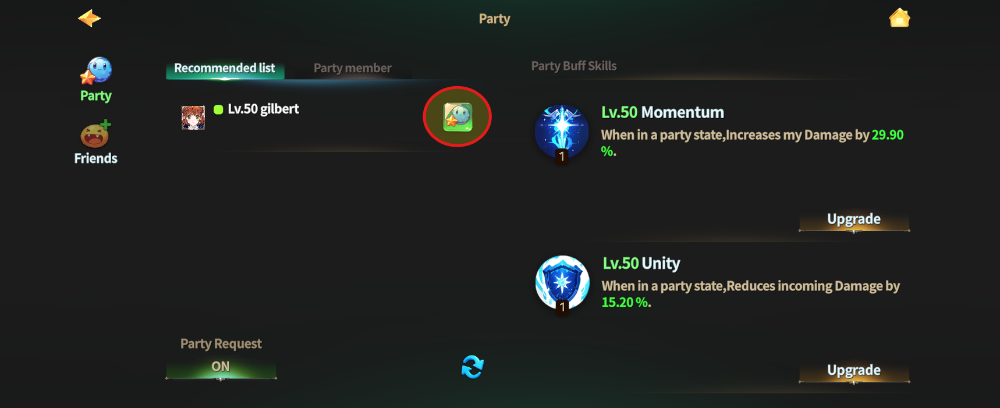
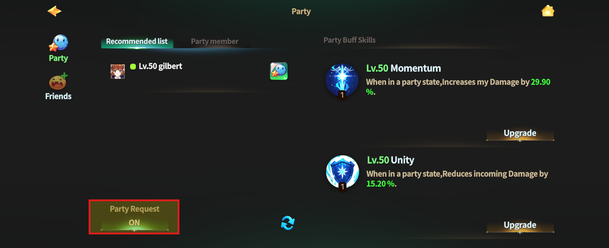
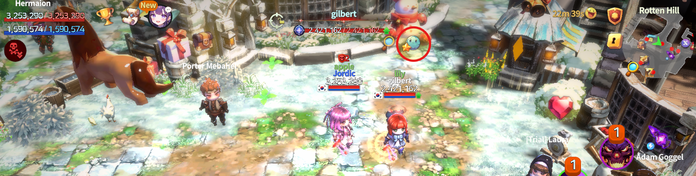
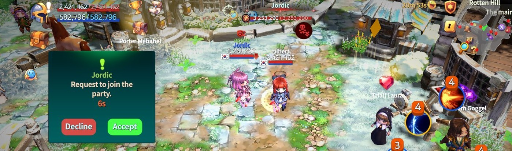
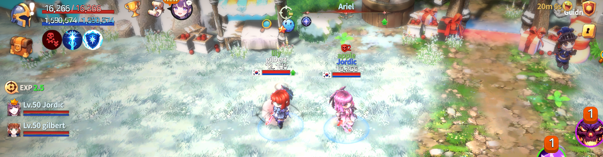
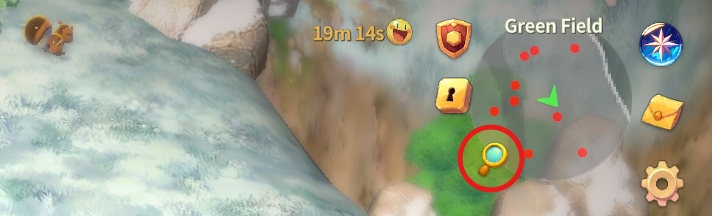
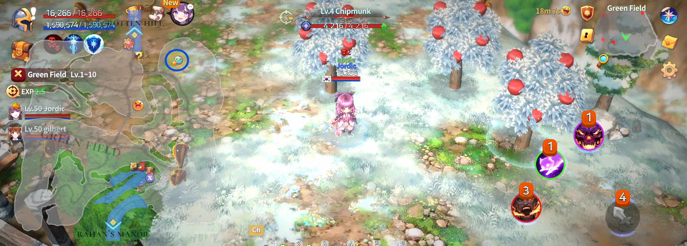
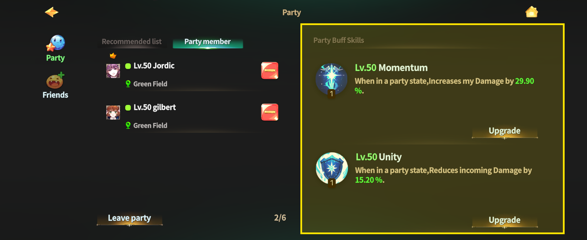
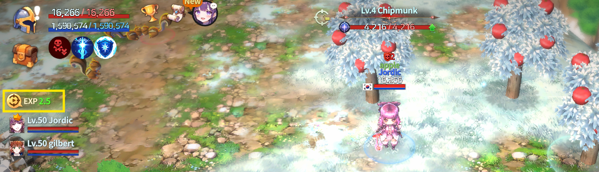

# 🧑‍🤝‍🧑 Party



### 📜 Party Guide

Hunting alone can be tough.\
Sometimes, the fastest way forward is fighting together.\
Form a party in **EXTOCIUM** and take on the world with your friends.

***

### ◾ What Is a Party?

A party is a co-op system that lets you hunt and challenge raids together with other adventurers.\
While in a party, you can track each other’s location and gain EXP bonuses and special party buffs.

***

### ◾ How to Form a Party

There are **two ways** to form a party.

#### 1️⃣ Invite Using the Party Button

Tap the **Party button** at the bottom-left of the main HUD.

<figure><figcaption></figcaption></figure>

When the party widget opens, a **recommended player list** appears on the left.\
Tap the **green button** next to a player to send a party invite.

<figure><figcaption></figcaption></figure>

If you don’t want to receive party requests,\
turn **OFF** the **“Party Request”** toggle at the bottom of the party widget.

<figure><figcaption></figcaption></figure>

#### 2️⃣ Invite Directly in the World

* Approach the adventurer you want to party with in the world.\
  Tap the **Party button above their character** to send an invite.

<figure><figcaption></figcaption></figure>

When the invited player taps **“Accept”**, the party is formed.

<figure><figcaption></figcaption></figure>

***

### ◾ Checking Party Status

* Once the party is formed, \
  party member information appears on the **left side of the main HUD**.
* A **blue ground effect** will appear around party members.

<figure><figcaption></figcaption></figure>

* Tap the **magnifying glass icon** at the top-right of the HUD.

<figure><figcaption></figcaption></figure>

* On the minimap, party members are shown as **blue circles**.

<figure><figcaption></figcaption></figure>

***

### ◾ Leaving a Party

To leave a party, follow these steps:

* Tap the **Party button** at the bottom-left of the HUD.

<figure><figcaption></figcaption></figure>

* Tap **“Leave Party”** at the bottom of the party widget.

<figure><figcaption></figcaption></figure>

* Tap **“Confirm”** in the popup to leave the party.

<figure><figcaption></figcaption></figure>

***

### ◾ Managing Party Members

Only the **Party Leader** can manage party members.

* Open the party widget by tapping the **Party button**.\
  Tap the **minus (−) button** on a member slot to remove that member from the party.

<figure><figcaption></figcaption></figure>

***

### ◾ Party Buff Skills

* Party buff skills are displayed on the **right side of the party widget**.
* There are **two party buffs**, and while the party is active, they apply **only to you**.

<figure><figcaption></figcaption></figure>


#### Buff types:

* A buff that **increases your attack damage**
* A buff that **reduces damage you take**

Just like normal skills, you can tap **Upgrade** to enhance these buffs using materials and gold.


***

### ◾ Party Distribution Rules

#### ▶ Normal Monsters

* When a monster is defeated, items and EXP are distributed **in party order**.\
  (1 → 2 → 3 → 4 → back to 1)
* Items use an **ownership-sharing system**.\
  After a short time, all party members can pick up the dropped items.

#### ▶ Raid Bosses

Raid rewards are determined by **player ranking**.\
Your ranking is based on the **amount of damage you deal during the raid**.

* When the raid ends, all participants are ranked according to their damage contribution.
* **Reward tiers vary by rank**, and rewards are granted based on your final ranking.

If you are in a party, \
Rewards earned by each party member based on their rank are **combined**,\
then **evenly redistributed (1/n)** among all party members.

* If there are fewer items than party members,\
  items are **randomly distributed**, with some members receiving one item.
* If party members are too far apart, **party distribution may be temporarily disabled**.

***

### ◾ Party EXP Bonus

When you form a party, \
the **EXP bonus value** is displayed to the right of the party toggle button.

<figure><figcaption></figcaption></figure>

* The EXP bonus applies when **2 or more active party members** are present.

| Number of Party Members | EXP Bonus |
| ----------------------- | --------- |
| 2명                      | +2.5%     |
| 3명                      | +2.7%     |
| 4명                      | +3.0%     |
| 5명                      | +3.2%     |
| 6명                      | +3.4%     |

***

✨

> **Fighting alone takes courage.**\
> **Fighting together takes you further.**\
> **In EXTOCIUM, the world shines brighter when you’re in a party.**



### 📜 파티 가이드

혼자 사냥이 버겁다면, 함께 싸우는 게 가장 빠른 길입니다.\
EXTOCIUM의 파티 시스템을 통해 친구들과 함께 더 강해져 보세요.

***

### ◾ 파티란?

파티는 다른 모험가와 함께 사냥, 레이드 등을 진행할 수 있는 협동 시스템입니다.\
파티를 맺으면 서로의 위치를 확인할 수 있고, EXP 보너스와 전용 버프 효과도 받을 수 있습니다.

***

### ◾ 파티 맺기

파티를 맺는 방법은 **두 가지**가 있습니다.

#### 1️⃣ 파티 버튼으로 요청하기

메인 HUD **좌측 하단의 파티 버튼**을 터치합니다.

<figure><figcaption></figcaption></figure>

파티 위젯이 열리면, 좌측에 **추천 목록**이 표시됩니다.\
원하는 대상 옆의 **녹색 버튼**을 터치하면 파티 요청이 전송됩니다.

<figure><figcaption></figcaption></figure>

파티 요청을 받고 싶지 않다면 파티 위젯 하단의 **‘파티 요청’ 토글 버튼**을 OFF로 설정할 수 있습니다.

<figure><figcaption></figcaption></figure>

#### 2️⃣ 월드에서 직접 요청하기

* 월드에서 파티를 맺고 싶은 모험가에게 다가가\
  **머리 위에 표시된 파티 버튼**을 터치하면 파티 요청을 보낼 수 있습니다.

<figure><figcaption></figcaption></figure>

요청을 받은 모험가가 **‘승인’** 버튼을 누르면 파티가 결성됩니다.

<figure><figcaption></figcaption></figure>

***

### ◾ 파티 상태 확인

* 파티가 결성되면 메인 HUD **좌측에 파티원 정보**가 표시됩니다.
* 파티원 주변에는 **파란색 바닥 이펙트**가 나타납니다.

<figure><figcaption></figcaption></figure>

* HUD 우측 상단의 **돋보기 버튼**을 눌러보세요.

<figure><figcaption></figcaption></figure>

* 미니맵에서 파티원의 위치를 **파란색 원**으로 확인할 수 있습니다.

<figure><figcaption></figcaption></figure>

***

### ◾ 파티 탈퇴

파티를 나가고 싶을 경우 아래 순서대로 진행하세요.

* 메인 HUD 좌측 하단의 **파티 버튼**을 터치합니다.

<figure><figcaption></figcaption></figure>

* 파티 위젯 하단의 **‘파티 탈퇴’** 버튼을 터치합니다.

<figure><figcaption></figcaption></figure>

* 확인 팝업에서 **‘확인’**&#xC744; 누르면 파티에서 탈퇴합니다.

<figure><figcaption></figcaption></figure>

***

### ◾ 파티원 관리

파티원 관리는 **파티 리더만 가능**합니다.

* 파티 버튼을 터치해 파티 위젯을 엽니다.\
  각 파티원 슬롯의 **마이너스(−) 버튼**을 누르면 해당 파티원을 파티에서 제외할 수 있습니다.

<figure><figcaption></figcaption></figure>

***

### ◾ 파티 버프 스킬

* 파티 위젯 **우측**에서 파티 버프 스킬을 확인할 수 있습니다.
* 파티 버프는 **2종류**이며, 파티가 유지되는 동안 **나에게만 적용**됩니다.

<figure><figcaption></figcaption></figure>


#### 버프 종류:

* 나의 **공격 데미지를 증가**시키는 버프
* 내가 받는 **피해를 감소**시키는 버프

일반 스킬과 동일하게 **업그레이드 버튼**을 통해 재료와 골드를 사용해 강화할 수 있습니다.


***

### ◾ 파티 분배 규칙

#### ▶ 일반 몬스터

* 파티원이 몬스터를 처치하면 **파티원 순서대로** 아이템과 EXP가 분배됩니다.\
  (1 → 2 → 3 → 4 → 다시 1)
* 아이템은 **소유권 분배 방식**으로 처리되며, 일정 시간이 지나면 모든 파티원이 획득할 수 있습니다.

#### ▶ 레이드 보스

레이드 보상은 **참여자의 등수**를 기준으로 책정됩니다.\
등수는 레이드 중 **내가 준 데미지 기여도**에 따라 결정됩니다.

* 레이드 종료 시, 각 참여자는 데미지 기여도에 따라 **순위가 정해집니다.**
* **등수에 따라 보상 레벨이 달라지며**, 해당 보상 레벨에 맞는 보상을 획득합니다.

파티 중일 경우, \
각 파티원이 **자신의 등수에 따라 획득한 보상**을 모두 합산한 뒤, 파티원 수에 따라 **균등 분배(1/n)** 됩니다.

* 아이템 수가 파티원 수보다 적을 경우, 일부 파티원에게 **무작위로 1개씩 지급**됩니다.
* 파티원과의 거리가 너무 멀어질 경우, **파티 분배 기능이 일시적으로 적용되지 않을 수 있습니다.**

***

### ◾ 파티 EXP 보너스

파티를 맺으면 파티 토글 버튼 우측에 **EXP 보너스 수치**가 표시됩니다.

<figure><figcaption></figcaption></figure>

* EXP 보너스는 **활성 파티원 2명 이상**부터 적용됩니다.

| 파티 인원 | EXP 보너스 |
| ----- | ------- |
| 2명    | +2.5%   |
| 3명    | +2.7%   |
| 4명    | +3.0%   |
| 5명    | +3.2%   |
| 6명    | +3.4%   |

***

✨

> **혼자 싸우는 용기도 멋지지만, 함께 싸우는 선택은 더 멀리 갑니다.**\
> **EXTOCIUM의 세계는, 파티에서 더 빛납니다.**



### 📜 パーティーガイド

ひとりでの狩りが大変なら、一緒に戦うのがいちばんの近道です。\
**EXTOCIUM**のパーティーシステムで、仲間とともにさらに強くなりましょう。

***

### ◾ パーティーとは？

パーティーは、ほかの冒険者と一緒に 狩りやレイドに挑戦できる協力システムです。\
パーティーを組むと、お互いの位置を確認でき、\
EXPボーナスや専用バフ効果を受けることができます。

***

### ◾ パーティーを組む

パーティーを組む方法は **2つ**あります。

#### 1️⃣ パーティーボタンから申請する

メインHUD左下の **パーティーボタン** をタッチします。

<figure><figcaption></figcaption></figure>

パーティーウィジェットが開くと、左側に **おすすめリスト** が表示されます。\
対象の横にある **緑色のボタン** をタッチすると、パーティー申請が送信されます。

<figure><figcaption></figcaption></figure>

パーティー申請を受け取りたくない場合は、パーティーウィジェット下部の\
&#xNAN;**「パーティー申請」トグルボタン** をOFFに設定してください。

<figure><figcaption></figcaption></figure>

#### 2️⃣ ワールドで直接申請する

* ワールドでパーティーを組みたい冒険者に近づき、キャラクターの頭上に表示される\
  **パーティーボタン** をタッチすると申請できます。

<figure><figcaption></figcaption></figure>

申請を受けた冒険者が **「承認」** ボタンを押すと、パーティーが結成されます。

<figure><figcaption></figcaption></figure>

***

### ◾ パーティー状態の確認

* パーティーが結成されると、メインHUD左側に **パーティーメンバー情報** が表示されます。
* パーティーメンバーの周囲には **青い床エフェクト** が表示されます。

<figure><figcaption></figcaption></figure>

* HUD右上の **虫眼鏡ボタン** をタッチしてください。

<figure><figcaption></figcaption></figure>

* ミニマップ上で、パーティーメンバーの位置を **青い円** で確認できます。

<figure><figcaption></figcaption></figure>

***

### ◾ パーティー脱退

パーティーから抜けたい場合は、以下の手順で進めてください。

* メインHUD左下の **パーティーボタン** をタッチ

<figure><figcaption></figcaption></figure>

* パーティーウィジェット下部の **「パーティー脱退」** をタッチ

<figure><figcaption></figcaption></figure>

* 確認ポップアップで **「確認」** を押すと脱退できます

<figure><figcaption></figcaption></figure>

***

### ◾ パーティーメンバー管理

パーティーメンバーの管理は **パーティーリーダーのみ可能** です。

* パーティーボタンをタッチして パーティーウィジェットを開き、\
  各メンバー枠の **マイナス（−）ボタン** をタッチすると、\
  対象のメンバーをパーティーから外すことができます。

<figure><figcaption></figcaption></figure>

***

### ◾ パーティーバフスキル

* パーティーウィジェット右側で **パーティーバフスキル** を確認できます。
* パーティーバフは **2種類** あり、パーティーを維持している間、**自分にのみ適用** されます。

<figure><figcaption></figcaption></figure>


#### バフの種類：

* 自分の **攻撃ダメージを増加** させるバフ
* 自分が受ける **ダメージを軽減** するバフ

通常のスキルと同様に、**アップグレード** ボタンから 素材とゴールドを消費して強化できます。


***

### ◾ パーティー分配ルール

#### ▶ 通常モンスター

* モンスターを倒すと、パーティーメンバーの順番で アイテムとEXPが分配されます。\
  （1 → 2 → 3 → 4 → 再び1）
* アイテムは **所有権分配方式** で処理され、一定時間が経過すると、\
  すべてのパーティーメンバーが獲得できます。

#### ▶ レイドボス

レイド報酬は **参加者の順位** を基準に決定されます。\
順位は、レイド中に与えた **ダメージ貢献度** によって決まります。

* レイド終了時、すべての参加者に順位が付けられます。
* **順位に応じて報酬レベルが変わり**、その報酬レベルに対応した報酬を獲得できます。

パーティー中の場合、\
各メンバーが順位に応じて獲得した報酬を合算し、\
**パーティーメンバー数に応じて均等分配（1/n）** されます。

* アイテム数がパーティーメンバー数より少ない場合、\
  一部のメンバーに **ランダムで1個ずつ** 配布されます。
* パーティーメンバーとの距離が離れすぎると、\
  **パーティー分配機能が一時的に無効** になることがあります。

***

### ◾ パーティーEXPボーナス

パーティーを組むと、パーティートグルボタン右側に **EXPボーナス数値** が表示されます。

<figure><figcaption></figcaption></figure>

* EXPボーナスは **有効なパーティーメンバーが2人以上** の場合に適用されます。

| パーティー人数 | EXPボーナス |
| ------- | ------- |
| 2명      | +2.5%   |
| 3명      | +2.7%   |
| 4명      | +3.0%   |
| 5명      | +3.2%   |
| 6명      | +3.4%   |

***

✨

> **ひとりで戦う勇気も素晴らしい。**\
> **でも、共に戦ぶ選択は、もっと遠くへ行けます。**\
> **EXTOCIUMの世界は、パーティーでこそ、より輝きます。**



<em>※ This guide was written based on the game status as of January 13, 2026,</em>  <em>and its contents may change with future updates.</em>

