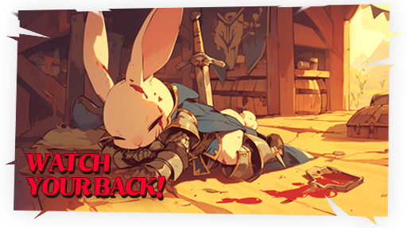

# ⚠️ PK

<figure><figcaption></figcaption></figure>



### ⚔ PK System

All fields in **EXTOCIUM** are defined as **combat zones**.\
In the field, you can hunt monsters to farm resources,\
or attack other Adventurers to secure those resources for yourself.


When you win a PvP battle, you have a **chance to obtain the defeated player’s gold and items**.


***

### ◾ PK Field Overview

Higher-tier fields are designated as **PK Zones**.\
This structure is an essential part of driving the EXTOCIUM economy.

* Encourages tension and rivalry between factions
* Prevents inflation caused by uncontrolled farming
* Fuels equipment progression and **XTO investment** through competition

PK is a system where **risk and reward coexist**.\
In PK Zones, the **PK Leverage Bonus** is applied,\
making strategic decision-making even more important.


#### If you are ready to accept the risk, prove your survival in the combat zones.


***

### ◾ PK Settings (PK On / Off)

Using the **PK On / Off button** at the bottom-right of the HUD,\
you can prevent yourself from PKing other players while in Auto mode.

<figure><figcaption></figcaption></figure>


#### However, this setting **does not prevent other players from PKing you**.


👉 [Learn more about Target Control](pk-targeting.md)\
👉 [View your PK Records](pk-record.md)

***

### ◾ PK Basic Rules

* PK Levels range from **1 to 10**.
* Each time you defeat another player (PC), your **PK Level increases by 1**.

If you are defeated by a monster or another player while having a high PK Level,\
**gold and items stored in the** [**Vault of Time**](../vault-of-time.md) **may be dropped**.

***

### ◾ PK Protection Rules (Low-Level Protection)

* Heroes **below level 25** are not affected by PK.
* They do not receive PK damage,\
  and cannot deal damage to other players through PK.

***

### ◾ Purple Skull State

<figure><figcaption></figcaption></figure>

* When players with **PK Level 0** exchange damage with each other,\
  a **purple skull icon** appears above their heads.
* Defeating a player in the purple skull state does **not increase PK Level**.
* The purple skull state is <mark style="color:purple;">**removed automatically after standing still for 15 seconds**</mark>.

***

### ◾ How to Reduce PK Level

PK Level can be reduced in the following ways:

* While standing still in a **safe zone**, PK Level decreases by **1 every 30 minutes**.
* You can also reduce your PK Level immediately\
  by paying gold and items to the town [**NPC “Niberius.”**](../../field-info/rotten-hill/npc-rotten-hill.md#niberius-pk-contract-broker)

<figure><figcaption></figcaption></figure>

***

### ◾ PK Zone Rules

* In **PK Leverage Zones**,\
  building up PK Levels allows you to obtain **greater rewards** in gold and items.
* PK actions in **Non-PK Zones** will result in **PK penalties**.
* From **PK Level 6 and above**, your **current location is revealed on the map**.

***

### ◾ Drop Rules on PK Death

When defeated through PK,\
**only the gold and items stored in the Vault of Time are dropped**,\
not the contents of your inventory.


⛔ Please note: In the [PK Leverage Zone](pk-leverage-bonus.md#pk-leverage-bonus), gold stored in your inventory may be dropped.


This design reduces excessive loss while preserving the tension and risk of field combat.

👉 For more details, please refer to the **\[**[**Vault of Time Guide**](../vault-of-time.md)**]**.

***



### ⚔ PK 시스템

**EXTOCIUM의 모든 필드는 ‘전투 지역’으로 정의됩니다.**\
필드에서는 몬스터를 사냥해 파밍할 수도 있고, \
리소스를 확보하기 위해 **다른 모험가를 공격할 수도 있습니다.**


PvP에서 승리할 경우, 상대의 **골드 및 아이템을 확률적으로 획득**할 수 있습니다.


***

### ◾ PK 필드 개요

상위 필드는 **‘PK 지역’**&#xC73C;로 설정되어 있습니다.\
이는 EXTOCIUM의 경제를 구동하기 위한 **필연적인 구조**입니다.

* 세력 간 견제 유도
* 무분별한 파밍으로 인한 인플레이션 방지
* 경쟁을 통한 장비 강화 및 **XTO 투자 활성화**

PK는 **리스크와 보상이 공존하는 시스템**입니다.\
PK 필드에는 **‘PK 레버리지 보너스’**&#xAC00; 적용되어, 전략적인 플레이가 더욱 중요해집니다.


#### 리스크를 감수할 준비가 되었다면, 전투 지역에서 생존을 증명해 보세요.


***

### ◾ PK 설정 (PK On / Off)

HUD 우측 하단의 **PK On / Off 버튼**을 사용하면,\
Auto 상태에서 **내가 다른 유저를 PK하는 것을 방지**할 수 있습니다.

<figure><figcaption></figcaption></figure>


#### 단, 이 설정은 **다른 유저가 나를 PK하는 것을 막지는 않습니다.**


👉 [타겟 설정 기능 자세히 보기](pk-targeting.md)\
👉 [PK 기록 확인하기](pk-record.md)

***

### ◾ PK 기본 규칙

* PK 레벨은 **1 \~ 10**까지 존재합니다.
* 다른 플레이어(PC)를 1명 처치할 때마다 **PK 레벨이 1씩 증가**합니다.

PK 레벨이 높은 상태에서 몬스터 또는 다른 유저에게 사망할 경우,\
[**시간의 금고**](../vault-of-time.md)에서 **아이템과 골드가 드랍될 수 있습니다.**

***

### ◾ PK 면책 규칙 (저레벨 보호)

* **레벨 25 이하의 영웅은 PK의 영향을 받지 않습니다.**
* PK로 인한 데미지를 받지 않으며, 레벨 25 이하 영웅으로는 다른 유저에게 데미지를 줄 수 없습니다.

***

### ◾ 보라색 해골 상태

<figure><figcaption></figcaption></figure>

* PK 레벨이 **0인 유저끼리 서로 데미지를 주고받을 경우**, 머리 위에 **보라색 해골 아이콘**이 표시됩니다.
* 보라색 해골 상태의 유저를 PK해도 **PK 레벨은 증가하지 않습니다.**
* 보라색 해골은 <mark style="color:purple;">**제자리에서 15초 대기 시 자동 해제**</mark>됩니다.

***

### ◾ PK 레벨 감소 방법

PK 레벨을 감소시키는 방법은 다음과 같습니다.

* 안전지대에서 제자리에 멈춰 서 있을 경우, **30분마다 PK 레벨이 1씩 감소**합니다.
* 마을의 [**NPC ‘니베리우스’**](../../field-info/rotten-hill/npc-rotten-hill.md#niberius-pk-contract-broker)에게 골드와 아이템을 지불하여 PK 레벨을 즉시 감소시킬 수 있습니다.

<figure><figcaption></figcaption></figure>

***

### ◾ PK 존별 규칙

* **PK 레버리지 존**에서는 PK 레벨을 쌓아 **더 많은 아이템과 골드**를 획득할 수 있습니다.
* **Non-PK 존**에서 PK를 진행할 경우, **PK 패널티**가 적용됩니다.
* **PK 레벨 6 이상**부터는 지도에 **현재 위치가 노출**됩니다.

***

#### ◾ PK 사망 시 드랍 규칙

PK로 인해 사망할 경우, 플레이어의 인벤토리가 아닌\
**시간의 금고(Vault of Time)에 보관된 골드와 아이템만 드랍**됩니다.


⛔단,[ PK 레버리지 존](pk-leverage-bonus.md#pk) 에서는 인벤토리에 보관중인 골드가 드랍될 수 있습니다.


이는 PK로 인한 과도한 손실을 방지하면서도, 필드 전투의 긴장감과 리스크를 유지하기 위한 설계입니다.

👉 시간의 금고 시스템에 대한 자세한 내용은 **\[**[**시간의 금고 가이드**](../vault-of-time.md)**]**&#xB97C; 참고해 주세요.

***



### ⚔ PKシステム

**EXTOCIUM**のすべてのフィールドは、**「戦闘エリア」として定義されています。**\
**フィールドではモンスターを討伐して資源を集めることも、**\
**資源を確保するために他の冒険者を攻撃すること**も可能です。


PvPで勝利した場合、相手が所持していた**ゴールドやアイテムを確率で獲得**できます。


***

### ◾ PKフィールド概要

上位フィールドは\*\*「PKゾーン」\*\*として設定されています。\
これはEXTOCIUMの経済を動かすための、**必然的な構造**です。

* 勢力間の緊張関係を生み出す
* 無秩序なファーミングによるインフレーションを防止
* 競争を通じた装備強化と**XTO投資の活性化**

PKは**リスクと報酬が共存するシステム**です。\
PKゾーンで&#x306F;**「PKレバレッジボーナス」**&#x304C;適用され、\
より戦略的なプレイが求められます。


#### リスクを受け入れる覚悟があるなら、戦闘エリアで生存を証明してください。


***

### ◾ PK設定（PK On / Off）

HUD右下の**PK On / Offボタン**を使用すると、\
Auto状態で**自分が他のプレイヤーをPKすることを防止**できます。

<figure><figcaption></figcaption></figure>


#### ただし、この設定では **他のプレイヤーからのPKを防ぐことはできません。**


👉 [ターゲット設定機能の詳細を見る](pk-targeting.md)\
👉 [PK履歴を確認する](pk-record.md)

***

### ◾ PK基本ルール

* PKレベルは**1～10**まで存在します。
* 他のプレイヤー（PC）を1人倒すごとに、**PKレベルが1上昇**します。

PKレベルが高い状態で モンスターまたは他のプレイヤーに倒された場合、\
[**時間の金庫**](../vault-of-time.md)**（Vault of Time）に保管された** \
**ゴールドやアイテムがドロップされることがあります。**

***

### ◾ PK免責ルール（低レベル保護）

* **レベル25以下のヒーロー**はPKの影響を受けません。
* PKによるダメージを受けず、レベル25以下のヒーローからは\
  他のプレイヤーにダメージを与えることもできません。

***

### ◾ 紫のスカル状態

<figure><figcaption></figcaption></figure>

* PKレベルが**0のプレイヤー同士**でダメージを与え合うと、\
  頭上に**紫色のスカルアイコン**が表示されます。
* 紫のスカル状態のプレイヤーをPKしても、**PKレベルは上昇しません。**
* 紫のスカル状態は、<mark style="color:purple;">**その場で15秒間待機すると自動的に解除**</mark>されます。

***

### ◾ PKレベルの減少方法

PKレベルは以下の方法で減少させることができます。

* **安全地帯**でその場に留まると、**30分ごとにPKレベルが1減少**します。
* 街の[**NPC 「ニベリウス」**](../../field-info/rotten-hill/npc-rotten-hill.md#pk-contract-broker)に ゴールドとアイテムを支払うことで、\
  PKレベルを即座に減少させることも可能です。

<figure><figcaption></figcaption></figure>

***

### ◾ PKゾーン別ルール

* **PKレバレッジゾーン**では、PKレベルを積み重ねることで\
  **より多くのゴールドやアイテム**を獲得できます。
* **Non-PKゾーン**でPKを行った場合、**PKペナルティ**が適用されます。
* **PKレベル6以上**になると、**現在位置がマップ上に表示**されます。

***

### ◾ PK死亡時のドロップルール

PKによって死亡した場合、プレイヤーのインベントリではなく、\
**時間の金庫（Vault of Time）に保管された ゴールドとアイテムのみがドロップ**されます。


⛔ ご注意ください：[PKレバレッジゾーンで](pk-leverage-bonus.md#pkrebarejjibnasu)は、インベントリに保管しているゴールドをドロップする場合があります。


これは過度な損失を防ぎつつ、\
フィールド戦闘の緊張感とリスクを維持するための設計です。

👉 詳細については［[**時間の金庫ガイド**](../vault-of-time.md)］をご確認ください。

***



<em>※ This guide was written based on the game status as of January 9, 2026,</em>  <em>and its contents may change with future updates.</em>

