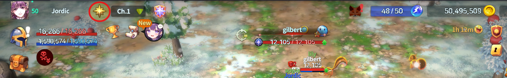
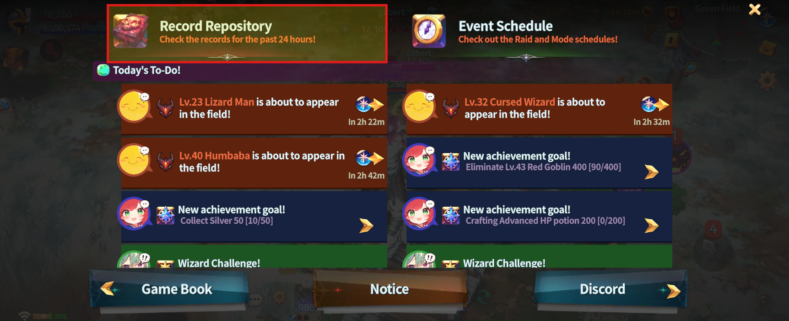
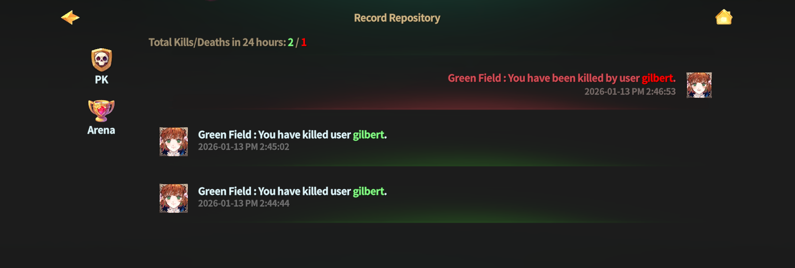

# 📕 PK Record



### 📜 PK Records

**PK Records** allow you to view the history of your PK battles.\
You can quickly review recent combat results and look back on your PK activities at a glance.

***

### ◾ How to Check PK Records

Follow the steps below to view your PK Records.

1️⃣ Tap the **Guide button** at the top of the Main HUD.

<figure><figcaption></figcaption></figure>

2️⃣ Select **Record Repository.**

<figure><figcaption></figcaption></figure>

3️⃣ View your **PK Records list**.

<figure><figcaption></figcaption></figure>


#### 💡Notes

* Up to **100 PK records** can be stored.


***

📌&#x20;

> **Use PK Records to quickly and easily review your combat history.**



### 📜 PK 기록

**PK 기록**은 내가 진행한 PK 전투 내역을 확인할 수 있는 기록 메뉴입니다.\
최근 전투 상황을 한눈에 확인하고, 나의 PK 활동을 되돌아볼 수 있습니다.

***

### ◾ PK 기록 확인 방법

아래 순서에 따라 PK 기록을 확인할 수 있습니다.

1️⃣ **메인 HUD 상단의 가이드 버튼**을 터치합니다.

<figure><figcaption></figcaption></figure>

2️⃣ **기록 보관소** 버튼을 선택합니다.

<figure><figcaption></figcaption></figure>

3️⃣ **나의 PK 기록 목록**을 확인합니다.

<figure><figcaption></figcaption></figure>


#### 💡 **참고 안내**

* PK 기록은 **최대 100개까지** 보관됩니다.


***

📌&#x20;

> **PK 기록을 통해  내 전투 이력을 쉽고 빠르게 확인할 수 있습니다.**



### 📜 PK記録

**PK記録**では、自分が行ったPK戦闘の履歴を確認できます。\
最近の戦闘状況を一目で把握し、自身のPK活動を振り返ることができます。

***

### ◾ PK記録の確認方法

以下の手順で PK記録を確認できます。

1️⃣ **メインHUD上部のガイドボタン**をタップします。

<figure><figcaption></figcaption></figure>

2️⃣ **記録保管庫**を選択します。

<figure><figcaption></figcaption></figure>

3️⃣ **自分のPK記録一覧**を確認します。

<figure><figcaption></figcaption></figure>


#### 💡 参考

* PK記録は**最大100件まで**保存されます。


***

📌&#x20;

> **PK記録を利用して、自分の戦闘履歴を簡単かつ素早く確認できます。**



<em>※ This guide was written based on the game status as of January 13, 2026,</em>  <em>and its contents may change with future updates.</em>

