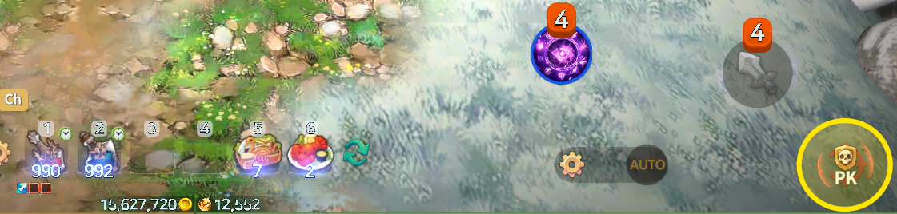
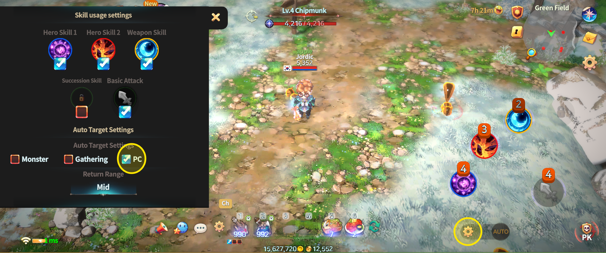
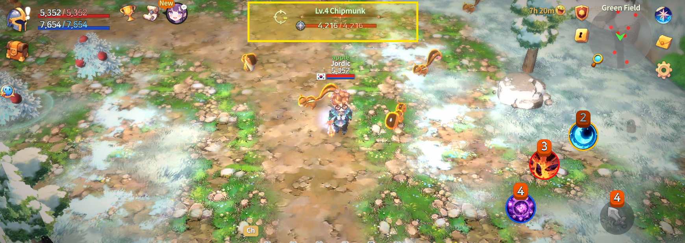
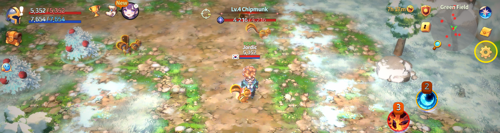
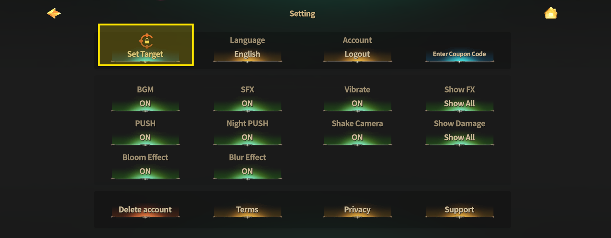
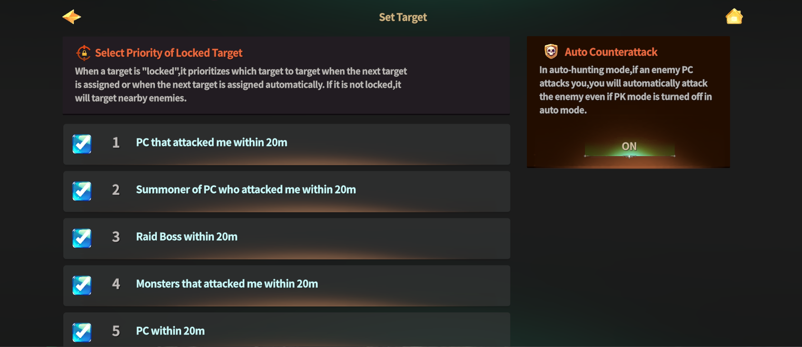
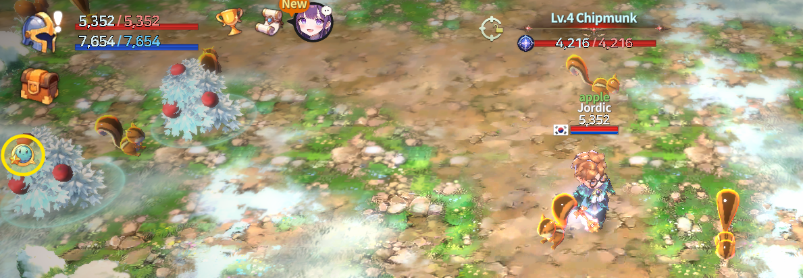
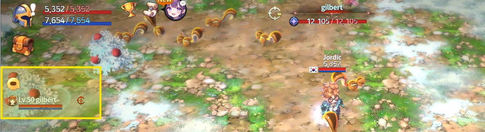

# 🎯 PK Targeting



### 🎯 PK Targeting

In PK combat, **quickly choosing the right target** is extremely important.

In EXTOCIUM, various PK targeting features are provided to ensure\
**accurate and stable combat**, even during large-scale battles or chaotic fights.

Use the features below to quickly focus your attacks on the target you want.

***

### ◾ PK Targeting Features

PK Targeting consists of the following functions:

1️⃣ PK On / Off Button\
2️⃣ Auto Target Settings\
3️⃣ Target Lock / Next Target\
4️⃣ Nearby PK Target List

***

### 1️⃣ PK On / Off Button

Using the **PK On / Off button** at the bottom-right of the HUD,\
you can choose whether or not to attack other players (PCs).

* **PK On**: You can attack other players
* **PK Off**: You will not initiate attacks on other players

<figure><figcaption></figcaption></figure>


#### Even when PK is set to Off, **you cannot prevent other players from PKing you**.


***

### 2️⃣ Auto Target Settings

While in Auto combat mode,\
you can configure targeting to **focus only on players (PCs)** for PK efficiency.

* When the Auto button is activated,\
  attacks are executed automatically based on your selected target settings.

<figure><figcaption></figcaption></figure>

***

### 3️⃣ Target Lock / Next Target

#### 🔹 Basic Target Selection

A **Target Panel** is displayed at the top of the HUD.

* By default, the target is automatically set to the **closest nearby target**.
* The target is continuously updated as positions change.

<figure><figcaption></figcaption></figure>

***

#### 🔹 Target Lock

By tapping the **Target Lock button** on the target panel, the current target becomes **locked**.

<figure><figcaption></figcaption></figure>

* A locked target remains active as long as both you and the target stay in the same field.
* The lock is released if you or the target dies or leaves the field via warp.\
  (The lock is maintained during revival or revival countdown.)
* Tapping the Target Lock button again will release the lock.

***

#### 🔹 Next Target Selection

When a target is locked, a **“Next Target” button** appears on the right side of the target panel.

<figure><figcaption></figcaption></figure>

The selection rules for the next target can be customized through the options menu.

***

#### 🔹 How to Set Next Target Priority

1️⃣ Tap the **Settings (gear icon)** at the top-right of the HUD

<figure><figcaption></figcaption></figure>

2️⃣ Select **“Target Settings”** from the settings widget

<figure><figcaption></figcaption></figure>

3️⃣ Configure the priority order for the next target

<figure><figcaption></figcaption></figure>

Available target options include:

* PCs that attacked you within 20m
* Summons of PCs that attacked you within 20m
* Raid bosses within 20m
* Monsters that attacked you within 20m
* Nearby PCs within 20m
* Summons of nearby PCs within 20m
* Nearby monsters within 20m


#### 💡 Notes

* Unchecked targets will not be selected as next targets.
* If all options are unchecked, the system behaves as if all options are enabled.
* If no valid targets are nearby, tapping “Next Target” may have no effect.


***

### 4️⃣ Nearby PK Target List

By using the **Party Toggle button** on the left side of the HUD,\
you can quickly check nearby PK targets.

<figure><figcaption></figcaption></figure>

* **Tap once**: Displays the party member list
* **Tap twice**: Displays the nearby PK target list

<figure><figcaption></figcaption></figure>


#### 💡 Notes

* The list is shown **only when PK-eligible targets are nearby**.
* Updating the target list may take **2–3 seconds**.

Tapping a target in the list will immediately **lock that target**.


***

📌

> **PK Targeting is a core feature** \
> **for accurately focusing attacks in chaotic combat situations.**



### 🎯 PK 타게팅 (PK Targeting)

PK 전투에서는 **누구를 공격할지 빠르게 선택하는 것**이 매우 중요합니다.

EXTOCIUM에서는 대규모 전투나 혼전 상황에서도 보다 정확하고 안정적인 전투를 할 수 있도록\
다양한 **PK 타게팅 기능**을 제공합니다.

아래 기능을 활용해 원하는 대상에게 빠르게 공격을 집중해 보세요.

***

### ◾ PK 타게팅 주요 기능

PK 타게팅은 다음 기능으로 구성되어 있습니다.

1️⃣ [PK On / Off 버튼](pk-targeting.md#id-1-pk-on-off)\
2️⃣ [오토 타겟 설정](pk-targeting.md#id-2)\
3️⃣ [타겟 고정 / 다음 타겟](pk-targeting.md#id-3)\
4️⃣ [근접 PK 타겟 목록](pk-targeting.md#id-4-pk)

***

### 1️⃣ PK On / Off 버튼

HUD 우측 하단의 **PK On / Off 버튼**을 사용하면,\
**내가 다른 플레이어(PC)를 공격할지 여부**를 선택할 수 있습니다.

* PK On : 다른 플레이어 공격 가능
* PK Off : 내가 먼저 다른 플레이어를 공격하지 않음

<figure><figcaption></figcaption></figure>


#### 단, PK Off 상태라도 **다른 플레이어가 나를 PK하는 것은 막을 수 없습니다.**


***

### 2️⃣ 오토 타겟 설정

Auto 전투 상태에서는 **PK에 유리하도록 PC만 자동으로 타겟**하게 설정할 수 있습니다.

* Auto 버튼을 활성화하면 설정된 타겟 기준에 따라 자동 공격이 진행됩니다.

<figure><figcaption></figcaption></figure>

***

### 3️⃣ 타겟 고정 / 다음 타겟

#### 🔹 기본 타겟 지정

HUD 상단에는 **타겟 패널**이 표시됩니다.

* 기본적으로 타겟은 **가장 가까운 대상**으로 자동 지정되며 위치가 변경될 때마다 계속 갱신됩니다.

<figure><figcaption></figcaption></figure>

***

#### 🔹 타겟 고정

타겟 패널의 **타겟 고정 버튼**을 터치하면, 현재 대상이 **고정 타겟**으로 설정됩니다.

<figure><figcaption></figcaption></figure>

* 고정된 타겟은 같은 필드 안에서는 계속 유지됩니다.
* 나 또는 타겟이 사망하거나 워프로 필드를 벗어나면 고정이 해제됩니다.\
  (부활 대기 / 부활 상태에서는 고정 유지)
* 타겟 고정 버튼을 다시 터치하면 고정이 해제됩니다.

***

#### 🔹 다음 타겟 선택

타겟이 고정되면, 타겟 패널 우측에 **‘다음 타겟’ 버튼**이 생성됩니다.

<figure><figcaption></figcaption></figure>

다음 타겟의 선택 기준은 옵션에서 직접 설정할 수 있습니다.

***

#### 🔹 다음 타겟 우선순위 설정 방법

1️⃣ HUD 우측 상단의 **설정(톱니바퀴) 버튼**을 터치

<figure><figcaption></figcaption></figure>

2️⃣ 설정 위젯에서 **‘타겟 설정’**&#xC744; 선택

<figure><figcaption></figcaption></figure>

3️⃣ 다음 타겟의 우선순위를 설정합니다.

<figure><figcaption></figcaption></figure>

설정 가능한 대상은 다음과 같습니다.

* 20m 이내 나를 공격한 PC
* 20m 이내 나를 공격한 PC의 소환수
* 20m 이내 레이드 보스
* 20m 이내 나를 공격한 몬스터
* 20m 이내 근접한 PC
* 20m 이내 근접한 PC의 소환수
* 20m 이내 근접한 몬스터


#### 💡 참고 안내

* 체크 해제된 대상은 다음 타겟으로 선택되지 않습니다.
* 모든 항목을 해제할 경우, 모든 항목이 선택된 것과 동일한 규칙이 적용됩니다.
* 근처에 대상이 없으면 ‘다음 타겟’을 눌러도 반응이 없을 수 있습니다.


***

### 4️⃣ 근접 PK 타겟 목록

HUD 좌측의 **파티원 토글 버튼**을 활용하면 근처 PK 대상을 빠르게 확인할 수 있습니다.

<figure><figcaption></figcaption></figure>

* 1회 터치 : 파티원 목록 표시
* 2회 터치 : **근접한 PK 대상 목록 표시**

<figure><figcaption></figcaption></figure>


#### 💡 참고 안내

* 근처에 **PK 가능한 대상이 있을 경우에만** 목록이 표시됩니다.
* 대상 목록은 갱신에 **2\~3초 정도의 지연**이 발생할 수 있습니다.

리스트에서 대상을 터치하면, 해당 대상이 **즉시 타겟 고정**됩니다.


***

📌

> **PK 타게팅은 혼전 상황에서도 원하는 대상을 정확히 공격하기 위한 핵심 기능입니다.**



### 🎯 PKターゲティング（PK Targeting）

PK戦闘では、**誰を攻撃するかを素早く選ぶこと**が非常に重要です。

EXTOCIUMでは、\
大規模戦闘や混戦状況でも **正確で安定した戦闘**を行えるよう、\
さまざまなPKターゲティング機能が用意されています。

以下の機能を活用し、狙った相手に素早く攻撃を集中させましょう。

***

### ◾ PKターゲティングの主な機能

PKターゲティングは、以下の機能で構成されています。

1️⃣ PK On / Off ボタン\
2️⃣ オートターゲット設定\
3️⃣ ターゲット固定 / 次のターゲット\
4️⃣ 近接PKターゲットリスト

***

### 1️⃣ PK On / Off ボタン

HUD右下の **PK On / Off ボタン**を使用すると、\
**他のプレイヤー（PC）を攻撃するかどうか**を選択できます。

* **PK On**：他のプレイヤーを攻撃可能
* **PK Off**：自分から他のプレイヤーを攻撃しません

<figure><figcaption></figcaption></figure>


#### ただし、PK Offの状態でも **他のプレイヤーからのPKを防ぐことはできません。**


***

### 2️⃣ オートターゲット設定

オート戦闘中は、PKに有利になるよう **PCのみを自動でターゲット**する設定が可能です。

* Autoボタンを有効にすると、設定されたターゲット条件に基づいて 自動攻撃が行われます。

<figure><figcaption></figcaption></figure>

***

### 3️⃣ ターゲット固定 / 次のターゲット

#### 🔹 基本ターゲット指定

HUD上部には **ターゲットパネル**が表示されます。

* ターゲットは基本的に **最も近い対象**が自動で選択されます。
* 位置が変わるたびに ターゲットは継続的に更新されます。

<figure><figcaption></figcaption></figure>

***

#### 🔹 ターゲット固定

ターゲットパネルの **ターゲット固定ボタン**をタップすると、\
現在の対象が**固定ターゲット**になります。

<figure><figcaption></figcaption></figure>

* 固定されたターゲットは、同じフィールド内にいる間は維持されます。
* 自分またはターゲットが死亡、もしくはワープでフィールドを離れた場合、\
  固定は解除されます。（復活待機中／復活後は固定が維持されます）
* ターゲット固定ボタンを再度タップすると、固定が解除されます。

***

#### 🔹 次のターゲット選択

ターゲットを固定すると、ターゲットパネル右側&#x306B;**「次のターゲット」ボタン**が表示されます。

<figure><figcaption></figcaption></figure>

次のターゲットの選択ルールは、オプションから自由に設定できます。

***

#### 🔹 次のターゲット優先順位の設定方法

1️⃣ HUD右上の **設定（歯車）ボタン**をタップ

<figure><figcaption></figcaption></figure>

2️⃣ 設定ウィジェットから **「ターゲット設定」**&#x3092;選択

<figure><figcaption></figcaption></figure>

3️⃣ 次のターゲットの優先順位を設定します

<figure><figcaption></figcaption></figure>

設定可能な対象は以下の通りです。

* 20m以内で自分を攻撃したPC
* 20m以内で自分を攻撃したPCの召喚獣
* 20m以内のレイドボス
* 20m以内で自分を攻撃したモンスター
* 20m以内の近接PC
* 20m以内の近接PCの召喚獣
* 20m以内の近接モンスター


#### 💡 参考

* チェックを外した対象は、次のターゲットとして選択されません。
* すべての項目を解除した場合、すべてが有効な状態と同じルールが適用されます。
* 周囲に対象が存在しない場合、「次のターゲット」を押しても反応しないことがあります。


***

### 4️⃣ 近接PKターゲットリスト

HUD左側の **パーティ切り替えボタン**を使用すると、近くにいるPK対象を素早く確認できます。

<figure><figcaption></figcaption></figure>

* **1回タップ**：パーティメンバー一覧を表示
* **2回タップ**：近接PKターゲットリストを表示

<figure><figcaption></figcaption></figure>


#### 💡 参考

* リストは、**PK可能な対象が近くにいる場合のみ**表示されます。
* 対象リストの更新には **2～3秒程度の遅延**が発生することがあります。

リスト内の対象をタップすると、その相手が**即座にターゲット固定**されます。


***

📌

> **PKターゲティングは、混戦状態でも狙った相手を正確に攻撃するための 重要な機能です。**



<em>※ This guide was written based on the game status as of January 13, 2026,</em>  <em>and its contents may change with future updates.</em>

