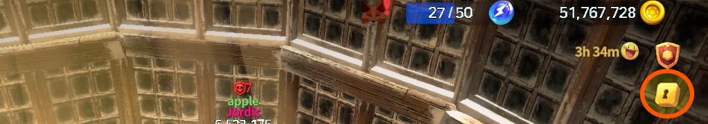
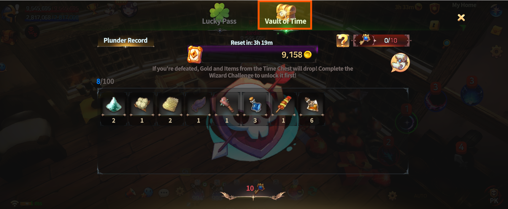
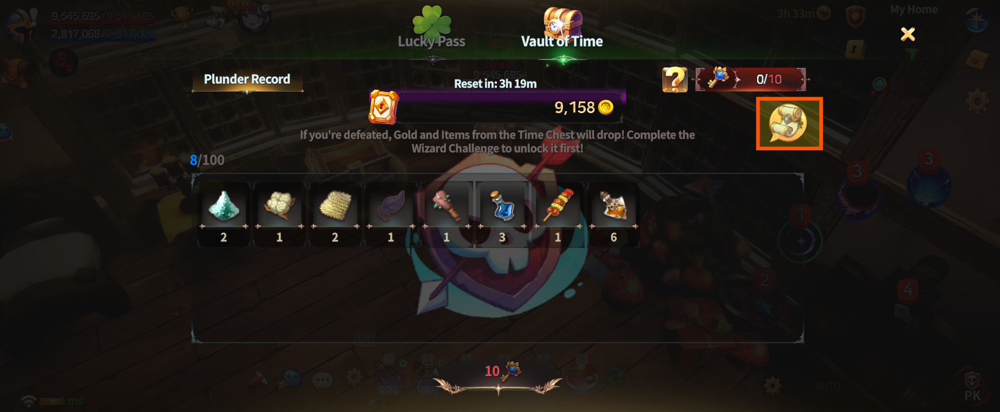
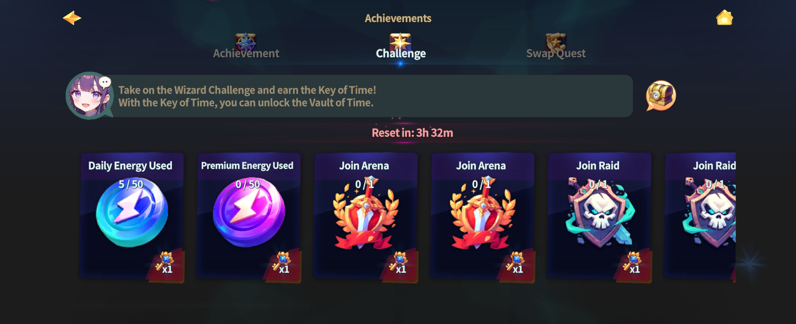

# 💵 Vault of Time



### ⏳ Vault of Time

The **Vault of Time** is a protective system that automatically stores\
a portion of the gold and items obtained through **PvE activities in the field**.

It is designed to reduce losses caused by PK\
while maintaining overall field tension and the PK structure\
through a **balanced system**.

***

### ◾ How to Access the Vault of Time

* Tap the **Vault icon** in the upper-right corner of the HUD.

<figure><figcaption></figcaption></figure>

* Select **“Vault of Time”** from the menu.
* You can view the list of gold and items currently stored in the Vault.

<figure><figcaption></figcaption></figure>

_👉 You can check the current Vault status at any time._

***

### ◾ Vault of Time Overview

* A portion of resources obtained through PvE activities is automatically stored.
* Resources stored in the Vault are managed **separately from your inventory**.
* This helps minimize inventory loss even when PK occurs.

***

### ◾ How the Vault of Time Works

#### 1️⃣ Automatic Resource Storage

A portion of the gold and items obtained through PvE activities\
such as defeating field monsters or clearing content\
is **automatically stored in the Vault of Time**.

***

#### 2️⃣ Vault Duration

At the moment you obtain resources for the first time,\
the Vault of Time is activated and a **6-hour timer begins**.

* The Vault remains active for **6 hours from activation**.
* If the Vault is not opened within the time limit,\
  it will automatically expire and the stored resources cannot be recovered.

⏰ Be sure to open the Vault within the time limit to claim your rewards.

***

#### 3️⃣ Drop Rules on PK

If you are defeated through PK,\
**only the resources stored in the Vault of Time are dropped**,\
not the items in your inventory.


If you pick up the dropped gold or items again,\
👉 they are **automatically returned to the Vault of Time**.

**This system prevents PK abuse and minimizes unnecessary repeated losses.**


***

#### 4️⃣ How to Open the Vault

To open the Vault of Time, you need a **Key** obtained from the [**Wizard Challenge**](../contents/wizard-challenge.md).

* Using the Key immediately opens the Vault.
* All stored gold and items are obtained instantly.

You can enter the Wizard Challenge\
by tapping the **scroll-shaped icon** on the right side of the HUD.

<figure><figcaption></figcaption></figure>

By completing the challenge, you can obtain a **Vault Key**.

<figure><figcaption></figcaption></figure>


#### If the Vault is not opened within the time limit, it will expire, and the next storage cycle will start from **zero**.


***

### 🔎 Vault of Time at a Glance

* Access the Vault of Time via the Vault icon in the upper-right HUD.
* A portion of PvE rewards is automatically stored in the Vault.
* The Vault remains active for **6 hours after activation**.
* If not opened in time, stored resources expire.
* On PK defeat, **only Vault-stored resources are dropped**, while inventory items are protected.
* Picked-up drops are returned to the Vault automatically.
* The Vault can only be opened using a **Key obtained from the Wizard Challenge**.



### ⏳ 시간의 금고 (Vault of Time)

시간의 금고는\
필드에서 진행하는 **PvE 활동 중 획득한 골드와 아이템의 일부를 자동으로 보관**하는 보호 시스템입니다.

PK로 인한 손실을 줄이면서도,\
필드 전반의 긴장감과 PK 구조가 유지되도록 설계된 **균형형 시스템**입니다.

***

### ◾ 시간의 금고 접근 방법

* HUD 우측 상단의 **금고 아이콘**을 터치합니다.

<figure><figcaption></figcaption></figure>

* 메뉴에서 **‘시간의 금고’**&#xB97C; 선택합니다.
* 현재 보관 중인 골드 및 아이템 목록을 확인할 수 있습니다.

<figure><figcaption></figcaption></figure>

👉 _언제든지 현재 금고 상태를 확인할 수 있습니다._

***

### ◾ 시간의 금고 기본 개요

* 필드 PvE 활동을 통해 획득한 재화 일부가 자동으로 보관됩니다.
* 금고에 보관된 재화는 일반 인벤토리와 **분리되어 관리**됩니다.
* PK 발생 시에도 인벤토리 손실을 최소화할 수 있습니다.

***

### ◾ 시간의 금고 작동 방식

#### 1️⃣ 재화 자동 보관

필드 몬스터 처치, 콘텐츠 클리어 등 PvE 활동을 통해 획득한 골드 및 아이템 중 일부가\
**자동으로 시간의 금고에 저장**됩니다.

***

#### 2️⃣ 금고 유지 시간

처음으로 재화를 획득한 순간, 시간의 금고가 **활성화되며 6시간 타이머가 시작**됩니다.

* 금고는 활성화 시점부터 **6시간 동안 유지**됩니다.
* 제한 시간 내에 열지 않으면, 금고는 자동으로 소멸되며 보관된 재화는 회수할 수 없습니다.

⏰ 반드시 시간 내에 금고를 열어 보상을 획득하세요.

***

#### 3️⃣ PK 발생 시 드랍 규칙

PK로 인해 사망할 경우, 플레이어의 인벤토리가 아닌 **시간의 금고에 보관된 재화만 드랍**됩니다.


드랍된 아이템이나 골드를 내가다시 획득하면,\
👉 해당 재화는 **다시 시간의 금고로 자동 귀속**됩니다.

**이를 통해 PK 악용을 방지하고, 불필요한 반복 피해를 최소화합니다.**


***

#### 4️⃣ 금고 개방 방법

시간의 금고를 개방하려면, [**위자드 챌린지(Wizard Challenge)**](../contents/wizard-challenge.md)에서 획득한 **열쇠(Key)**&#xAC00; 필요합니다.\
열쇠를 사용하면 금고가 즉시 개방되며, 보관 중이던 골드와 아이템을 모두 획득할 수 있습니다.

위자드 챌린지는 **HUD 우측의 두루마리 모양 아이콘**을 터치하여 입장할 수 있습니다.

<figure><figcaption></figcaption></figure>

챌린지를 완료하면 **금고 열쇠를 획득**할 수 있습니다.

<figure><figcaption></figcaption></figure>


#### 제한 시간 내에 열지 못하면 금고는 소멸되며, 다음 보관은 다시 0부터 시작됩니다.


***

### 🔎 시간의 금고 한눈에 다시보기

* HUD 우측 상단 금고 아이콘을 통해 시간의 금고에 접근할 수 있습니다.
* PvE로 획득한 일부 재화가 자동으로 금고에 저장됩니다.
* 금고는 활성화 후 **6시간 동안 유지**됩니다.
* 시간 내에 열지 않으면 보관된 재화는 소멸됩니다.
* PK 발생 시 **금고 보관분만 드랍**되며 인벤토리는 보호됩니다.
* 드랍된 재화를 다시 획득하면 금고로 재귀속됩니다.
* 금고는 **위자드 챌린지에서 획득한 열쇠**로만 개방할 수 있습니다.



### ⏳ 時間の金庫（Vault of Time）

**時間の金庫**は、\
フィールドで行う **PvE活動中に獲得したゴールドやアイテムの一部を自動で保管**する保護システムです。

PKによる損失を抑えつつ、\
フィールド全体の緊張感とPK構造を維持するよう設計された **バランス型システム**です。

***

### ◾ 時間の金庫へのアクセス方法

* HUD右上の **金庫アイコン** をタップします。

<figure><figcaption></figcaption></figure>

* メニューから **「時間の金庫」** を選択します。
* 現在保管中のゴールドおよびアイテム一覧を確認できます。

<figure><figcaption></figcaption></figure>

_👉 いつでも現在の金庫の状態を確認できます。_

***

### ◾ 時間の金庫 基本概要

* フィールドでのPvE活動によって獲得した資源の一部が自動で保管されます。
* 金庫に保管された資源は、通常のインベントリとは **別に管理** されます。
* PKが発生した場合でも、インベントリの損失を最小限に抑えられます。

***

### ◾ 時間の金庫の仕組み

#### 1️⃣ 資源の自動保管

フィールドモンスターの討伐やコンテンツクリアなど、\
PvE活動によって獲得したゴールドやアイテムの一部が\
**自動的に時間の金庫へ保管**されます。

***

#### 2️⃣ 金庫の保持時間

初めて資源を獲得した瞬間、時間の金庫が **有効化され、6時間のタイマーが開始**されます。

* 金庫は有効化時点から **6時間維持**されます。
* 制限時間内に開放しなかった場合、\
  金庫は自動的に消滅し、保管された資源は回収できません。

⏰ 必ず時間内に金庫を開放し、報酬を獲得してください。

***

#### 3️⃣ PK発生時のドロップルール

PKによって死亡した場合、プレイヤーのインベントリではなく、\
**時間の金庫に保管された資源のみがドロップ**されます。


ドロップしたゴールドやアイテムを再度拾った場合、\
👉 **再び時間の金庫へ自動的に帰属**されます。

**これにより、PKの悪用を防止し、不要な繰り返し被害を最小限に抑えます。**


***

#### 4️⃣ 金庫の開放方法

時間の金庫を開放するには、[**ウィザードチャレンジ（Wizard Challenge）**](../contents/wizard-challenge.md)で獲得できる\
**鍵（Key）**&#x304C;必要です。

* 鍵を使用すると、金庫は即座に開放されます。
* 保管されていたゴールドおよびアイテムをすべて獲得できます。

ウィザードチャレンジは、HUD右側の **巻物型アイコン** をタップすると入場できます。

<figure><figcaption></figcaption></figure>

チャレンジをクリアすると、**金庫の鍵**を獲得できます。

<figure><figcaption></figcaption></figure>


#### 제制限時間内に金庫を開放できなかった場合、金庫は消滅し、次回の保管は **0から再スタート**します。


***

### 🔎 時間の金庫 ひと目で確認

* HUD右上の金庫アイコンから時間の金庫にアクセスできます。
* PvEで獲得した資源の一部が自動で金庫に保管されます。
* 金庫は有効化後 **6時間維持**されます。
* 時間内に開放しない場合、保管された資源は消滅します。
* PK発生時は **金庫保管分のみがドロップ**し、インベントリは保護されます。
* ドロップした資源を再取得すると金庫へ再帰属されます。
* 金庫は **ウィザードチャレンジで獲得した鍵**でのみ開放可能です。



<em>※ This guide was written based on the game status as of January 9, 2026,</em>  <em>and its contents may change with future updates.</em>

