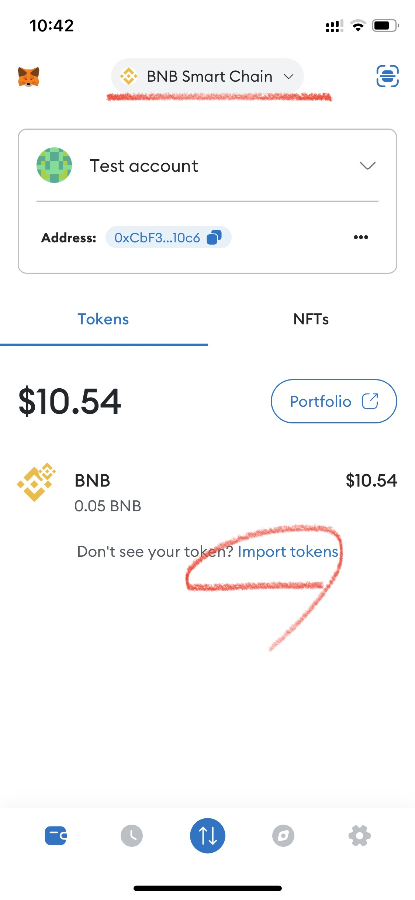

# ✅ Connect to MetaMask

🛑 This information may be updated later than the game server data.\
🛑 이 내용은 게임 서버 데이터보다 늦게 업데이트 될 수 있습니다.\
🛑 この情報はゲームサーバーデータよりも遅れて更新される場合があります。

**📢&#x20;**_**Contents**_

* [What is MetaMask?](./#what-is-metamask)
* [Getting Started with MetaMask](./#getting-started-with-metamask)
* [Add BSC Network](./#add-bsc-network)
* [Import XTO Token](./#import-xto-token)
* [Connecting to the game](./#connecting-to-the-game)
* [Registering NFT to MetaMask](./#registering-nft-to-metamask)
* [Requested connection with MetaMask, but no response?](./#requested-connection-with-metamask-but-no-response)
* [BNB Top-Up Method Using G-cash for G-cash Users](./#bnb-top-up-method-using-g-cash-for-g-cash-users)

## **❓What is MetaMask?**&#x20;



MetaMask is a **decentralized wallet** that allows users to store and manage smart contracts and digital assets on the blockchain. It is widely used across the world for interacting with decentralized applications (DApps).


<mark style="color:blue;">EXTOCIUM requires a MetaMask wallet connection to upload your game assets to the blockchain.</mark>


💡[ **Need help?**](../../getting-started-guide/wallet-connection/connecting-games-and-metamask.md#eng) Check out our guide on how to connect your MetaMask wallet to EXTOCIUM!



메타마스크(MetaMask)는 **스마트 계약 및 디지털 자산을 안전하게 보관하고 관리할 수 있는 탈중앙화 지갑**입니다.\
전 세계적으로 널리 사용되며, 블록체인 기반의 다양한 탈중앙화 애플리케이션(DApp)과 상호작용할 수 있도록 도와줍니다.


<mark style="color:blue;">**엑스토시움은 게임 자산을 블록체인에 업로드하기 위해 메타마스크 지갑 연결이 반드시 필요합니다.**</mark>


💡 [**도움이 필요하신가요?**](../../getting-started-guide/wallet-connection/connecting-games-and-metamask.md#undefined-1) 메타마스크를 엑스토시움에 연결하는 방법을 확인해 보세요!



MetaMask（メタマスク）は、**スマートコントラクトやデジタル資産を安全に保管・管理できる分散型ウォレット**です。\
世界中で広く利用されており、ブロックチェーンを基盤とした**分散型アプリケーション（DApp）と連携**することができます。


<mark style="color:blue;">EXTOCIUMは、ゲーム資産をブロックチェーンにアップロードするためにメタマスクウォレット接続が必ず必要です。</mark>


💡 [**お困りですか？**](../../getting-started-guide/wallet-connection/connecting-games-and-metamask.md#ri-ben-yu) EXTOCIUMにMetaMaskを接続する方法を確認してみましょう！



> [_MetaMask Guide_](https://support.metamask.io/hc/en-us/articles/360015489531-Getting-started-with-MetaMask)

## Getting Started with MetaMask



✅Your _game account_ and your _MetaMask wallet address_ must be matched 1:1. \
✅Once a game account is connected to a wallet address, it cannot be changed, and cannot be duplicated with other accounts or wallets.

This is a requirement to prevent hacking and ensure that your wallet address matches your game data.

If you mint NFTs within the game, the game asset will be generated in your wallet and the developers cannot access it. \
Therefore, please never lose your wallet under any circumstances.\





✅당신의 게임 계정과 당신의 메타마스크 지갑 주소는 반드시 1:1로 매칭됩니다.\
✅한 번 연결된 게임 계정과 지갑 주소는 변경할 수 없으며, 다른 계정이나 지갑과 중복 연결할 수 없습니다.


이는 해킹을 방지하고, 당신의 지갑 주소와 당신의 게임 데이터를 일치 시키기 위한 조건입니다.

만약 당신이 게임 내에서 NFT를 발행하게 될 경우, 이 게임 자산은 당신의 지갑에 생성됩니다. \
개발자는 당신의 지갑에 접근할 수 없습니다. 따라서 절대로 지갑을 잃어버리지 마세요.



✅あなたのゲームアカウントとあなたのメタマスクウォレットアドレスは、必ず1:1でマッチングされます。\
✅一度接続されたゲームアカウントとウォレットアドレスは変更できず、他のアカウントやウォレットとの重複接続はできません。

これはハッキングを防止し、あなたのウォレットアドレスとゲームデータが一致することを確認するための条件です。

もしゲーム内でNFTを発行する場合、そのゲームアセットはあなたのウォレットに生成されます。開発者はあなたのウォレットにアクセスすることはできません。\
そのため、どんな状況でも絶対にウォレットを失わないようにしてください。



## Add BSC Network



Extoxium is based on the Binance Smart Chain. \
Therefore, you need to add the _**BSC network**_ to your MetaMask wallet app. \
Please follow the instructions below.

<figure><figcaption></figcaption></figure>

:arrow\_up: Please touch the Network section at the top center of your screen.

<figure><figcaption></figcaption></figure>

:arrow\_up: Please touch the Network section at the top center of your screen.

<figure><figcaption></figcaption></figure>

:arrow\_up: If the network does not exist, select the '**Custom Networks**' menu and enter the following information in each field.

|                                                                                                                                                                                                                                                                                                                                                                                                                            |
| -------------------------------------------------------------------------------------------------------------------------------------------------------------------------------------------------------------------------------------------------------------------------------------------------------------------------------------------------------------------------------------------------------------------------- |
| 
👉Network Name : <strong>Binance Smart Chain</strong> <strong>👉</strong>RPC URL : <a href="https://bsc-dataseed.binance.org/"><strong>https://bsc-dataseed.binance.org</strong></a> <strong>👉</strong>Chain ID : <strong>56</strong> <strong>👉</strong>Symbol : <strong>BNB</strong> <strong>👉</strong>Block Explorer URL : <a href="https://bscscan.com/"><strong>https://bscscan.com</strong></a>
 |



엑스토시움은 바이낸스 스마트 체인을 기반으로 합니다. \
따라서 당신은 메타마스크 지갑 앱에 _**BSC 네트워크**_&#xB97C; 추가해야 합니다. 아래 내용을 따라해보세요.

<figure><figcaption></figcaption></figure>

:arrow\_up: 지갑 중앙 상단에 Network 부분을 터치해보세요.

<figure><figcaption></figcaption></figure>

:arrow\_up: 네트워크 추가 버튼을 누르고, **Binance smart chain**을 선택하세요.

<figure><figcaption></figcaption></figure>

:arrow\_up: 만약 네트워크가 존재하지 않을 경우, **커스텀 네트워크** 메뉴를 선택하고, 아래 정보를 각 칸에 입력해주세요.

|                                                                                                                                                                                                                                                                                                                                                                                                                            |
| -------------------------------------------------------------------------------------------------------------------------------------------------------------------------------------------------------------------------------------------------------------------------------------------------------------------------------------------------------------------------------------------------------------------------- |
| 
👉Network Name : <strong>Binance Smart Chain</strong> <strong>👉</strong>RPC URL : <a href="https://bsc-dataseed.binance.org/"><strong>https://bsc-dataseed.binance.org</strong></a> <strong>👉</strong>Chain ID : <strong>56</strong> <strong>👉</strong>Symbol : <strong>BNB</strong> <strong>👉</strong>Block Explorer URL : <a href="https://bscscan.com/"><strong>https://bscscan.com</strong></a>
 |



エクストキシウムはBinance Smart Chainを基にしています。\
そのため、MetaMaskウォレットアプリ&#x306B;_**BSCネットワーク**_&#x3092;追加する必要があります。\
以下の手順に従ってください。

<figure><figcaption></figcaption></figure>

:arrow\_up: 財布の中央上段のNetwork部分をタッチしてみてください。

<figure><figcaption></figcaption></figure>

:arrow\_up: 『ネットワークを追加』ボタンを押し、『**Binance Smart Chain**』を選択してください。

<figure><figcaption></figcaption></figure>

:arrow\_up: もしネットワークが存在しない場合は、『**カスタムネットワーク**』メニューを選択し、以下の情報を各欄に入力してください。

|                                                                                                                                                                                                                                                                                                                                                                                                                            |
| -------------------------------------------------------------------------------------------------------------------------------------------------------------------------------------------------------------------------------------------------------------------------------------------------------------------------------------------------------------------------------------------------------------------------- |
| 
👉Network Name : <strong>Binance Smart Chain</strong> <strong>👉</strong>RPC URL : <a href="https://bsc-dataseed.binance.org/"><strong>https://bsc-dataseed.binance.org</strong></a> <strong>👉</strong>Chain ID : <strong>56</strong> <strong>👉</strong>Symbol : <strong>BNB</strong> <strong>👉</strong>Block Explorer URL : <a href="https://bscscan.com/"><strong>https://bscscan.com</strong></a>
 |



> [How to display unlisted tokens in MetaMask?](https://support.metamask.io/hc/en-us/articles/360015489031-How-to-add-unlisted-tokens-custom-tokens-in-MetaMask)

## Import XTO Token

<figure><figcaption>
Import XTO Token
</figcaption></figure>

* If you have added the BSC network, please touch the '_**Import Tokens**_' button to add XTO token.
* BSC 네트워크가 추가었다면 XTO토큰을 추가하기 위해, _**토큰 추가하기(Import Tokens) 버튼**_&#xC744; 터치해주세요.
* BSCネットワークを追加した場合は、XTOトークンを追加するために、『_**トークンを追加する(Import Tokens)**_』ボタンをタッチしてください。

<figure><figcaption>
Custom Token
</figcaption></figure> <figure><figcaption>
Custom Token Import
</figcaption></figure>

* Select the '**Custom Token**' menu on the next screen and enter the following information.
* 다음 화면에서 **커스텀 토큰** 메뉴를 선택하고, 아래 정보를 입력해주세요.
* 次の画面で『**カスタムトークン**』メニューを選択し、以下の情報を入力してください。


👉 Token  Address : 0xAA390Bd1657514730D98BAaBcE4b393a53ACD579\
👉 Token  Symbol : XTO\
<mark style="color:red;">👉 Token  Decimal : 18</mark>


* After that, simply touch the '**IMPORT**' button.
* 그런 후 "**IMPORT**" 버튼을 터치하면 됩니다.
* その後、「**IMPORT**」ボタンをタッチしてください。



## Connecting to the Game

When you launch the game, there will be a step to connect with MetaMask after logging in. During this step, the game app will automatically load your MetaMask app. Alternatively, you can connect to your wallet by scanning the QR code.\
\
게임을 실행하면, 로그인 후 메타마스크에 연결하는 단계가 존재합니다. 이 단계에서 게임 앱은 자동으로  메타마스크 앱을 불러옵니다. 혹은 QR코드를 인식하여 지갑에 연결할 수 있습니다.\
\
ゲームを起動すると、ログイン後にMetaMaskとの接続手順があります。この手順では、ゲームアプリが自動的にあなたのMetaMaskアプリを読み込みます。また、QRコードをスキャンしてウォレットに接続することもできます。\
\
💠**If you are using multiple accounts within MetaMask:** \
Before starting the game, log-in to the MetaMask app and select the MetaMask account you want to use.

When you request a transaction from the in-game wallet, it will be initiated from the connected MetaMask account. Therefore, if you are not logged in with the wallet account connected to the game, the transaction request may appear to be ignored.\
\
💠**MetaMask 내에서 여러 계정을 사용 중인 경우:** \
게임을 실행하기 전에 MetaMask 앱에 로그인하고 사용할 MetaMask 계정을 선택해야 합니다.

게임 내 지갑에서 거래를 요청하면 연결된 메타마스크 계정으로 요청됩니다. 따라서 게임에 연결된 지갑 계정에 로그인하지 않은 경우 거래 요청이 무시된 것처럼 보일 수 있습니다.\
\
💠**MetaMaskで複数のアカウントを使用している場合：** \
ゲームを開始する前に、MetaMaskアプリにログインし、使用するMetaMaskアカウントを選択してください。

ゲーム内のウォレットから取引を要求すると、接続されたMetaMaskアカウントから要求が行われます。したがって、ゲームに接続されたウォレットアカウントにログインしていない場合、取引要求は無視されたように見える可能性があります。"





> [NFT Tokens in your MetaMask Wallet](https://support.metamask.io/hc/en-us/articles/360058238591-NFT-tokens-in-your-MetaMask-wallet)

## Registering NFT to MetaMask

\
All the NFTs you own within the game can be registered on MetaMask.\
게임 내에서 가지고 있는 모든 NFT는 메타마스크에 등록 할 수 있습니다.\
ゲーム内で所有しているすべてのNFTはMetaMaskに登録できます。

<figure><figcaption>
Registering NFT
</figcaption></figure>

1. First, access the information page of the NFT you own within the game.
2. Touch the address on the left side of the hero to copy it to the clipboard.
3. Remember or touch the ID at the bottom to copy it as well.
4. Now, go to MetaMask and touch the NFT tab.
5. Touch '_Import NFT_' at the bottom.
6. Simply paste the copied address and ID to load the NFT.

1. 먼저 게임 내 보유하고 있는 NFT의 정보 페이지에 접속합니다.
2. 영웅의 왼쪽에 있는 주소를 터치하여 클립보드에 복사합니다.
3. 하단의 아이디도 기억하시거나 터치하셔서 복사하세요.
4. 이제 메타마스크로 이동하여 NFT 탭을 터치합니다.
5. 하단에서 NFT 가져오기를 터치합니다.
6. 복사한 주소와 아이디를 넣고 불러오기만 하면 됩니다.

1. まず、ゲーム内で所有しているNFTの情報ページにアクセスします。
2. クリップボードにコピーするために、英雄の左側にあるアドレスをタッチします。
3. 下部のIDを覚えておくか、タッチしてコピーします。
4. それでは、MetaMaskに移動してNFTタブをタッチします。
5. 下部で『NFTを取り込む』をタッチします。
6. コピーしたアドレスとIDを貼り付けるだけで、NFTを取り込むことができます。

## Requested connection with MetaMask, but no response?

�&#xDCA0;_**We have requested a connection with MetaMask, but there is no response.**_\
\
The MetaMask app often disconnects due to security reasons, which may result in the wallet not responding or the confirmation pop-up not appearing. In such cases, please follow the steps below:

1. Force close the MetaMask app and relaunch it.
2. If the fox button on the top right of the game is connected, touch it and then click the disconnect button.
3. Then, check the QR code screen again.
4. Clicking the QR code once will refresh it. (Please do not click multiple times.)
5. Next, scan the QR code in the MetaMask app to reconnect. (For in-app connection via mobile, touch the 'fox button'.)"

�&#xDCA0;_**메타마스크 연결을 요청했지만 응답이 없어요.**_\
\
Metamask 앱은 보안 문제로 인해 자주 연결이 끊어집니다. 이로 인해 지갑이 응답하지 않거나 확인 팝업이 나타나지 않을 수 있습니다. 이 경우 아래와 같이 따라해 보세요.

1. Metamask 앱을 ​​강제 종료하고 다시 실행합니다.
2. 게임 우측 상단의 여우 버튼이 연결되어 있다면 터치 후 연결 해제 버튼을 터치합니다.
3. 그런 다음 QR 코드 화면을 다시 확인하십시오.
4. 이때 QR코드를 한번 클릭하면 QR이 갱신됩니다. (여러번 클릭하지 마세요)
5. 그런 다음 Metamask 앱에서 QR을 찍고 다시 연결하십시오. (모바일을 통한 인앱 연결은 '여우 버튼'을 터치하시면 됩니다.)

�&#xDCA0;_**MetaMaskとの接続要求がありましたが、応答がないようです。**_

MetaMaskアプリはセキュリティ上の理由から頻繁に切断されることがあります。これにより、ウォレットが応答しないか、確認ポップアップが表示されない場合があります。そのような場合は、以下の手順をお試しください。

1. MetaMaskアプリを強制終了し、再起動します。
2. ゲームの右上にあるキツネのボタンが接続されている場合は、タッチして切断ボタンをタッチします。
3. その後、QRコード画面を再確認します。
4. QRコードを1回クリックすると更新されます。（複数回クリックしないでください）
5. 次に、MetaMaskアプリでQRコードをスキャンして再接続してください。（モバイルを使ったアプリ内接続の場合は、「キツネのボタン」をタッチしてください。）

<figure><figcaption>
QR code
</figcaption></figure>

## BNB Top-Up Method Using G-cash for G-cash Users



