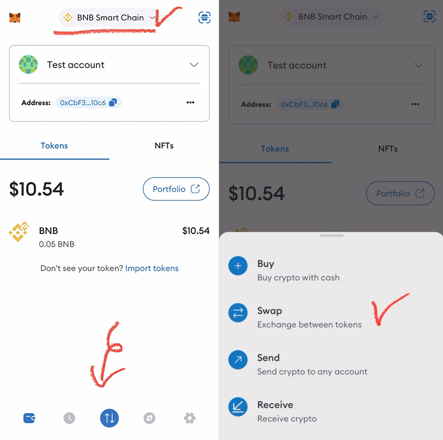
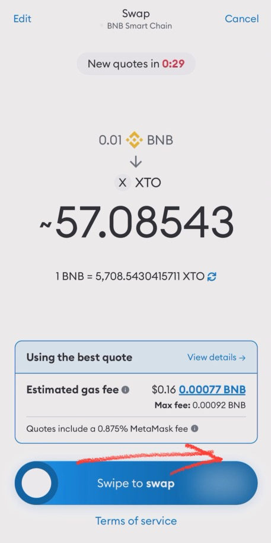

# 🎲 XTO ↔ BNB Swap

🛑 This information may be updated later than the game server data.\
🛑 이 내용은 게임 서버 데이터보다 늦게 업데이트 될 수 있습니다.\
🛑 この情報はゲームサーバーデータよりも遅れて更新される場合があります。

📢 _**Contents**_

* [Swap on MetaMask](xto-bnb-swap.md#swap-on-metamask)
* [Swap on PancakeSwap](xto-bnb-swap.md#swap-on-pancakeswap)\

## **Swap on MetaMask**

On the MetaMask app, you can easily swap XTO to BNB or BNB to XTO.\
메타마스크 앱에서 손쉽게 XTO를 BNB로, 혹은 BNB를 XTO로  스왑할 수 있습니다.\
メタマスクアプリで簡単にXTOをBNBに、あるいはBNBをXTOにスワップできます。\
\
&#x20;                                                   ♦️♦️♦️♦️♦️♦️♦️♦️♦️♦️♦️♦️♦️♦️♦️♦️♦️♦️♦️♦️♦️♦️♦️

<figure><figcaption>
Main Screen
</figcaption></figure>

Open your MetaMask wallet and select the BSC network. \
If the XTO token is already registered, it will be convenient to use. [(Register Token) ](./)\
Then, touch the displayed Swap button on the screen.\
&#x20;                                                                         💠\
메타마스크 지갑에 접속하여, BSC 네트워크를 선택합니다. \
XTO 토큰이 먼저 등록되어있으면 사용하기 편리합니다. [(토큰 등록하기) ](./)\
그리고 화면에 표시된 Swap 버튼을 터치합니다.\
&#x20;                                                                         💠\
MetaMaskウォレットにアクセスし、BSCネットワークを選択します。 \
もしXTOトークンがすでに登録されていれば、使いやすくなります。[（トークンを登録） ](./)\
そして、画面に表示されているSwapボタンをタッチしてください。\
\
&#x20;                                                    ♦️♦️♦️♦️♦️♦️♦️♦️♦️♦️♦️♦️♦️♦️♦️♦️♦️♦️♦️♦️♦️♦️♦️

<figure><figcaption>
Swap Screen
</figcaption></figure>

This is the Swap screen. \
&#xNAN;_**The BNB section**_ displayed above allows you to set _**the token you want to sell**_, and the '_**Select a token**_' shown below allows you to set _**the token you want to buy**_. \
Press the blue arrow to switch the positions of the two tokens.

✅In other words, set the token you want to receive below. \
✅Now, touch the _'Select a token'_ part on the _'Swap screen'_.\
\
Swap 화면 입니다. \
위에 표시된 _**BNB부분**_&#xC740; 내가 _**판매할 토큰**_&#xC744; 설정 할 수 있고, 아래 표시된 ' _**Select a token**_'에 내가 _**구매할 토큰**_&#xC744; 설정할 수 있습니다. \
파란 화살표를 누르면 두 토큰의 자리를 바꿀 수 있습니다.

✅즉, 내가 받고 싶은 토큰을 아래에 설정하면 됩니다. \
✅이제 '_Swap 화면_'에서 '_Select a token_' 부분을 터치합니다.\
\
これはSwap画面です。\
上に表示されてい&#x308B;_**BNBの部分**_&#x306F;、_**販売したいトークン**_&#x3092;設定できます。また、下に表示されている'_**Select a token**_'では、_**購入したいトークン**_&#x3092;設定できます。\
青い矢印を押すと、2つのトークンの位置を交換できます。

✅つまり、受け取りたいトークンを下に設定してください。\
✅それでは、'_Swap画面_'で'_Select a token_'部分をタッチしてください。

&#x20;                                                    ♦️♦️♦️♦️♦️♦️♦️♦️♦️♦️♦️♦️♦️♦️♦️♦️♦️♦️♦️♦️♦️♦️♦️

<figure><figcaption>
Search XTO
</figcaption></figure>

When the '_Convert to_' popup appears, enter XTO. \
If you have registered a custom token, you will find the XTO token in the menu. \
Touch the XTO token displayed on the screen.\
&#x20;                                                                         💠\
'_Convert to_' 팝업이 뜨면 XTO를 입력해줍니다. \
나의 커스텀 토큰이 등록되어 있다면, 메뉴에 XTO 토큰이 검색됩니다. \
화면에 검색된 XTO를 터치합니다.\
&#x20;                                                                         💠\
'_Convert to_'のポップアップが表示されたら、XTOを入力します。 \
カスタムトークンが登録されている場合、メニューにXTOトークンが表示されます。\
&#x20;画面に表示されたXTOトークンをタッチしてください。\
\
&#x20;                                                          ♦️♦️♦️♦️♦️♦️♦️♦️♦️♦️♦️♦️♦️♦️♦️♦️♦️♦️♦️♦️♦️♦️♦️\

<figure><figcaption>
Swap screen
</figcaption></figure>

XTO has been registered on the Swap screen. \
As XTO is categorized as a custom token, please make sure to double-check. \
Now, enter the amount of BNB you want to pay in this section. \
Then, scroll down and touch the blue '_**Get quotes**_' button at the bottom.\
&#x20;                                                                         💠\
Swap화면에 XTO가 등록되었습니다. \
XTO는 커스텀 토큰으로 분류되기 때문에, 꼭 확인을 해주어야 합니다. \
이제 이곳에서 내가 지불할 BNB의 양을 입력해줍니다. \
그리고 하단에 내려보면 나오는 푸른색의 _**Get quotes**_ 버튼을 터치합니다.\
&#x20;                                                                         💠\
Swap画面にXTOが登録されました。 \
XTOはカスタムトークンに分類されるため、必ず確認してください。 \
さて、ここに支払いたいBNBの金額を入力してください。 \
次に、下にスクロールして、画面下部に表示される青い『_**Get quotes**_』ボタンをタッチしてください。

&#x20;                                                       ♦️♦️♦️♦️♦️♦️♦️♦️♦️♦️♦️♦️♦️♦️♦️♦️♦️♦️♦️♦️♦️♦️♦️

<figure><figcaption>
Swipe to Swap
</figcaption></figure>

After the loading screen with the fox icon finishes, the final swap confirmation screen will appear.\
On this screen, if you agree with the fees and XTO price, you can complete the transaction by swiping the '_Swipe to swap_' section. \
(If you don't have enough BNB balance to cover the payment, the swipe function will not work.)\
&#x20;                                                                         💠\
여우 모양의 로딩 화면이 끝나면 최종 스왑 확인 화면이 뜹니다. \
이 화면에서 수수료 및 XTO 가격에 동의할 경우, '_Swipe to swap_' 부분을 밀어서 거래를 완료할 수 있습니다. \
( 지불해야 할 BNB 보유량이 부족할 경우, Swipe가 작동하지 않습니다. )\
&#x20;                                                                         💠\
キツネのアイコンが表示されるローディング画面が終わると、最終的なスワップ確認画面が表示されます。 \
この画面で手数料とXTOの価格に同意した場合、'_Swipe to swap_'の部分をスワイプして取引を完了することができます。 \
（支払いに必要なBNBの残高が足りない場合は、スワイプ機能が動作しません。）\
\
&#x20;                                                        ♦️♦️♦️♦️♦️♦️♦️♦️♦️♦️♦️♦️♦️♦️♦️♦️♦️♦️♦️♦️♦️♦️♦️

<figure><figcaption>
Transaction Complete
</figcaption></figure>

After the transaction is successful, you will return to the wallet main screen, and a '_Complete_' pop-up like the image above will appear at the bottom.\
\
거래가 성사되면 지갑 메인으로 돌아오면서, 하단에 위 이미지와 같은 _Complete_ 팝업이 생성됩니다.\
\
取引が成功すると、ウォレットのメイン画面に戻り、下の画像のような「_Complete_」ポップアップが表示されます。\
\
&#x20;                                                         ♦️♦️♦️♦️♦️♦️♦️♦️♦️♦️♦️♦️♦️♦️♦️♦️♦️♦️♦️♦️♦️♦️♦️\
\

<figure><figcaption>
Transaction Result
</figcaption></figure>

Finally, you can verify in your wallet that BNB has been paid and XTO has been deposited. \
(It may take a few seconds for the transaction result to reflect on the screen.)\
&#x20;                                                                         💠\
최종적으로 BNB가 지불되고 XTO가 충전된 것을 지갑에서 확인할 수 있습니다. (거래 결과가 화면에 반영되는데 수 초가 걸릴 수 있습니다.)\
&#x20;                                                                         💠\
最終的に、BNBが支払われ、XTOがウォレットに入金されたことが確認できます。（取引結果が画面に反映されるまで数秒かかる場合があります。）



## Swap on PancakeSwap

You can also trade XTO on PancakeSwap.\
PancakeSwap에서도 XTO를 거래할 수 있습니다.\
PancakeSwapでもXTOを取引できます。

<figure><figcaption>
PancakeSwap
</figcaption></figure>

&#x20;                                                        ♦️♦️♦️♦️♦️♦️♦️♦️♦️♦️♦️♦️♦️♦️♦️♦️♦️♦️♦️♦️♦️♦️♦️

#### How to make P2P trade XTO coins on Pancakeswap:

<figure><figcaption>
PancakeSwap Homepage
</figcaption></figure>

Go to the PancakeSwap homepage and connect with your MetaMask.

1. Click the _**trade button > swap**_ located in the top-left corner of the homepage.
2. When you press the Trade > Swap button, a page resembling the screenshot above will appear.
3. **BNB** indicates the coin you are selling, and **CAKE** represents the coin you will receive as payment.
4. You can click on each coin section to switch it to a different coin.

Pancakeswap 홈페이지로 이동하여 메타마스크를 연결합니다.

1. 홈페이지 왼쪽 상단 모서리에 있는 거래 > 스왑버튼을 클릭합니다 .
2. Trade > 스왑 버튼을 누르면 위의 스크린샷과 같은 페이지가 나타납니다.
3. **BNB**는 판매하는 코인 이고 **CAKE**는 결제대금으로 받을 코인입니다 .
4. 각 동전 부분을 클릭하면 다른 동전으로 변경할 수 있습니다.

PancakeSwapのホームページにアクセスし、MetaMaskと連携します。

1. ホームページの左上隅にある取引 > スワップ ボタンをクリックします。
2. Trade>Swapボタンを押すと、上記のスクリーンショットと同様のページが表示されます。
3. **BNB**は販売しているコインで、**CAKE**は決済代金として受け取るコインです。
4. 各コイン部分をクリックすると、別のコインに変更できます。

<figure><figcaption>
Manage Tokens 1
</figcaption></figure>

&#x20;  5\. Click on CAKE to switch the coin.\
&#x20;      To find the XTO coin, click on 'Token Management' in the pop-up window.\
&#x20;   \
&#x20;  5\. CAKE를 클릭하여 코인을 변경해 보겠습니다. \
&#x20;      XTO 코인을 찾으려면 팝업 창에서 토큰 관리를 클릭하십시오.\
\
&#x20;  5\. CAKEをクリックしてコインを変更してみましょう。\
&#x20;     XTOコインを見つけるために、ポップアップウィンドウで『トークン管理』をクリックしてください。

<figure><figcaption>
Manage Tokens 2
</figcaption></figure>

&#x20;  6\. Then, click on _**Tokens**_.\
&#x20;  7\.  Paste the address below into the appearing window.\
\
&#x20;  6\. 그런 다음 토큰을 클릭합니다 .\
&#x20;  7\. 다음에 나타나는 창에서 아래 주소를 붙여 넣으십시오.\
\
&#x20;  6\. 次に、トークンをクリックします。\
&#x20;  7\. 次に表示されるウィンドウに以下のアドレスを貼り付けてください。

### **Contract Addr : 0xAA390Bd1657514730D98BAaBcE4b393a53ACD579**

<figure><figcaption>
Game Screen
</figcaption></figure>

<figure><figcaption></figcaption></figure>

&#x20;  8\. You can also conveniently copy the XTO contract address directly from the game screen.\
&#x20;  9\. With that, you are now able to import your assets and proceed with the transaction.\
\
&#x20;  8\. XTO의 컨트랙트 주소도 게임 화면에서 쉽게 복사할 수 있습니다.\
&#x20;  9\. 이제 자산을 가져오고 거래할 수 있습니다.\
\
&#x20;  8\. XTOの契約アドレスもゲーム画面から簡単にコピーできます。\
&#x20;  9\. これで、資産を取り込んで取引を進めることができます。

