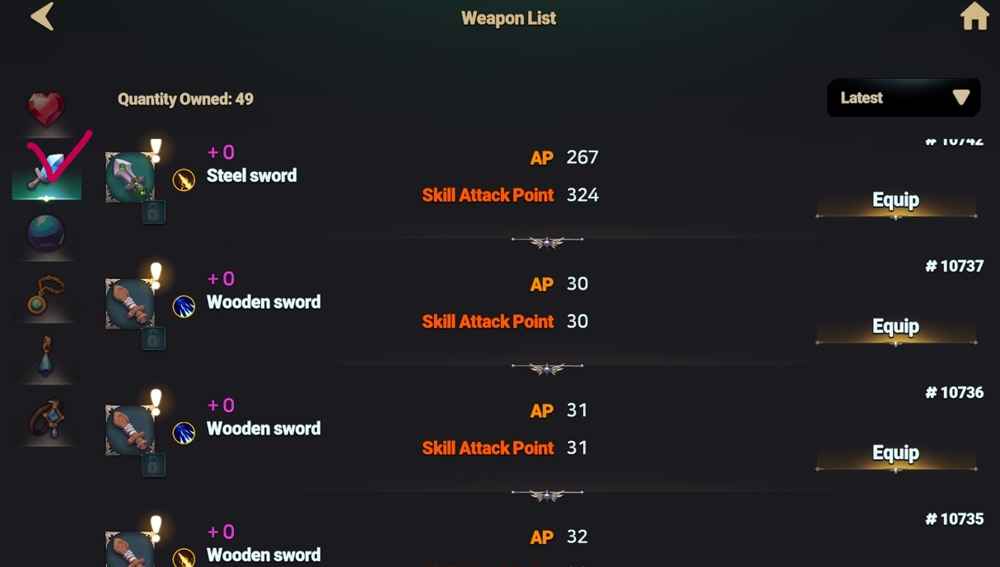
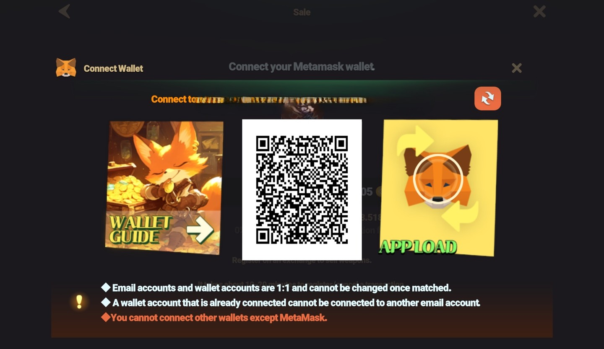
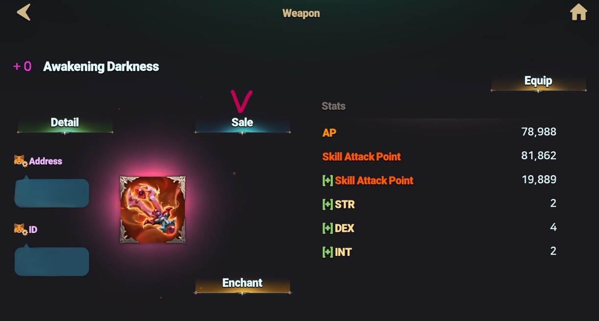

# 📤 Sell


### Want to sell your weapon? Follow these simple steps to list it on the market!



How to register NFT items in the Market





_💡Do you want to sell NFTs? First, please_ [_connect your MetaMask_](../../../getting-started-guide/wallet-connection/connecting-games-and-metamask.md#connecting-the-game-with-metamask)_!_


### **👉Step 1:** Access the Dashboard

* Click on the **Dashboard** button on the left side of the game screen.

<figure><figcaption>
<strong>Dashboard</strong>
</figcaption></figure>

### **👉Step 2:** Enter the **Equipment** Bag

* Navigate to the **Equipment Bag** from the dashboard.

<figure><figcaption>
<strong>Equipment Bag</strong>
</figcaption></figure>

### **👉Step 3:** Select the Weapon You Wish to Sell

* Click on the weapon you want to put up for sale.

<figure><figcaption>
Weapon List
</figcaption></figure>

### **👉Step 4:** Connect Your Wallet if Selling an NFT Weapon

* If the weapon is an **NFT**, you **must connect your MetaMask wallet**.
* Without a connected wallet, you won’t be able to proceed with the sale.

<figure><figcaption></figcaption></figure>

### **👉Step 5:** Open the Weapon Details Page

* Go to the weapon’s **detailed information page** and click **"Sale."**

<figure><figcaption></figcaption></figure>

### **👉Step 6:** Set Your Desired Price

* Enter the price you wish to sell the weapon for and click **"Sale"** again.

<figure><figcaption></figcaption></figure>

### **👉Step 7:** Confirm the Listing

* A confirmation window will appear. Click **"Register"** to finalize the listing.

<figure><figcaption></figcaption></figure>

### **👉Step 8:** Final Confirmation for NFT Weapons

* If you’re selling an **NFT weapon**, a **confirmation prompt will appear in MetaMask.**
* Click **"Confirm"** to complete the transaction.

<figure><figcaption></figcaption></figure>

### **👉Step 9:** Verify Your Listing

* Navigate to **Market > My Stuff** to ensure that your weapon has been successfully listed.

<figure><figcaption></figcaption></figure>

> 💡 **TIP:** \
> Check the market price before setting your price to increase the chances of a quick sale!
>
> Your weapon is now up for sale!  \
> Best of luck in your trade!&#x20;

🛑 [**Did you encounter any problems during the transaction? Please check this tab!**](common-issues.md)




_💡NFT 판매를 원하시나요? 우선,_ [_메타마스크를 연결_](../../../getting-started-guide/wallet-connection/connecting-games-and-metamask.md#undefined-2)_해주세요!_


### **👉1단계:** 게임 좌측의 대시보드로 진입

* 게임 화면의 좌측에 위치한 **대시보드** 버튼을 눌러 주세요.

<figure><figcaption>
<strong>Dashboard</strong>
</figcaption></figure>

### **👉2단계:** 장비 가방으로 진입

* 대시보드에서 **장비 가방** 메뉴로 이동합니다.

<figure><figcaption></figcaption></figure>

### **👉3단계:** 판매할 무기 선택

* 가방에서 판매하려는 무기를 클릭하여 선택하세요.

<figure><figcaption></figcaption></figure>

### **👉4단계:** NFT 무기라면 지갑 연결 필수!

* 선택한 무기가 **NFT 무기**라면, **지갑을 연결**해야 합니다.
* 지갑이 연결되지 않으면 NFT 무기를 판매할 수 없습니다.

<figure><figcaption></figcaption></figure>

### **👉5단계:** 판매 설정

* 선택한 무기의 **상세 정보 페이지**로 이동한 후, **"판매"** 버튼을 클릭합니다.

<figure><figcaption></figcaption></figure>

### **👉6단계:** 가격 설정

* 원하는 판매 가격을 입력하고 다시 **"판매"** 버튼을 눌러 주세요.

<figure><figcaption></figcaption></figure>

### **👉7단계:** 판매 등록 확인

* 판매 등록을 확정하는 **확인창**이 나타납니다. **"판매 등록"** 버튼을 눌러 주세요.

<figure><figcaption></figcaption></figure>

### **👉8단계:** NFT 무기 등록 추가 절차

* NFT 무기의 경우, **메타마스크 지갑에서 확인 버튼**이 나타납니다.
* **확인(Confirm)** 버튼을 눌러야 등록이 완료됩니다.

<figure><figcaption></figcaption></figure>

### **👉9단계:** 등록 확인

* **거래소 > 나의 물품** 메뉴로 이동하여 무기가 정상적으로 등록되었는지 확인하세요!

<figure><figcaption></figcaption></figure>

> 💡 **TIP:** \
> 판매 가격을 설정할 때, 시장 가격을 참고하여 적절한 가격을 책정하면 더 빠르게 거래될 수 있습니다!
>
> 이제 당신의 무기를 판매할 준비가 완료되었습니다!&#x20;
>
> 행운을 빕니다!&#x20;

🛑[거래 도중 문제가 발생하셨나요? 이 탭을 확인해주세요!](common-issues.md)




_💡NFTを販売したいですか？まず、_[_MetaMaskを接続_](../../../getting-started-guide/wallet-connection/connecting-games-and-metamask.md#gmutometamaskwosuru)_してください！_


### **👉ステップ 1:** ダッシュボードを開く

* ゲーム画面の左側にある **ダッシュボード** ボタンをクリックします。

<figure><figcaption>
<strong>Dashboard</strong>
</figcaption></figure>

### **👉ステップ 2:** 装備バッグに移動

* ダッシュボードから **装備バッグ** へ移動します。

<figure><figcaption></figcaption></figure>

### **👉ステップ 3:** 販売する武器を選択

* 販売したい武器をクリックして選択してください。

<figure><figcaption></figcaption></figure>

### **👉ステップ 4:** NFT 武器ならウォレット接続が必須

* 選択した武器が **NFT 武器** の場合、**ウォレット (MetaMask) の接続** が必要です。
* ウォレットが接続されていないと、NFT 武器を販売できません。

<figure><figcaption></figcaption></figure>

### **👉ステップ 5:** 販売設定

* 選択した武器の **詳細情報ページ** に移動し、**「販売 」** をクリックします。

<figure><figcaption></figcaption></figure>

### **👉ステップ 6:** 販売価格の設定

* 希望の価格を入力し、もう一度 **「販売」** をクリックします。

<figure><figcaption>
<strong>販売</strong>
</figcaption></figure>

### **👉ステップ 7:** 販売登録の確認

* 確認画面が表示されるので、**「登録」** ボタンを押してください。

<figure><figcaption>
<strong>登録</strong>
</figcaption></figure>

### **👉ステップ 8:** NFT 武器の追加確認

* **NFT 武器** の場合、**MetaMask で確認画面** が表示されます。
* **「確認 」** ボタンを押すと、販売が確定します。

<figure><figcaption>
<strong>MetaMask</strong>
</figcaption></figure>

### **👉ステップ 9:** 登録の確認

* **マーケット >** **私の品物** に移動し、正常に登録されたか確認しましょう！

<figure><figcaption>
<strong>私の品物</strong>
</figcaption></figure>

> 💡 **TIP:** \
> 市場価格を確認して適切な価格を設定すると、より早く売れる可能性が高くなります！
>
> これで武器の販売準備は完了です！
>
> &#x20;良い取引を！

🛑 [取引中に問題が発生しましたか？このタブをチェックしてください！](common-issues.md)



