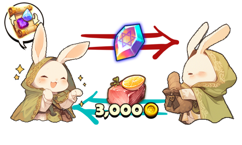
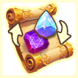

# 💰 Personal Trade

<figure><figcaption></figcaption></figure>



💡 **The 'Personal Trading System' is a system within the game for trading items between individuals.**&#x20;

If you want to trade your items not in an open space like a market, but secretly with a specific person, try using this system.&#x20;

🛑 **Personal trading is only possible in peaceful areas!**

1️⃣[Send request](personal-trade.md#id-1-send-request)\
2️⃣[Respond to requests](personal-trade.md#id-2-respond-to-requests)\
3️⃣[Let's trade!](personal-trade.md#id-3-lets-trade)\
4️⃣[How to get ‘Item Trading Pass’](personal-trade.md#id-4-how-to-get-item-trading-pass)

#### 1️⃣Send request

<figure><figcaption></figcaption></figure>

* Approach the trading partner with an '[Item Trading Pass](personal-trade.md#how-to-get-item-trading-pass)' in your inventory.&#x20;
* Then, a blue trade icon will appear above the other user's head.&#x20;
* Touch the button to request a trade with the other party.

#### 2️⃣**Respond to requests**

<figure><figcaption></figcaption></figure>

* A trade request popup will appear on the other person's screen.&#x20;
* Touch the 'Accept' button to start the trade.

#### 3️⃣Let's trade!

<figure><figcaption></figcaption></figure>

* When the trading window appears, you can enter the gold or items to be used in the trade. The top area displays the other party's registered goods, while the bottom area shows your registered goods.
* From the left inventory, you can drag & drop the items you wish to trade into the trading slot at the bottom right. Similarly, by touching the gold input form, you can enter the amount of gold to be exchanged.
* After registering the items and gold, pressing the 'Lock' button will transmit your registration information to the other party.
* For instance, if I entered 1.5 million gold, the other party will see 1.35 million gold as the amount they will actually receive (after fees).
* Once the other party also agrees and presses the 'Lock' button, the 'Confirm' button will be activated.
* When both sides press the 'Confirm' button, the trade is completed, and one '[Item Trading Pass](personal-trade.md#how-to-get-item-trading-pass)' from the trade initiator will be consumed.
* If one party cancels the trade or the connection is lost, the trade will automatically be canceled.

#### 4️⃣How to get ‘Item Trading Pass’

<figure><figcaption></figcaption></figure>

Item trading pass can be purchased in the 'Shop > Item Shop > XTO' category. Additionally, from the items obtained through XTO holder drops, you can collect 'Item Trade Shard' from the [🌷Special Material Random Box](../item-info/random-box-info.md#special-material-random-box) to craft an Item trading pass.



�&#xDCA1;**'개인 거래 시스템'은 게임 안에서 개인 간에 아이템을 거래하기 위한 시스템입니다.**&#x20;

당신의 아이템을 마켓과 같은 열린 공간이 아닌, 특정 개인과 비밀스럽게 거래하고 싶다면 이 시스템을 이용해 보세요.&#x20;

🛑 **개인 거래는 평화 지역에서만 가능합니다!**

[1️⃣요청 보내기](personal-trade.md#id-1)\
[2️⃣요청에 응답하기](personal-trade.md#id-2)\
[3️⃣거래하기](personal-trade.md#id-3)\
[4️⃣'아이템 거래권' 획득 방법](personal-trade.md#id-4)

#### 1️⃣요청 보내기

<figure><figcaption></figcaption></figure>

* '[아이템 거래권](personal-trade.md#how-to-get-item-trading-pass)'을 인벤토리에 보유한 상태로 거래 대상에게 직접 다가갑니다.
* 그러면상대 유저의 머리 위에 파란색 거래 아이콘이 생성됩니다.
* 버튼을 터치하여 상대방에게 거래를 요청하세요.

#### 2️⃣요청에 응답하기

<figure><figcaption></figcaption></figure>

* 상대의 화면에 거래 요청 팝업이 뜹니다.&#x20;
* '수락' 버튼을 터치하면 거래가 시작됩니다.

#### 3️⃣거래하기

<figure><figcaption></figcaption></figure>

* 거래 창이 나타나면 거래에 사용될 골드나 아이템을 입력할 수 있게 됩니다. 상단 영역은 상대방의 재화 등록 정보, 하단 영역은 나의 재화 등록 정보가 표시됩니다.&#x20;
* 좌측 인벤토리에서 내가 거래할 아이템을 우측 하단의 거래 슬롯으로 드래그&드랍 하여 등록할 수 있습니다. 마찬가지로 골드 입력 폼을 터치하여 주고 받을 골드를 입력할 수 있습니다.
* 아이템과 골드를 등록 후 '잠금' 버튼을 누르면 상대방에게 나의 등록 정보가 전달됩니다.&#x20;
* 이 때, 내가 만약 150만 골드를 입력했다면, 상대방에게는 수수료를 제외한 135만 골드가 보여지게 됩니다. ( 상대가 실제 받을 금액 )
* 상대방도 동의하여 '잠금' 버튼을 누르면, '확인' 버튼이 활성화 됩니다.
* 양측이 모두 '확인' 버튼을 누르면 거래가 성사되고, 거래 요청자의 '[아이템 거래권](personal-trade.md#how-to-get-item-trading-pass)'이 1장 소멸됩니다.
* 둘 중 한 명이 거래를 취소하거나, 연결이 끊기면 거래는 자동으로 취소됩니다.

#### 4️⃣'아이템 거래권' 획득 방법

<figure><figcaption></figcaption></figure>

아이템 거래권은 '상점 > 아이템 상점 > XTO' 카테고리에서 구입할 수 있습니다. 또한XTO 홀더 드랍을 통해 얻은 아이템 중, [🌷Special Material Random Box](../item-info/random-box-info.md#special-material-random-box) 에서 나온 '아이템 거래권 조각'을 모아 아이템 거래권을 제작할 수도 있습니다.&#x20;



💡 **「個人取引システム」は、ゲーム内で個人間でアイテムを取引するためのシステムです。**

あなたのアイテムを市場のような公開スペースではなく、特定の個人と秘密に取引したい場合は、このシステムを利用してみてください。&#x20;

🛑 **個人取引は平和なエリアでのみ可能です！**

1️⃣リクエストを送る\
2️⃣リクエストに応答する\
3️⃣取引する\
4️⃣「アイテム取引許可」の入手方法

#### 1️⃣リクエストを送る

<figure><figcaption></figcaption></figure>

* インベントリに「[アイテム取引券](personal-trade.md#how-to-get-item-trading-pass)」を持った状態で、取引相手に直接近づきます。&#x20;
* すると、相手ユーザーの頭上に青い取引アイコンが生成されます。&#x20;
* ボタンをタッチして、相手に取引を要求してください。

#### 2️⃣リクエストに応答する

<figure><figcaption></figcaption></figure>

* 相手の画面に取引要求のポップアップが表示されます。
* &#x20;「受け入れる」ボタンをタッチすると、取引が開始されます。

#### 3️⃣取引する

<figure><figcaption></figcaption></figure>

* 取引ウィンドウが表示されると、取引に使用されるゴールドやアイテムを入力できます。上部エリアには相手方の登録した財産の情報が、下部エリアには自分の登録した財産の情報が表示されます。
* 左側のインベントリから取引するアイテムを右下の取引スロットにドラッグ＆ドロップして登録できます。同様に、ゴールド入力フォームをタッチすることで、交換するゴールドを入力できます。
* アイテムとゴールドを登録した後、「ロック」ボタンを押すと、自分の登録情報が相手方に伝えられます。
* 例えば、私が150万ゴールドを入力した場合、相手方には手数料を除いた135万ゴールドが表示されます（相手が実際に受け取る金額）。
* 相手方も同意して「ロック」ボタンを押すと、「確認」ボタンが活性化されます。
* 両方が「確認」ボタンを押すと取引が成立し、取引を申し込んだ側の「[アイテム取引券](personal-trade.md#how-to-get-item-trading-pass)」が1枚消費されます。
* 一方が取引をキャンセルするか、接続が切れると、取引は自動的にキャンセルされます。

#### 4️⃣「アイテム取引許可」の入手方法

<figure><figcaption></figcaption></figure>

装備取引券は、「ショップ > アイテムショップ > XTO」カテゴリで購入できます。さらに、XTOホルダードロップを通じて得られたアイテムの中で、[🌷Special Material Random Box](../item-info/random-box-info.md#special-material-random-box)から出た「装備取引券の欠片」を集めて、装備取引券を作成することもできます。



