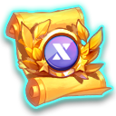

# 🎁 XTO Holding Service

<figure><figcaption></figcaption></figure>



**💡 You can earn X Points by holding XTO tickets in the game. Use the XTO holding system to create stronger heroes!**

🕑 **Reward Time:** 👉 KST (UTC+9): Every Monday at 00:00\
🍯 **Reward Collection:** In-game mailbox


❓ **1 X Point** is accumulated per week for every **1,000 XTO held.**


### ✅How to Access the Holding Menu

 (1) (1).png>)

👉 Tap the dashboard located in the upper-left corner of the main HUD.

<figure><figcaption></figcaption></figure>

👉 Tap the shop button in the upper-left corner of the dashboard.

<figure><figcaption></figcaption></figure>

👉 Tap the XTO Holding button in the center of the shop menu.

<figure><figcaption></figcaption></figure>

👉 The ticket holding service widget will appear. It shows the details of your held tickets and the X Points you can earn weekly. There are three buttons at the bottom for purchasing, modifying, and swapping tickets.

<figure><figcaption></figcaption></figure>

👉 Tap the 'Purchase Tickets' button to open the ticket purchase popup. Tickets are available in three types.


❓ X Points are **not** accumulated through XTO ticket purchases.\
❓ If you are not holding XTO tickets, you can immediately exchange them back to XTO via 'Ticket Swap.'\
❓ A gold fee is charged when swapping tickets. The fee is 1 million gold per 1,000 XTO.


<figure><figcaption></figcaption></figure>

👉 Tap the 'Modify' button to manage ticket holdings in the popup. Use the red minus (-) and green plus (+) buttons to adjust the number of tickets to hold.


⛔ Ticket holding adjustments can only be made **once per week** to prevent abuse, so please proceed with caution.


<figure><figcaption></figcaption></figure>

👉 Tap the 'Ticket Swap' button to instantly swap your XTO tickets back to XTO.


❓ A gold fee is charged when swapping tickets. The fee is 1 million gold per 1,000 XTO.




💡게임 내에서 XTO 티켓을 홀딩하여 X포인트를 얻을  수 있습니다. 더 강한 영웅을 만들기 위해 XTO 홀딩 시스템을 이용해보세요!

🕑**보상 시간 :** 👉KST (UTC+9) : 매주 월요일 00:00\
**🍯보상 획득 :** 인게임 우편함


❓1천 XTO 홀딩 당 1주일에 1 X포인트가 적립됩니다.


### ✅홀딩 메뉴 살펴보기

 (1) (1).png>)

👉메인 HUD 좌측 상단에 있는 대시보드를 터치 합니다.

<figure><figcaption></figcaption></figure>

👉대시보드 좌측 상단에 상점 버튼을 터치하세요.

<figure><figcaption></figcaption></figure>

👉상점 메뉴 중앙의 XTO 홀딩 버튼을 터치하세요.

<figure><figcaption></figcaption></figure>

👉티켓 홀딩 서비스 위젯이 나옵니다. 내가 홀딩중인 티켓 정보와 매주 받을 수 있는 X포인트 정보가 있습니다. 하단에 3개 버튼으로 티켓을 구매, 변경, 스왑 할 수 있습니다.

<figure><figcaption></figcaption></figure>

👉’티켓 구매’ 버튼을 터치하면 티켓 구매 팝업이 나옵니다. 티켓은 3종류로 구성되어 있습니다.


❓XTO 티켓 구매로는 X포인트가 적립되지 않습니다.&#x20;

❓XTO 티켓을 홀딩하지 않고있다면 ‘티켓 스왑’ 을 통해 바로 다시 XTO로 환전할 수 있습니다.&#x20;

❓티켓 환전 시 골드 수수료가 소비됩니다. 1000 XTO 당 100만 골드의 수수료가 소비됩니다.


<figure><figcaption></figcaption></figure>

👉’변경’ 버튼을 터치하면 티켓 홀딩을 관리할 수 있는 팝업이 나옵니다.  각 티켓의 붉은색 마이너스 버튼, 초록색 플러스 버튼을 터치하여 몇 개의 티켓을 홀딩 할 지 정합니다.


**⛔티켓 홀딩 정보는 어뷰징 방지를 위하여 매주 1회만 진행할 수 있으니 주의하세요.**


<figure><figcaption></figcaption></figure>

👉’티켓 스왑’ 버튼을 터치하면 보유중인 XTO 티켓을 XTO로 바로 스왑할 수 있습니다.


❓티켓 환전 시 골드 수수료가 소비됩니다. 1000 XTO 당 100만 골드의 수수료가 소비됩니다.




💡 ゲーム内でXTOチケットをホールドすることで、Xポイントを獲得できます。より強力なヒーローを作るために、XTOホールドシステムを活用してください！

🕑 **報酬時間:** 👉 KST (UTC+9): 毎週月曜日00:00\
🍯 **報酬の受け取り:** ゲーム内メールボックス


❓ 1,000 XTOをホールドするごとに、1週間で1 Xポイントが累積されます。


### ✅ホールドメニューの確認方法

 (1) (1).png>)

👉 メインHUDの左上にあるダッシュボードをタップします。

<figure><figcaption></figcaption></figure>

👉 ダッシュボードの左上にあるショップボタンをタップしてください。

<figure><figcaption></figcaption></figure>

👉 ショップメニュー中央のXTOホールドボタンをタップします。

<figure><figcaption></figcaption></figure>

👉 チケットホールドサービスのウィジェットが表示されます。ホールド中のチケット情報や毎週受け取れるXポイントの情報が確認できます。下部にはチケット購入、変更、スワップ用の3つのボタンがあります。

<figure><figcaption></figcaption></figure>

👉 「チケット購入」ボタンをタップすると、チケット購入ポップアップが表示されます。チケットは3種類あります。


❓ XTOチケット購入ではXポイントは累積されません。&#x20;

❓ XTOチケットをホールドしていない場合、「チケットスワップ」を利用してすぐにXTOに交換できます。&#x20;

❓ チケット交換時にはゴールド手数料が発生します。1,000 XTOごとに100万ゴールドの手数料がかかります。


<figure><figcaption></figcaption></figure>

👉 「変更」ボタンをタップすると、チケットホールドを管理できるポップアップが表示されます。各チケットの赤いマイナスボタン、緑のプラスボタンをタップして、ホールドするチケットの数を設定してください。


⛔ チケットホールド情報は**不正防止のため、週1回のみ**変更可能ですのでご注意ください。


<figure><figcaption></figcaption></figure>

👉 「チケットスワップ」ボタンをタップすると、保有しているXTOチケットを即座にXTOにスワップできます。


❓ チケット交換時にはゴールド手数料が発生します。1,000 XTOごとに100万ゴールドの手数料がかかります。




