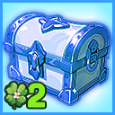
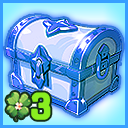
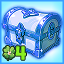
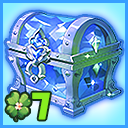
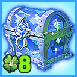
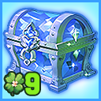
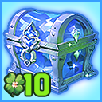

# 📁 Rewards List

### ✅Rewards List

👉 [Quick access to Random Box information](../../item-info/random-box-info.md)

👉[랜덤 박스 정보 바로가기](../../item-info/random-box-info.md)

👉[ ランダムボックス情報へのクイックアクセス](../../item-info/random-box-info.md)

<table data-header-hidden><thead><tr><th width="190"></th><th></th></tr></thead><tbody><tr><td>x1 tickets</td><td></td></tr><tr><td> </td><td>Potion Material Random Box x 1</td></tr><tr><td> </td><td>Raid Material Random Box x 1</td></tr><tr><td> </td><td>Lv.30 Sanjiba 1 hour [Solo] x 2</td></tr><tr><td> </td><td> </td></tr><tr><td>x2 tickets</td><td></td></tr><tr><td> </td><td>Potion Material Random Box x 1</td></tr><tr><td> </td><td>Special Material Random Box x 1</td></tr><tr><td> </td><td>Raid Material Random Box x 1</td></tr><tr><td> </td><td>Lv.30 Sanjiba 3 hour [Solo] x 1</td></tr><tr><td> </td><td> </td></tr><tr><td>x3 tickets</td><td></td></tr><tr><td> </td><td>Potion Material Random Box x 2</td></tr><tr><td> </td><td>Special Material Random Box x 1</td></tr><tr><td> </td><td>Raid Material Random Box x 1</td></tr><tr><td> </td><td>Dungeon Material Random Box x 1</td></tr><tr><td> </td><td>Lv.40 Kalasutra 1 hour [Solo] x 1</td></tr><tr><td> </td><td>Lv.30 Sanjiba 3 hour [Solo] x 1</td></tr><tr><td> </td><td> </td></tr><tr><td>x4 tickets</td><td></td></tr><tr><td> </td><td>Potion Material Random Box x 2</td></tr><tr><td> </td><td>Special Material Random Box x 1</td></tr><tr><td> </td><td>Raid Material Random Box x 2</td></tr><tr><td> </td><td>Dungeon Material Random Box x 1</td></tr><tr><td> </td><td>Arena Material Random Box x 1</td></tr><tr><td> </td><td>Lv.50 Samgata 1 hour [Solo] x 1</td></tr><tr><td> </td><td>Lv.40 Kalasutra 1 hour [Solo] x 1</td></tr><tr><td> </td><td> </td></tr><tr><td> </td><td> </td></tr><tr><td>x5 tickets</td><td></td></tr><tr><td> </td><td>Potion Material Random Box x 2</td></tr><tr><td> </td><td>Special Material Random Box x 2</td></tr><tr><td> </td><td>Raid Material Random Box x 2</td></tr><tr><td> </td><td>Dungeon Material Random Box x 2</td></tr><tr><td> </td><td>Arena Material Random Box x 2</td></tr><tr><td> </td><td>EXP Bottle x 5</td></tr><tr><td> </td><td>Mercenary certificate x 1</td></tr><tr><td> </td><td>Lv.50 Samgata 1 hour [Solo] x 1</td></tr><tr><td> </td><td>Lv.40 Kalasutra 1 hour [Solo] x 2</td></tr><tr><td> </td><td> </td></tr><tr><td>x6 tickets</td><td></td></tr><tr><td> </td><td>Potion Material Random Box x 3</td></tr><tr><td> </td><td>Special Material Random Box x 3</td></tr><tr><td> </td><td>Raid Material Random Box x 3</td></tr><tr><td> </td><td>Dungeon Material Random Box x 3</td></tr><tr><td> </td><td>Arena Material Random Box x 3</td></tr><tr><td> </td><td>TP Bottle x 2</td></tr><tr><td> </td><td>EXP Bottle x 8</td></tr><tr><td> </td><td>Mercenary certificate x 1</td></tr><tr><td> </td><td>Lv.50 Samgata 1 hour [Solo] x 2</td></tr><tr><td> </td><td>Lv.40 Kalasutra 1 hour [Solo] x 3</td></tr><tr><td> </td><td> </td></tr><tr><td>x7 tickets</td><td></td></tr><tr><td> </td><td>Potion Material Random Box x 4</td></tr><tr><td> </td><td>Special Material Random Box x 4</td></tr><tr><td> </td><td>Raid Material Random Box x 4</td></tr><tr><td> </td><td>Dungeon Material Random Box x 4</td></tr><tr><td> </td><td>Arena Material Random Box x 4</td></tr><tr><td> </td><td>TP Bottle x 4</td></tr><tr><td> </td><td>EXP Bottle x 10</td></tr><tr><td> </td><td>Mercenary certificate x 2</td></tr><tr><td> </td><td>Lv.50 Samgata 3 hour [Solo] x 1</td></tr><tr><td> </td><td>Lv.40 Kalasutra 1 hour [Solo] x 3</td></tr><tr><td> </td><td> </td></tr><tr><td>x8 tickets</td><td></td></tr><tr><td> </td><td>Potion Material Random Box x 5</td></tr><tr><td> </td><td>Special Material Random Box x 5</td></tr><tr><td> </td><td>Raid Material Random Box x 5</td></tr><tr><td> </td><td>Dungeon Material Random Box x 5</td></tr><tr><td> </td><td>Arena Material Random Box x 5</td></tr><tr><td> </td><td>TP Bottle x 6</td></tr><tr><td> </td><td>EXP Bottle x 20</td></tr><tr><td> </td><td>Mercenary certificate x 3</td></tr><tr><td> </td><td>Lv.50 Samgata 3 hour [Solo] x 2</td></tr><tr><td> </td><td> </td></tr><tr><td>x9 tickets</td><td></td></tr><tr><td> </td><td>Potion Material Random Box x 6</td></tr><tr><td> </td><td>Special Material Random Box x 6</td></tr><tr><td> </td><td>Raid Material Random Box x 6</td></tr><tr><td> </td><td>Dungeon Material Random Box x 6</td></tr><tr><td> </td><td>Arena Material Random Box x 6</td></tr><tr><td> </td><td>TP Bottle x 8</td></tr><tr><td> </td><td>EXP Bottle x 25</td></tr><tr><td> </td><td>Mercenary certificate x 4</td></tr><tr><td> </td><td>Lv.50 Samgata 3 hour [Solo] x 3</td></tr><tr><td> </td><td> </td></tr><tr><td>x10 tickets</td><td></td></tr><tr><td> </td><td>Potion Material Random Box x 8</td></tr><tr><td> </td><td>Special Material Random Box x 8</td></tr><tr><td> </td><td>Raid Material Random Box x 8</td></tr><tr><td> </td><td>Dungeon Material Random Box x 8</td></tr><tr><td> </td><td>Arena Material Random Box x 8</td></tr><tr><td> </td><td>TP Bottle x 10</td></tr><tr><td> </td><td>EXP Bottle x 30</td></tr><tr><td> </td><td>Mercenary certificate x 5</td></tr><tr><td> </td><td>Lv.50 Samgata 3 hour [Solo] x 3</td></tr><tr><td> </td><td>Red Lucky Box - Exclusive for 100,000 Holders</td></tr></tbody></table>

