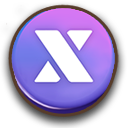

# 📋 XTO Summary

<figure><figcaption></figcaption></figure>

## ◾ Token Basic Information

> <mark style="color:purple;">**XTO coin (BEP20)**</mark>
>
> **Name :** XTO
>
> **Network :** Binance Smart Chain (BEP-20)
>
> **Contract Addr :&#x20;**<mark style="color:blue;">**0xAA390Bd1657514730D98BAaBcE4b393a53ACD579**</mark>
>
> **Symbol :** <mark style="background-color:purple;">XTO</mark>
>
> **Total supply :** 2,100,000,000
>
> **Max Mining Amount per Day :** 20,000 (flexible)

***

## ◾ Token Introduction



XTO is a governance token that supports the virtual economy of EXTOCIUM.\
It serves a similar role to Gold, the in-game currency. However, due to blockchain limitations that make real-time drops difficult, Gold is used in-game as a bridge currency.

In short, **Gold** is the currency used inside the game,\
while **XTO** is the token recorded on the blockchain.

You can connect XTO with gameplay through the services below.


[xto-swap-service](../xto-swap-service/)



[xto-holding-service](../xto-holding-service/)




XTO는 EXTOCIUM의 가상 경제를 지탱하는 **거버넌스 토큰**입니다.\
게임 내 재화인 **골드**와 같은 역할을 하지만, \
블록체인 특성상 실시간 드롭이 어려워 게임에서는 **골드**를 브릿지 재화로 사용합니다.

즉, 골드는 게임 안에서 사용하는 재화이고, XTO는 블록체인 위에 기록되는 토큰입니다.

아래 서비스를 통해 XTO를 게임 플레이와 연동할 수 있습니다.


[xto-swap-service](../xto-swap-service/)



[xto-holding-service](../xto-holding-service/)




XTOは、EXTOCIUMの仮想経済を支える**ガバナンストークン**です。\
ゲーム内通貨であるゴールドと同じ役割を持っていますが、\
ブロックチェーンの特性上、リアルタイムでのドロップが難しいため、\
ゲーム内ではゴールドを**ブリッジ通貨**として使用しています。

つまり、**ゴールド**はゲーム内で使用する通貨であり、\
**XTO**はブロックチェーン上に記録されるトークンです。

以下のサービスを通じて、XTOをゲームプレイと連携できます。


[xto-swap-service](../xto-swap-service/)



[xto-holding-service](../xto-holding-service/)




***

## ◾ How to Obtain XTO



Obtaining XTO is simple.

1️⃣ Play the game and earn **Gold**.\
2️⃣ After collecting a certain amount of Gold,\
you can use the **XTO–Gold Swap Service** through the in-game NPC **YEYILEL**.

Since the amount of XTO that can be swapped using Gold is limited,\
purchasing XTO from an external exchange is also an option when needed.



XTO를 얻는 방법은 매우 단순합니다.

1️⃣ 게임을 플레이하며 **골드**를 획득합니다.\
2️⃣ 일정량의 골드를 모은 뒤,\
게임 내 NPC **예이렐**을 통해 **XTO – 골드 스왑 서비스**를 이용할 수 있습니다.

골드로 스왑할 수 있는 XTO의 양은 제한적이기 때문에,\
필요에 따라 외부 거래소에서 XTO를 구매하는 것도 하나의 방법입니다.



XTOの入手方法はとてもシンプルです。

1️⃣ ゲームをプレイして **ゴールド** を獲得します。\
2️⃣ 一定量のゴールドを集めた後、\
ゲーム内NPC **イェイレル** を通じて  **XTO－ゴールド スワップサービス**を利用できます。

ゴールドでスワップできるXTOの量には制限があるため、\
必要に応じて外部取引所でXTOを購入する方法もあります。



***

## ◾ How XTO Is Used



XTO is used to obtain exclusive items and rewards in EXTOCIUM.\
By holding XTO, you can earn **X Points**, and some items can only be purchased using these points.

XTO is not just a token, but a resource directly connected to the growth and progression of EXTOCIUM.\
For more details, please refer to the service guide pages.



XTO는 EXTOCIUM에서 전용 아이템과 보상을 획득하는 데 사용됩니다.
\
XTO 홀딩을 통해 X 포인트를 얻을 수 있으며,
&#x20;포인트로만 구매 가능한 아이템도 존재합니다.

XTO는 단순한 토큰이 아니라, EXTOCIUM의 성장과 진행에 직접 연결된 재화입니다.\
자세한 내용은 각 서비스 안내 페이지에서 확인할 수 있습니다.



XTOは、EXTOCIUMで**専用アイテムや報酬を獲得するため**に使用されます。\
XTOをホールドすることで **Xポイント** を獲得でき、\
ポイントでのみ購入できるアイテムも存在します。

XTOは単なるトークンではなく、\
EXTOCIUMの成長と進行に直接つながる重要なリソースです。\
詳細は、各サービスの案内ページをご確認ください。



***

## ◾ Token DEX Link


<mark style="color:blue;">**📈XTO Price Page , v2 (Coinmarketcap)**</mark>



<mark style="color:blue;">**📈**</mark><mark style="color:orange;">**XTO Pool Page , v2 (PancakeSwap)**</mark>



<mark style="color:purple;">**📑XTO Holder info (BscScan)**</mark>


※ Token prices may fluctuate depending on market conditions.

***

<em>※ This guide was written based on the game status as of February 11, 2026,</em>  <em>and its contents may change with future updates.</em>

