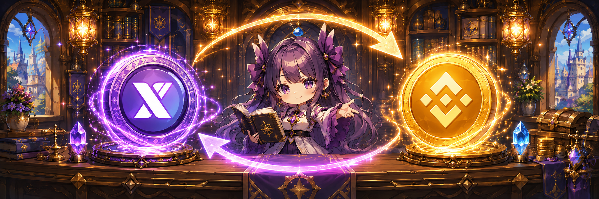

# 🤝 XTO Swap Service

<figure><figcaption></figcaption></figure>



### 🔄 XTO Swap Service

XTO and Gold-related services can be accessed through the town NPC [**YEYILEL**](../../field-info/rotten-hill/npc-rotten-hill.md#yeyilel-banker-of-rotten-hill).

<figure><figcaption></figcaption></figure>

***


#### ◾ Before You Begin

* To perform any XTO-related actions, you must first [connect your **MetaMask wallet**](../../beginners-guide/wallet-connection/wallet-setup/connect-your-wallet-to-extocium.md).
* Swap and Holding services are not available without a connected wallet.




### 🔄 XTO Swap Service

XTO와 골드 관련 서비스는 마을 NPC [**예이렐**](../../field-info/rotten-hill/npc-rotten-hill.md#yeyilel-banker-of-rotten-hill)을 통해 이용할 수 있습니다.

<figure><figcaption></figcaption></figure>

***


#### ◾ 이용 전 확인 사항

* XTO와 관련된 작업을 진행하려면, 먼저 [**MetaMask 지갑을 연결**](../../beginners-guide/wallet-connection/wallet-setup/connect-your-wallet-to-extocium.md)해야 합니다.
* 지갑이 연결되지 않은 상태에서는 스왑 및 홀딩 서비스를 이용할 수 없습니다.




### 🔄 XTOスワップサービス

XTOおよびゴールド関連のサービスは、町のNPC [**イェイレル**](../../field-info/rotten-hill/npc-rotten-hill.md#yeyilel-banker-of-rotten-hill) から利用できます。

<figure><figcaption></figcaption></figure>

***


#### ◾ 利用前の確認事項

* XTOに関連する操作を行うには、事前に [**MetaMaskウォレットを接続**](../../beginners-guide/wallet-connection/wallet-setup/connect-your-wallet-to-extocium.md)する必要があります。
* ウォレットが接続されていない場合、スワップおよびホールディングサービスは利用できません。





[gold-greater-than-xto.md](gold-greater-than-xto.md)



[xto-greater-than-gold.md](xto-greater-than-gold.md)



[xto-holding-service](../xto-holding-service/)


<em>※ This guide was written based on the game status as of February 11, 2026,</em>  <em>and its contents may change with future updates.</em>

